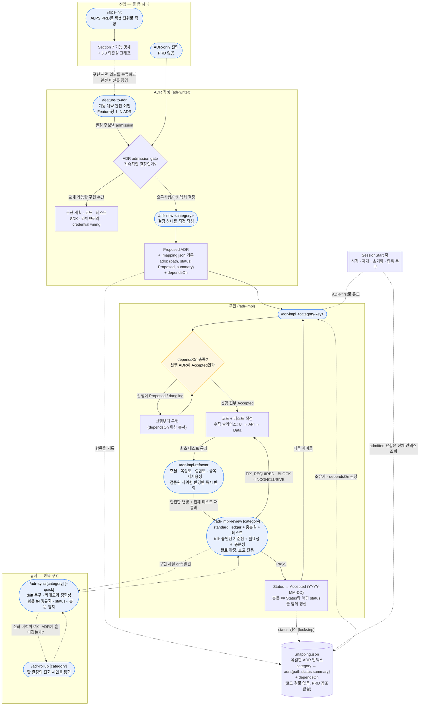
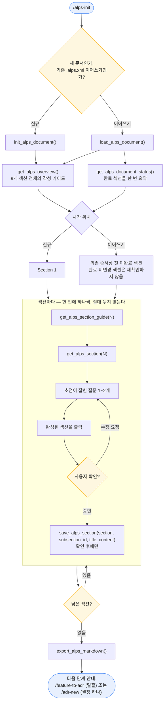
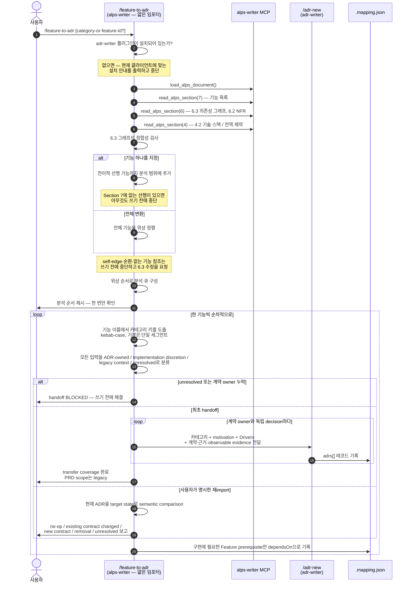
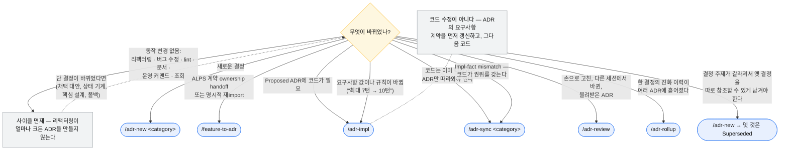
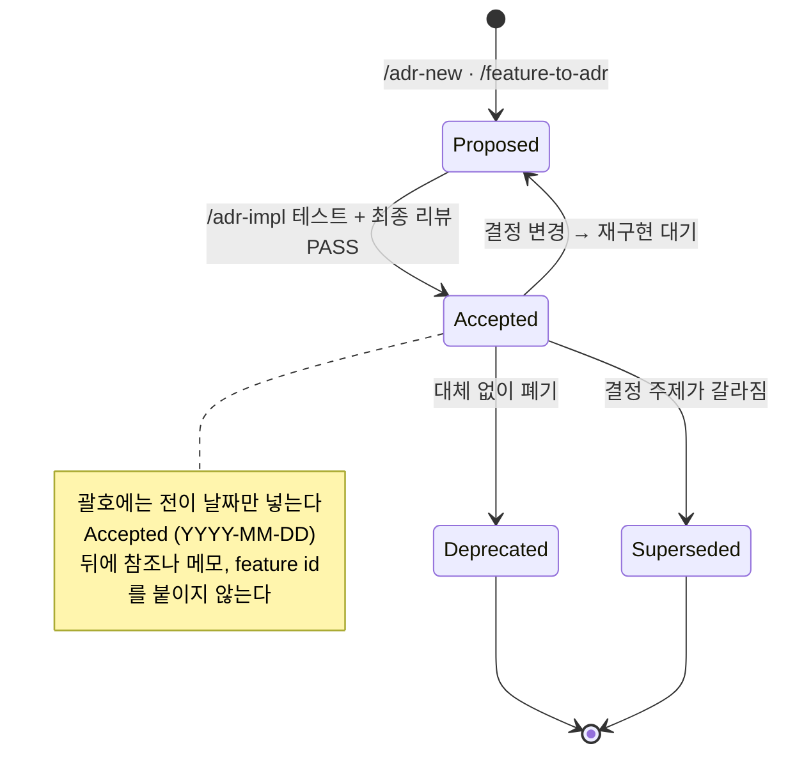
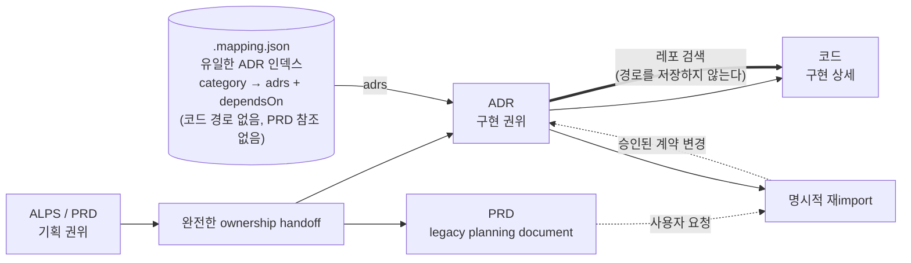

# ADR 프로세스 개요 (다이어그램)

이 문서는 `alps-writer`에서 `adr-writer`로 이어지는 개발 사이클 전체를 Mermaid로 한눈에 보여준다. 산문 설명은 [`usage.md`](./usage.md), 의존성 규칙의 근거는 [`dependency-model.md`](./dependency-model.md)를 본다.

핵심 불변식:

- **`.mapping.json`이 유일한 ADR 인덱스다** — 카테고리마다 각 ADR을 `{path, status, summary}`로 한 번씩 보유하고 `dependsOn`을 기록한다. README는 ADR 목록을 두지 않으며(개념 색인만), admission gate를 통과한 요청이 코드 변경 전에 이 인덱스를 읽는다.
- **adr-writer는 독립적이다** — 매핑은 코드 경로도, Feature ID도, PRD 참조도 저장하지 않는다. `/feature-to-adr`가 ALPS의 구현 관련 계약을 ADR로 완전 이전하고 명시적 재import를 비교하지만, adr-writer는 ALPS를 읽지 않는다.
- **소유권은 한 방향(PRD → ADR → 코드)으로 이전되며**, handoff 뒤에는 ADR만 구현 권위로 남는다. 어떤 산출물도 본문에서 다른 산출물을 직접 가리키지 않는다.
- **ADR admission gate가 생성보다 먼저다.** 요구사항 계약, 지속적인 시스템·데이터·보안 경계, 외부 제공자·모델과 fallback, 키 설계, 알고리즘과 트레이드오프만 ADR 레이어로 올린다. 같은 계약과 경계를 유지한 채 교체할 수 있는 라이브러리, SDK, 프레임워크, credential/auth adapter, 모듈 구조는 코드 레이어에 둔다.
- **ADR 본문 = 현재 상태, decision-log.md = 주요 변경 이력.** ADR은 현재 코드를 서술하는 요구사항 문서이고, 그 진화의 타임라인은 카테고리별 `decision-log.md`가 보존한다(관례 파일이며 인덱스에 등록하지 않는다). 진화는 기본적으로 제자리 수정 + 로그 한 줄이고, supersede는 결정 주제 자체가 갈라졌을 때만 쓴다.
- **ADR 완결성의 기준은 재생성 테스트다** — "코드를 전부 지우고 이 ADR만 남았을 때, 요구사항을 지키는 코드를 이것만으로 다시 세울 수 있는가?" 구현과 구조, 이름은 달라져도 된다(ADR에 없으므로 재량이다). 하지만 **결과가 지켜야 하는 계약은 하나도 빠져서는 안 된다.** 그래서 요구사항 값(최대 턴 수, 사용량 쿼터, 보존 기간, 상한, 목표치)은 숫자와 근거를 그대로 ADR에 넣고, 구현 튜닝 값(커넥션 풀, 백오프, 캐시 TTL)은 넣지 않는다. 판단 기준은 `templates/adr/authoring-rules.md`의 "Concrete numbers"를 본다.

목차 — 사이클을 처음부터 끝까지 본 뒤 핵심 커맨드, 라우팅, 운영 구조를 차례로 본다:

| §                                                       | 다이어그램         | 답하는 질문                                                |
| ------------------------------------------------------- | ------------------ | ---------------------------------------------------------- |
| [1](#1-전체-라이프사이클)                               | 전체 라이프사이클  | PRD부터 유지 단계까지, 어떤 커맨드가 언제 실행되는가       |
| [2](#2-alps-init-내부-섹션-단위-작성-루프)              | `/alps-init`       | ALPS 9개 섹션이 어떻게 작성되고, 왜 순서가 어긋나는가      |
| [3](#3-feature-to-adr-내부-계약-소유권-이전과-재import) | `/feature-to-adr`  | 기능 계약을 어떻게 완전 이전하고 멱등하게 다시 가져오는가  |
| [4](#4-adr-impl-내부-선행-의존성-게이트)                | `/adr-impl`        | 대상을 어떻게 찾고, 의존성 게이트를 왜 건너뛸 수 없는가    |
| [5](#5-adr-impl-review-내부-적대적-리뷰)                | `/adr-impl-review` | 격리와 승인된 기준선이 어떻게 반증 기반 판정을 만드는가    |
| [6](#6-이-변경은-어느-커맨드-소유인가)                  | 라우팅             | 어떤 이견이나 변경 요청이 들어왔을 때 어느 커맨드가 맡는가 |
| [7](#7-adr-status-전이)                                 | Status             | Proposed / Accepted / Superseded 사이를 누가 옮기는가      |
| [8](#8-의존성-모델과-결합-지점)                         | PRD → ADR → 코드   | 연결이 어디에 살고, 어디에는 의도적으로 두지 않는가        |
| [9](#9-실행-계층과-효율성-검토)                         | 운영 내부 구조     | 어디서 비용이 발생하고, 현재 최적화와 다음 개선은 무엇인가 |

## 1. 전체 라이프사이클

**읽는 법**

- **진입점은 둘이지만 ADR 생성보다 admission gate가 먼저다.** PRD-first는 `/feature-to-adr`가 `/adr-new`에 위임하고, ADR-only는 직접 결정을 제시한다. 두 경로 모두 요구사항 계약이나 지속적인 아키텍처 경계를 바꾸는 결정만 ADR로 만들며, SDK·라이브러리·credential wiring처럼 교체 가능한 구현 수단은 코드와 테스트로 내려보낸다.
- **`/feature-to-adr`는 소유권 handoff를 소유한다.** 구현 관련 입력을 ADR 소유, 구현 재량, legacy context, unresolved로 분류하고 빠짐없이 소유자가 정해진 경우에만 완료한다. 이전된 Feature는 실제 계약 소유 ADR을 1개 이상 가지며, 완료 후 PRD는 legacy 문서가 된다. 명시적 재import만 현재 ADR과 의미를 비교하며 동일한 입력은 no-op이다.
- **새 초안은 한 번 검증하고, 두 번 리뷰하지 않는다.** `/adr-new`는 `adr-reviewer`가 적용하는 것과 같은 규칙(R1-R20)으로 작성하므로, 결정론적 하네스를 돌린 뒤 판단 규칙에 대한 자체 점검을 수행한다 — 방금 제대로 해낸 것을 대부분 되풀이할 리뷰어를 띄우지 않는다. `/adr-review`는 그 작성 컨텍스트가 사라진 자리에 독립적인 읽기를 공급한다. **손으로 고친, 다른 세션에서 바뀐, 물려받은** ADR이 그 대상이며, 작성 직후 자동으로가 아니라 요청 시에 실행된다.
- **의존성 게이트는 필수다.** `/adr-impl`은 곧장 코딩으로 가지 않는다. `dependsOn`을 전이적으로 순회하고, 선행이 `Proposed`이거나 dangling이면 그것을 위상 순서로 먼저 구현한다.
- **Stacked PR은 요청 기반 구현 전달 fallback이다.** 사용자가 리뷰 부담 감소를 요청했지만 Feature나 ADR을 더 나누면 의미 경계가 깨질 때, `/adr-impl`은 같은 승인된 ADR을 구현하는 dependency-ordered PR layer를 제안할 수 있다. 각 layer는 하나의 review question만 가지며 점수만으로 자동 생성하지 않고 ALPS·ADR·mapping에 Stack 상태를 저장하지 않는다.
- **구현 완료 전 검증된 리팩터링을 수행한다.** 최초 테스트가 통과하면 `/adr-impl-refactor`의 읽기 전용 리뷰어가 실행 효율, 복잡도, 결합도, 중복과 현재 코드에 근거한 재사용 기회를 독립적으로 찾는다. 독립 reviewer가 없으면 제안만 남기고 자동 반영하지 않는다. 실제 변경이 없으면 동일 targeted test를 반복하지 않는다.
- **최종 리뷰가 위험에 비례해 완료를 판정한다.** 보호 표면을 바꾸지 않는 국소 구현은 `standard`로 decision ledger, 독립 충분성 검토와 targeted test를 수행한다. 계약·공개 표면·데이터·상태·권한·보안·fallback·동시성·트랜잭션·오류 의미 또는 넓은 범위를 바꾸면 `full`로 구현 전에 승인된 기준선과 독립 필요성·충분성 검토를 사용한다. 의도와 재생성 완전성은 구현 전에 승인하므로 완료 검토에서 일상적인 사람 게이트를 반복하지 않는다. 불명확하면 `full`이다.
- **진화 이력은 ADR 본문이 아니라 decision log에 산다.** ADR 본문은 현재 상태만 서술하고, 같은 결정이 진화하면 제자리에서 덮어쓴다. 주요 전이(채택 대안 교체, 핵심 알고리즘이나 아키텍처 변경, Driver 반전)는 카테고리별 `decision-log.md`에 최신순 한 줄로 남긴다 — `/adr-impl`과 `/adr-sync`가 추가하거나 수확하고, `/adr-rollup`은 통합 과정에서 체인의 주요 전이를 로그로 수확하고 현재 상태 통합 ADR만 남긴다. 로그는 관례 파일이므로 `.mapping.json`에 등록하지 않고 하네스도 검사하지 않는다. supersede(새 ADR)는 결정 주제가 갈라질 때만 일어나며, 진화 체인은 기본적으로 누적하지 않는다.
- **`/adr-impl`은 카테고리 키로 대상을 찾는다.** Feature ID는 어디에도 저장하지 않으며, 숫자만으로 된 폴백 키(`f1`)조차 평범한 리터럴 카테고리 키로 해석한다.
- **훅이 사이클을 지탱한다.** 세션 시작·재개·초기화와 컨텍스트 압축 복구 시 짧은 ADR admission 지시를 주입해 일반 사용자 메시지마다 실행하지 않고도 흐름을 유지한다. admission을 통과한 요청만 코드 변경 전에 전체 `.mapping.json`과 plausible ADR 본문을 읽는다.
- **독립적인 순수 리팩터링 요청은 ADR 작성에서 면제된다.** 동작을 바꾸지 않는 구조 변경은 규모가 얼마나 크든 새 ADR을 만들지 않는다. 다만 `/adr-impl` 안에서는 방금 만든 구현의 완료 품질을 높이기 위해 검증된 저위험 리팩터링 단계를 자동 실행한다. 이 단계도 결정을 바꾸지 않으며, 채택 대안·상태 기계·핵심 설계·외부 의존성 폴백을 바꾼다면 리팩터링이 아니라 동작 변경이므로 해당 ADR을 먼저 갱신한다.

## 2. /alps-init 내부: 섹션 단위 작성 루프

PRD 레이어는 커맨드 하나지만, 실제로는 9개 섹션과 확인 게이트다. 기본은 섹션별 원자 승인이다. 사용자가 명시적으로 batch를 요청하거나 완전한 구조화 자료를 제공하면 여러 초안을 한 번에 승인할 수 있지만, 각 section/feature는 별도 표시와 별도 저장 단위를 유지한다.

**작성 순서** — `1 → 2 → 3 → 4 → 6 → 5 → 7 → 8 → 9`. 섹션 번호와 최종 문서 순서는 그대로다(5는 Design, 6은 Requirements). _질문하는_ 순서만 어긋나는데, Section 5가 Section 6.1이 정의하는 Feature ID(F1, F2, …)를 재사용하기 때문이다. 질문 순서가 숫자 순서에서 벗어나는 곳은 여기 한 군데뿐이다.

기존 문서는 `get_alps_document_status` 결과를 읽고 이 순서에서 첫 미완료 섹션부터 이어간다. 완료된 섹션은 한 번 요약하되, 사용자가 전체 재검토를 요청하거나 선행 내용이 바뀐 경우가 아니면 다시 승인받지 않는다.

| §   | 섹션                      | §   | 섹션                        |
| --- | ------------------------- | --- | --------------------------- |
| 1   | Overview                  | 6   | Requirements Summary        |
| 2   | MVP Goals and Key Metrics | 7   | Feature-Level Specification |
| 3   | Demo Scenario             | 8   | MVP Metrics                 |
| 4   | High-Level Architecture   | 9   | Out of Scope                |
| 5   | Design Specification      |     |                             |

**Section 7은 특별히 조심해야 하는 예외다.** 원자 모드에서는 각 Feature를 하나씩 확인·저장한다. batch 모드에서도 각 7.x는 독립 초안과 저장 호출을 유지하며, 작거나 비슷하다는 이유로 합치거나 생략하지 않는다.

## 3. /feature-to-adr 내부: 계약 소유권 이전과 재import

alps-writer가 adr-writer에 넘기는 유일한 지점이다. 최초 실행은 PRD의 구현 관련 의도를 ADR 집합으로 완전 이전한다. 이후 일반 구현은 PRD를 읽지 않는다. 사용자가 변경된 PRD의 재import를 명시한 경우에만 현재 ADR과 semantic comparison을 수행한다.

**이 핸드셰이크가 지키는 불변식.**

- **이전된 Feature는 `1..N` ADR을 가진다.** 최소 하나는 실제 사용자 계약과 observable evidence를 소유한다. 독립 결정은 별도 ADR이고, 라이브러리·SDK 같은 교체 가능한 수단은 코드에 둔다. 제품 계약 없이 구현 교체만 적힌 입력은 transferable Feature가 아니다.
- **Handoff는 completeness transaction이다.** 모든 구현 관련 입력이 ADR-owned, implementation discretion, legacy context 중 하나로 분류되고 unresolved가 0일 때만 완료한다. 이후 PRD는 legacy 문서이며 구현·리뷰·sync는 ADR만 읽는다.
- **재import는 명시적이고 멱등적이다.** 같은 의미의 PRD를 같은 ADR 상태에 반복 적용하면 ADR, mapping, Status와 decision log를 바꾸지 않는다. 계약 추가·변경은 ADR 변경 제안이고, 삭제는 자동 적용하지 않는다.
- **구현 prerequisite를 영속화한다.** 이전된 Feature마다 실제 계약 owner가 있으므로, 계약을 만족하기 위해 필요한 선행 Feature는 category `dependsOn`으로 보존한다. 코드 재사용과 편의 순서는 저장하지 않는다.
- **임포터는 도메인 경계를 발명하지 않는다.** ALPS에는 기능보다 상위의 개념이 없으므로, 2세그먼트 `<context>/<feature>` 키는 두 경우에만 쓴다. Section 7이 이미 기능을 그룹으로 묶고 있을 때(PRD가 경계를 주장한 경우), 또는 사용자가 명시적으로 그룹화를 요청할 때다. 그 외에는 flat이 기본이며, 이것이 "adr-writer는 ALPS를 참조하지 않는다"를 참으로 유지한다.
- **Feature ID는 절대 키가 되지 않는다.** `F1` / `F-AUTH-01`이 있어도 키는 기능 이름에서 나오고, ID는 어디에도 저장하지 않는다. 이름이 숫자뿐인 기능은 소문자 id(`f1`)를 평범한 리터럴 키로 쓰는 것이지, ID를 보존하는 필드가 아니다.
- **그대로 넘어가는 것**: motivation, 근거를 포함한 요구사항 값, 상태·전이, 필수 여부, 권한·가시성, 순서·유일성·단위, 실패 보장, NFR, 외부 경계·fallback, 관련 non-goal과 구현 독립적인 observable evidence다. 여기서 내용을 일반화하면 handoff 뒤 복구할 상위 권위가 없다.

## 4. /adr-impl 내부: 선행 의존성 게이트

대상 확정과 의존성 게이트는 이 커맨드가 코드를 생각하기 전에 반드시 끝내는 두 가지다. 게이트는 ADR이 하나뿐일 때조차 생략하거나 미룰 수 없다.

```mermaid
flowchart TD
    S(["/adr-impl [경로 | 카테고리 | 인자 없음]"]) --> Id["1. 대상 ADR 식별"]
    Id --> Kind{"인자 형태"}
    Kind -->|파일 경로| Disk{"디스크에 존재?"}
    Disk -->|없음| Moved["rollup 리넘버로 옮겨졌을 수 있다:<br/>같은 카테고리에서 kebab 제목 매칭, 이어서<br/>git log --all --diff-filter=R --name-status"]
    Moved --> Id
    Kind -->|카테고리 키| Key[".mapping.json 카테고리 키와 매칭<br/>(f1 같은 폴백 키도 리터럴로 매칭 —<br/>Feature ID 조회 경로는 없다)"]
    Kind -->|"비었음 / 모호함 /<br/>매핑 없음"| List["Proposed ADR 목록을 보여주고 선택받는다<br/>(재귀 순회 — flat과 2세그먼트 폴더 모두)"]
    List --> Id
    Disk -->|있음| Gate
    Key --> Gate

    Gate["2. 의존성 게이트 — 필수<br/>3단계 계획으로 건너뛰지 않는다"]
    Gate --> Dep{"dependsOn"}
    Dep -->|"키 자체가 없음<br/>(미선언)"| Say["한 줄로 고지하고 진행<br/>(미선언 ≠ 의존성 없음)"]
    Dep -->|"[] 빈 배열"| Plan
    Dep -->|키가 있음| Walk["한 홉씩 전이적으로 순회"]

    Walk --> Node{"방문한 노드"}
    Node -->|"dangling — 항목이 없거나<br/>ADR 파일이 없음"| StopD["중단: mapping/결정 모델을 복구한다<br/>placeholder ADR은 만들지 않는다"]
    Node -->|Proposed| StopP["중단: 선행 ADR을 먼저 구현한다<br/>사용자 확인으로 우회할 수 없다"]
    Node -->|순환| StopC["중단: 얽힌 카테고리를 보고하고<br/>어디서 끊을지 묻는다"]
    Node -->|전부 Accepted| Plan
    StopP --> Sort["대상 목록을 위상 순서로 재구성<br/>(가장 깊은 선행부터)"]
    Sort --> Plan
    Say --> Plan

    Plan["3. 계획 — Decision / Mermaid에서<br/>수직 슬라이스 추출 (UI → API → 데이터),<br/>ADR 키워드로 Glob/Grep 해서 코드를 찾고,<br/>비차단 진행 상황을 공유한다"]
    Plan --> AntiP{"안티패턴 카테고리?<br/>frontend/ backend/ api/ db/"}
    AntiP -->|그렇다| StopA["중단: 추출할 수직 슬라이스가 없다<br/>→ /adr-sync로 카테고리 재정렬"]
    AntiP -->|아니다| Gaps{"요구사항 gap 분류<br/>계약에서 도출되는 의무?<br/>프로젝트·도메인 기본값?<br/>제품 판단?"}
    Gaps -->|"derived obligation<br/>또는 가역적 기본값"| Impl4["4. 구현 — ADR 계약과 도출 의무를 강제하고,<br/>이름 있는 변경 함수에는 언어 표준 why/how 문서 주석을 작성한다.<br/>계약 용어는 재사용하되 ADR 파일은 참조하지 않고,<br/>ideal path와 관련 edge case를 테스트한다"]
    Gaps -->|"여러 제품 결과가 유효"| DecisionReq["하나의 Decision request<br/>추천안 + 근거 · 2~3개 대안 · 영향 ·<br/>정확한 ADR 계약 문구"]
    DecisionReq --> FixAdr
    Impl4 --> Test{"5. 테스트 통과?"}
    Test -->|"구현 버그"| Impl4
    Test -->|"ADR의 결정이 틀렸다"| FixAdr["ADR을 먼저 고친다"]
    FixAdr --> Impl4
    Test -->|통과| Refactor["5.1 /adr-impl-refactor<br/>읽기 전용 reviewer가 효율·복잡도·중복·재사용성 검토<br/>안전 게이트 통과 항목만 변경 전후 테스트와 함께 적용<br/>나머지는 제안으로 기록"]
    Refactor --> FinalTest{"5.2 코드가 바뀌었으면<br/>전체 프로젝트 테스트 재통과?"}
    FinalTest -->|"리팩터링 문제"| Refactor
    FinalTest -->|통과| Lint["6. adr-structure-lint &lt;category&gt;<br/>현재 ADR 기준선 확인"]
    Lint --> Rev(["6.1 /adr-impl-review &lt;category&gt;<br/>보고 전용 완료 게이트"])
    Rev --> Verdict{"판정"}
    Verdict -->|PASS| Promote["7. Proposed면 묻지 않고 Accepted로 승격<br/>기존 Accepted의 계약이 그대로면 Status 유지"]
    Verdict -->|"FIX_REQUIRED · BLOCK · INCONCLUSIVE"| Impl4
    Promote --> PostLint["전이 후 lint 재실행<br/>날짜 형식 + status lockstep"]

    classDef cmd fill:#e8f0fe,stroke:#4285f4,color:#111;
    classDef gate fill:#fef7e0,stroke:#f9ab00,color:#111;
    classDef stop fill:#fce8e6,stroke:#d93025,color:#111;
    class S,Rev cmd;
    class Gate,Dep,Node,Test,FinalTest,Verdict,AntiP,Kind,Disk gate;
    class StopD,StopP,StopC,StopA stop;
```

- **의존성 순서가 입력 순서를 이긴다.** 대상이 여럿일 때 — 사용자가 `checkout, identity/login, cart`를 직접 고른 경우든 게이트가 선행을 추가한 경우든 — 항상 위상 정렬해서 가장 깊은 선행부터 구현하고, 그 순서를 한 줄로 사용자에게 보여준다.
- **계획은 승인 게이트가 아니라 진행 상황이다.** 같은 승인된 ADR revision이면 범위와 테스트를 공유하고 바로 진행한다. 명시 계약에서 도출되는 의무와 반복된 저장소·도메인 기본값은 자동으로 채우고, 금액·권한·보존·규제·비가역 데이터·public contract·durable fallback처럼 여러 제품 선택지가 남는 gap만 하나의 Decision request로 묶는다.
- **변경 없는 `Accepted` ADR은 다시 `Proposed`로 내리지 않는다.** 계약이 그대로인 보강 구현과 리뷰는 기존 Status를 유지하고, 완료 시 전이 script 없이 body/index lockstep만 검증한다.
- **요구사항 값 변경은 코드 수정이 아니다.** "최대 7턴 → 10턴"은 상수 하나처럼 보이지만 시스템 동작 요구사항이 바뀐 것이다. ADR의 요구사항 계약을 먼저 갱신하고(제자리 수정, 그리고 최소 major이므로 `decision-log.md` 한 줄도), 테스트와 최종 리뷰가 통과한 뒤 다시 `Accepted`로 승격한다.
- **함수 문서 주석과 테스트 범주는 완료 계약이다.** ADR 동작을 위해 새로 만들거나 실질 변경한 이름 있는 함수·메서드는 언어 표준 형식으로 존재 이유와 동작을 설명한다. 계약 용어는 검색을 위해 재사용하지만 ADR 번호·경로·링크나 출처 표기는 코드와 주석에 남기지 않는다. 각 구현 동작은 ideal case와 실제 계약에 관련된 edge case를 모두 자동 테스트로 검증한다.
- **자동 리팩터링은 보수적이다.** 공개 계약, 스키마, 의존성, 상태 전이, 권한, 필수 검증, 동시성, 트랜잭션, 폴백과 오류 의미를 건드리는 항목은 즉시 반영하지 않는다. 독립 reviewer가 없으면 제안 전용이며, 실제 변경이 없으면 기준선 테스트를 재사용한다.
- **Status는 사실을 기록하며 의도를 기록하지 않는다** — 최초 테스트, 리팩터링 뒤 필요한 전체 테스트, 최종 구현 리뷰가 모두 통과하기 전에는 승격하지 않는다.

## 5. /adr-impl-review 내부: 적대적 리뷰

먼저 ADR의 모든 Decision과 requirement contract 행에서 전체 구현 범위를 찾고, 현재 diff는 별도 변경 문맥으로 둔다. 직접·간접 호출 경로, 설정·생성 코드와 관련 테스트를 따라가며 diff에 없는 기존 구현도 계약 대조에 포함한다. 그다음 보호 표면으로 `standard`와 `full`을 고른다. 국소 구현은 decision ledger, 독립 충분성 검토와 targeted test만 수행한다. 요구사항, 공개 계약, 데이터, 상태, 권한, 보안, fallback, 동시성, 트랜잭션, 오류 의미 또는 넓은 범위가 바뀌면 `full`을 사용한다. 두 모드 모두 언어 표준 함수 문서 주석의 why/how·계약 용어·ADR 직접 참조 부재와 ideal·관련 edge 테스트를 확인하고 동일한 독립 실행형 HTML 보고서를 만든다. 결과는 ADR 의도와 중요한 사용자·운영·상태·실패 흐름을 먼저 설명하고 finding을 보여준 뒤, 목차와 접힌 계약 증거로 내려간다.

```mermaid
flowchart TD
    S(["/adr-impl-review [category]"]) --> Scope["1. 대상 ADR에서 전체 구현 범위 탐색<br/>모든 계약 행 → 저장소 검색 → 직접·간접 호출 경로<br/>설정·생성 코드·ideal/edge 테스트 확인"]
    Scope --> Change["변경 범위는 별도 확정<br/>사용자가 준 PR/범위 또는 --base →<br/>staged + unstaged → 기본 브랜치와의 merge-base<br/>diff는 전체 구현 범위의 상한이 아니다"]
    Change --> Mat["원본 재료 수집:<br/>ADR 전문 + 매핑 항목 · 전체 구현 inventory · 원본 diff ·<br/>레포가 실제로 가진 docs/adr/concepts.md + authoring-rules.md ·<br/>AGENTS/CONTRIBUTING/CLAUDE.md · 실행 가능한 테스트 커맨드"]
    Mat --> Mode{"보호 표면 또는<br/>넓은 범위 변경?"}
    Mode -->|"아니오"| Ledger["standard<br/>ADR decision ledger +<br/>요구사항별 coverage + 중요 구현 선택"]
    Ledger --> StdSuf["독립 sufficiency reviewer<br/>+ targeted test"]
    StdSuf --> StdRep["주니어용 narrative source + findings.json<br/>ADR intent → 중요도순 주제별 흐름 → findings<br/>반복 표·질문은 placeholder<br/>복잡한 관계만 grounded Mermaid"]
    StdRep --> Materialize["deterministic materializer<br/>At a glance · coverage · 구현 선택 · 질문 생성"]
    Materialize --> Validate["artifact validator → HTML renderer<br/>adr-impl-review-report.html 존재·비어 있지 않음 확인"]

    Mode -->|"예 또는 불명확"| Art[("full 산출물 디렉터리<br/>${TMPDIR:-/tmp}/adr-impl-review-&lt;slug&gt;-&lt;ts&gt;/<br/>레포를 더럽히지 않는다")]

    Art --> Exp["2. adr-impl-explainer (새 컨텍스트, 읽기 전용)<br/>ADR, 전체 구현 범위, 별도 변경 범위, 테스트만 받는다<br/>→ ADR intent + 중요도순 주제별 흐름"]
    Art --> Base[("2. review-baseline.md<br/>ADR + 구현 전에 승인된 기준선<br/>+ 결정에 영향을 주는 가정 + 요구사항별 재생성 체크리스트")]
    Base --> Gap{"ADR 계약 자체가<br/>불완전하거나 모순인가?"}
    Gap -->|"예"| Out(["코드를 고치지 않고 밖으로 라우팅:<br/>ADR 갱신 또는 /adr-review"])
    Gap -->|"아니오"| Par
    subgraph Par["3. 독립 근거의 두 리뷰 관점 — 병렬 또는 순차"]
        direction LR
        Nec["3.1 adr-impl-necessity-reviewer<br/>“각 review unit이 정말 필요한가?”<br/>diff가 있으면 변경 단위, 독립 기존 구현 리뷰면 구현 단위를 공격<br/>요구사항을 강제하는 코드는 불필요로 올릴 수 없다"]
        Suf["3.2 adr-impl-sufficiency-reviewer<br/>“이 구현을 실패시키는 반례가 있는가?”<br/>계약별 PROVEN/VIOLATED/UNVERIFIED/CONTRADICTED와<br/>중요 구현 선택의 ADR intent fit을 한 번 도출"]
    end
    Note1["독립 근거와 관점 분리를 보존하는<br/>가장 작은 실행 전략을 현재 모델이 선택한다.<br/>agent 수·종류·모델 계열·병렬 여부는 계약이 아니다."]
    Note1 -.- Par

    Par --> Syn["4. 증거 검증 — 메인 세션은 투표로 병합하지 않는다<br/>같은 문제는 합치되 관점은 모두 보존 ·<br/>ADR 대상 선택은 Undecided behavior · 구현 재량은 읽기 전용 요약 ·<br/>확인 못한 값은 Unverified risk"]
    Syn --> V{"판정"}
    V --> P1["PASS"]
    V --> P2["FIX_REQUIRED"]
    V --> P3["INCONCLUSIVE"]
    V --> P4["BLOCK — 사람의 아키텍처 결정이 필요"]

    P1 & P2 & P3 & P4 --> Rep["5. adr-impl-review-report-writer<br/>→ implementation-review.md narrative source (파일명 고정)<br/>ADR intent → 검증된 story/causal flow → findings<br/>반복 evidence section은 placeholder"]
    Exp -.->|"리뷰어 판단에는 전달하지 않고<br/>리포트 작성에만 사용"| Rep
    Rep --> Json["6. findings.json<br/>coverage · 구현 선택 · comprehension criteria의 단일 구조화 원본"]
    Json --> Materialize
    Validate --> Caller{"호출 경로"}
    Caller -->|"독립 호출"| Standalone["보고 전용:<br/>결과와 권장 경로를 반환"]
    Caller -->|"/adr-impl 완료 게이트"| Integrated{"판정"}
    Integrated -->|"PASS"| Route(["7. 호출자가 Accepted 승격"])
    Integrated -->|"FIX_REQUIRED"| Remediate{"계약 변경 · 모순 · 중대한 미검증 위험 ·<br/>파괴적 범위 확장인가?"}
    Integrated -->|"BLOCK · unresolved INCONCLUSIVE"| Human["사용자 판단 요청<br/>ADR은 Proposed 유지"]
    Remediate -->|"아니오"| Auto["증거 기반 코드·테스트 수정 자동 반영<br/>테스트 + 같은 리뷰 모드 재실행"]
    Remediate -->|"예"| Human
    Auto -.-> Integrated
    Route --> Complete["일반 완료 응답<br/>verdict · 핵심 결과 · tests · HTML 경로<br/>질문은 출력하지 않는다"]
    Standalone --> Complete
    Complete -. "사용자가 이해도 확인을 명시적으로 요청" .-> Quiz["PR 이해도 확인<br/>자유응답 1~5개를 하나씩 출제"]
    Quiz --> Ready{"모든 질문 통과?"}
    Ready -->|"예"| PR["PR comprehension-ready"]
    Ready -->|"아니오"| Retry["근거 설명 후 같은 개념 재확인<br/>PR을 열거나 보내지 않는다"]
    Retry --> Quiz

    classDef cmd fill:#e8f0fe,stroke:#4285f4,color:#111;
    classDef gate fill:#fef7e0,stroke:#f9ab00,color:#111;
    classDef note fill:#f1f3f4,stroke:#9aa0a6,color:#111;
    class S,Route,Out cmd;
    class Gap,V,Caller,Integrated,Remediate,Ready gate;
    class Note1 note;
```

- **언제나 보고 전용이다.** 리뷰 산출물만 쓰고, 코드와 ADR과 매핑은 건드리지 않는다.
- **ADR에서 전체 구현 범위를 다시 찾는다.** diff와 호출자가 준 파일 목록은 탐색 시작점일 뿐 상한이 아니다. 모든 계약 행의 직접·간접 경로와 테스트를 확인하지 못하면 `INCONCLUSIVE`다.
- **ADR이 동작 스펙이고, 리뷰어들은 구조적으로 그것을 옳다고 전제한다.** spec fitness와 regeneration checklist는 구현 전에 한 번 승인하며, 완료 검토는 그 기준선을 다시 묻지 않고 반증한다. `standard`는 보호 표면이 바뀌지 않은 국소 구현에만 허용되며, 분류가 불명확하면 `full`로 올린다.
- **요구사항별 달성 내용이 첫 화면이다.** 각 ADR 계약 행은 상태, 구현 내용, ADR 근거, 코드·실행 증거와 테스트를 가진다. `PASS`는 모든 행이 `PROVEN`일 때만 가능하며, `PROVEN`은 수학적 증명이 아니라 현재 증거에서 반례를 찾지 못했다는 뜻이다.
- **AI가 정한 값을 숨기지 않되 ADR로 끌어올리지 않는다.** admission gate를 통과한 미결정은 `Undecided behavior`, 코드에서 복구 가능한 중요한 구현 재량은 선택값 또는 동작·코드 근거·ADR 의도와 양립하는 이유·중요성을 가진 일시적 읽기 전용 요약, 확인하지 못한 값은 `Unverified risk`다.
- **리포트는 처음 보는 주니어가 점진적으로 읽는다.** 두 모드 모두 검증된 `adr-impl-review-report.html`을 생성한다. HTML은 목차, 결론, 사용자·운영 영향, ADR 의도와 핵심 흐름, finding 순서로 보여주고, `PROVEN` coverage·scope·metrics·구현 선택은 접힌 읽기 전용 evidence로 둔다. 세 단계 이상 알고리즘, 복수 참여자, 상태, 경계, 데이터 또는 실패·재시도 흐름은 grounded Mermaid가 필수이며 validator가 누락을 거부한다. Mermaid는 `Visual map`이나 각 주제별 section에 배치하고 서로 다른 관계를 설명하면 여러 개를 사용한다. 단순 국소 변경은 생략 근거를 기록한다.
- **의도와 증거 위치만 고정하고 서사는 주제에 맡긴다.** 모든 구현 리뷰는 한눈에 보기 뒤 `ADR intent`를 제공하고, contract coverage 앞에 하나 이상의 중요도순 주제별 section을 둔다. 근거 있는 story나 causal flow가 있으면 이를 따르며 구현 순서는 선택 사항이다.
- **reader-first pass가 AI slop을 걷어낸다.** 반복 대조문, 장식용 영어 명칭, 강제 번호 구조, filler bridge와 중복 시각 요소를 제거하되 계약값과 근거는 줄이지 않고 확인되지 않은 일화나 결과는 만들지 않는다.
- **코드 PASS와 PR 이해 준비도는 다르다.** 리뷰는 중요한 동작과 인과관계를 묻는 자유응답 질문을 1~5개 만들어 HTML의 접힌 section에 넣는다. 사용자가 답을 입력하고 self-check를 누르면 판정 기준을 비교용으로 볼 수 있지만 PR-ready 판정은 생성하지 않는다. 사용자가 이해도 확인을 명시적으로 요청한 경우에만 질문을 하나씩 의미 기준으로 채점하며, 실패·미응답이면 근거를 설명하고 PR comprehension-ready라고 안내하지 않는다. 퀴즈 상태는 ADR이나 mapping에 저장하지 않는다.
- **독립 호출과 완료 게이트의 후속 동작이 다르다.** 독립 `/adr-impl-review`는 결과만 보고한다. `/adr-impl`이 호출한 완료 게이트에서는 계약을 바꾸지 않는 증거 기반 코드·테스트 결함을 호출자가 자동 수정하고 같은 모드로 다시 검토한다. 사용자 판단은 계약 변경, 모순, 중대한 미검증 위험, 파괴적인 범위 확장에만 남긴다.
- **source-of-truth 구분이 카테고리를 결정한다.** enum 식별자 이름이 다른 것은 `Impl-fact mismatch`(ADR을 고친다)이고, 허용 집합이나 전이 규칙이 다른 것은 `Spec violation`(코드를 고친다)이다.

## 6. 이 변경은 어느 커맨드 소유인가

모든 finding과 들어오는 모든 요청은 하나의 소유자로 귀결된다. 이것을 잘못 보내면 변동이 심한 레이어가 안정적인 레이어를 끌고 다니게 된다.

`/adr-impl-review`의 finding 카테고리별 라우팅:

| Finding                            | 소유자                                                                                                                                           |
| ---------------------------------- | ------------------------------------------------------------------------------------------------------------------------------------------------ |
| `Unnecessary change`               | 코드를 제거하고 관련 테스트를 다시 실행                                                                                                          |
| `Simpler alternative` · `Refactor` | ADR 결정이 바뀌지 않음을 확인한 뒤 단순화                                                                                                        |
| `Spec violation` · `Best practice` | 코드를 고친다                                                                                                                                    |
| `Decision changed in code`         | 사용자가 선택: `/adr-impl`(같은 사이클에서 코드를 다시 작업) 또는 `/adr-sync`(코드는 그대로) — 정의상 major이므로 `decision-log.md` 한 줄도 함께 |
| `Undecided behavior`               | ADR에 추가(`/adr-impl`, `/adr-sync`)하거나 코드에서 제거. 정말 별개의 결정이면 `/adr-new`                                                        |
| `Impl-fact mismatch`               | `/adr-sync <category>` — 구현 사실에 대해서는 코드가 권위를 갖는다                                                                               |
| `Test gap`                         | 실패를 잡아내는 테스트를 **먼저** 추가하고, 그다음 수정                                                                                          |
| `Unverified risk`                  | 먼저 재현하거나 위험을 명시적으로 감수한다 — 바로 고치지 않는다                                                                                  |
| `Contradiction`                    | 두 전제 중 어느 것이 성립하는지 사람이 정하기 전에는 아무것도 고치지 않는다                                                                      |

## 7. ADR Status 전이

Status는 사람이 손으로 정하는 값이 아니라 사이클이 자동으로 갱신하는 값이다. 상세 규칙은 `docs/adr/concepts.md`의 "Status" + "Automatic transition rules"를 본다.

- `Proposed` — 제안되었고 아직 구현되지 않았다. 날짜를 갖지 않는다(작성 날짜는 본문 상단 `Date:`에 있다).
- `Accepted (YYYY-MM-DD)` — 구현 완료 + 테스트 통과 + 최종 구현 리뷰 PASS. 괄호에는 **전이 날짜만** 들어간다(하네스가 `date-only`로 검증한다).
- `Deprecated (YYYY-MM-DD)` — 대체 없이 폐기되었다.
- `Superseded by [ADR XXXX](link)` — 새 ADR로 대체되었다(날짜 대신 후속 ADR 링크).

## 8. 의존성 모델과 결합 지점

PRD → ADR → 코드는 단방향 소유권 이전과 의존성이다. Handoff 전에는 PRD, 완료 후에는 ADR이 구현 의도를 소유한다. 세 산출물 중 어느 것도 본문에서 다른 것을 물리적으로 가리키지 않으며, `.mapping.json`은 ADR index와 `dependsOn`만 가진다.

- **PRD↔ADR 참조는 저장되지 않는다** — `/feature-to-adr`가 motivation과 계약을 흡수하지만 ADR 본문과 매핑에는 PRD 경로나 Feature ID를 남기지 않는다. Handoff report도 일시적 evidence다.
- **ADR↔코드도 본문에서 가리키지 않는다** — ADR이 다스리는 코드는 그때마다 결정의 키워드로 레포를 검색해서 찾는다. 리팩터링이 ADR이나 매핑을 끌고 다니는 일이 없다.
- **안정성 기울기**: PRD가 기획 권위일 때는 `코드 >> ADR >> PRD`, handoff 뒤의 live dependency는 `코드 >> ADR`이다. Legacy PRD 변경은 명시적 재import와 승인을 거쳐야만 이 흐름에 들어온다.

## 9. 실행 계층과 효율성 검토

이 워크플로우는 한 프롬프트가 전부 수행하는 구조가 아니다. 실행 비용과 실패 격리를 위해 다음 계층으로 나뉜다.

| 계층              | 실행 시점                                     | 역할                                                                 | 비용 특성                                                       |
| ----------------- | --------------------------------------------- | -------------------------------------------------------------------- | --------------------------------------------------------------- |
| `SessionStart` 훅 | startup · resume · clear · compact            | 짧은 admission directive만 주입                                      | 매 사용자 메시지에 실행하지 않으며 mapping도 싣지 않음          |
| skill             | 사용자가 커맨드를 호출하거나 의도가 매칭될 때 | 단계 오케스트레이션, 사용자 승인, 파일 수정                          | 선택된 `SKILL.md` 전체를 읽으므로 긴 skill은 비쌈               |
| alps-writer MCP   | PRD 작성·조회·저장 시                         | 템플릿/가이드 제공, `.alps.xml` 상태 관리, Markdown export           | 정형 I/O; LLM 판단을 서비스 코드로 옮기지 않음                  |
| 결정론적 script   | 작성·구현·리뷰·동기화 게이트                  | 구조, mapping, Status, back-reference, review artifact 검증          | 저비용이며 LLM 검토 전에 실행                                   |
| 모델 선택 review  | 문서 리뷰, 리팩터링, 구현 리뷰                | 필요한 관점, 주관적 판단과 반례 탐색                                 | named/generic/main-session 경로를 위험과 capability에 맞게 선택 |
| repo artifact     | ADR 작성·변경·검토 결과                       | 현재 결정, transition log, mapping, 임시 review evidence를 분리 보존 | 영속 문서와 임시 증거를 구분                                    |

### 현재 효율적으로 구성된 부분

| 장치                             | 효과                                                                                               |
| -------------------------------- | -------------------------------------------------------------------------------------------------- |
| admission 이후 mapping on-demand | ADR과 무관한 요청이 전체 인덱스와 본문을 읽지 않는다.                                              |
| atomic 기본 + 명시적 batch       | 승인 단위를 보존하면서 완성된 입력에서는 왕복을 줄인다.                                            |
| Feature당 `1..N` contract owner  | 이전된 Feature의 계약을 ADR-only 흐름에서 보존하면서 독립 결정만 추가 ADR로 분리한다.              |
| harness-first                    | 형식·경로·Status·mapping 오류를 모델 토큰으로 다시 판단하지 않는다.                                |
| 작성 직후 중복 reviewer 제거     | `/adr-new`가 방금 사용한 R1-R20을 즉시 별도 agent가 반복하지 않는다.                               |
| `standard` / `full` 리뷰 분리    | 보호 표면이 없는 국소 구현은 necessity 관점을 생략하되 공통 HTML Evidence Package는 유지한다.      |
| 테스트 기준선 재사용             | 리팩터링이 실제로 적용되지 않으면 같은 targeted test를 반복하지 않는다.                            |
| `--quick` sync                   | 작은 변경에서 전체 ADR 본문과 코드의 deep comparison을 피한다.                                     |
| caller 자동 remediation          | 명확한 코드·테스트 결함마다 사용자 응답을 기다리지 않고 수정·재검증한다.                           |
| model-selected orchestration     | 필수 관점과 증거는 유지하면서 subagent 수·종류·병렬 여부는 현재 capability와 위험에 맞게 선택한다. |

### 확인된 개선 기회

| 우선순위 | 문제                                                                                                                        | 더 나은 방향                                                                                                                                                                                                        |
| -------- | --------------------------------------------------------------------------------------------------------------------------- | ------------------------------------------------------------------------------------------------------------------------------------------------------------------------------------------------------------------- |
| P0       | 사용자 문서의 다이어그램이 skill 변경 뒤에도 오래된 `human-baseline` 흐름을 보존할 수 있었다.                               | 문구 일부가 아니라 폐기된 상태명(`human-baseline.md`, 구현 후 사람 게이트) 자체를 금지하는 회귀 테스트를 둔다. 이번 갱신에서 반영한다.                                                                              |
| 제외     | 승인 근거는 active context가 사라지면 휘발한다.                                                                             | 명시적인 승인 근거가 현재 컨텍스트에 있을 때만 재사용하고, 없으면 짧게 다시 확인한다. 승인 digest·cache·registry는 만들지 않는다.                                                                                   |
| 반영     | skill과 reviewer 프롬프트가 약 4.5만 단어이고, provider fallback과 `/adr-sync` 저장소 위생 절차가 상시 로드되거나 반복됐다. | 공통 dispatch 계약을 plugin-local reference로 단일화하고, `/adr-sync` 저장소 위생 절차를 deep mode 또는 stale naming 후보가 있을 때만 읽도록 분리했다. 추가 모듈화는 행동 eval이 있는 경로부터 단계적으로 진행한다. |
| 반영     | subagent 지원 판단과 agent topology가 provider 이름 및 고정 dispatch 순서에 결합되어 있었다.                                | 필수 관점과 증거만 계약으로 유지하고 named/generic/main-session, agent 수와 병렬 여부는 현재 모델이 capability와 위험에 맞게 선택한다. 알려진 오류 문자열은 재시도 방지용 fallback으로만 유지한다.                  |
| P2       | `alps-init` 흐름은 MCP server instructions와 skill에 의도적으로 중복되어 독립 MCP 클라이언트를 지원한다.                    | 순서·승인·C4 레벨 같은 공유 불변식을 양쪽에서 추출해 비교하는 테스트를 유지하고, 설명 문구까지 억지로 단일화하지 않는다.                                                                                            |

필수 P1 작업은 남아 있지 않다. 프롬프트 모듈화는 정적 계약 테스트와 eval harness가 reference까지 포함한 유효 프롬프트를 검증하도록 유지하며 계속 확장한다. P2 항목은 실제 provider capability 신호나 중복 드리프트 문제가 확인될 때 진행한다.
