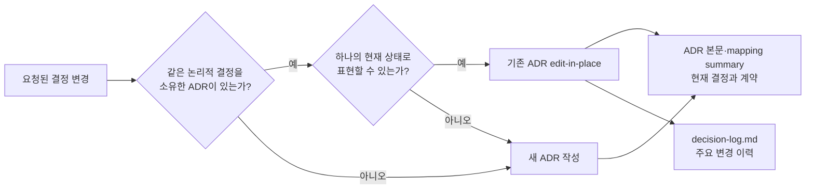

# ADR 0001: ADR 본문에는 최종 결정 상태만 기록

Date: 2026-08-15

## Status

Accepted (2026-09-30)

## Purpose

ADR을 수정할 때 현재 결정이 과거 식별자나 전환 과정과 함께 서술되는 경우가 있다. 이런 비교 서술은 현재 계약을 찾기 어렵게 만들고, 구현에 필요하지 않은 중간 단계를 본문에 누적한다.

같은 논리적 결정의 채택 대안이나 Decision Driver가 바뀔 때마다 새 ADR을 만들면 결정의 개수가 아니라 변경 횟수만큼 문서가 늘어난다. 외부 모델은 유지하면서 제공자를 Amazon Bedrock에서 OpenAI API로 바꾸거나 이전 제공자로 되돌리는 변경도 모델·제공자 경계라는 하나의 결정이 계속 진화하는 경우다.

ADR 본문은 현재 유효한 결정과 요구사항을 독립적으로 설명해야 한다. 선택 과정과 주요 변경 이력은 각각 Alternatives와 decision-log가 담당한다.

동기화와 병합 과정에서 같은 계약의 서로 다른 기록을 발견하면, 무엇을 현재 상태로 남길지 판단해야 한다. 이후에 기록되거나 커밋된 내용을 기본으로 우선하면 명확한 변경을 사용자에게 반복해서 묻지 않을 수 있다. 다만 새로운 코드가 실제 의도 변경인지, 날짜만 최신인 문서가 같은 계약을 바꾼 것인지는 근거로 구분해야 한다.

## Decision Drivers

- 독자는 과거 상태를 해석하지 않고 현재 구현 계약을 바로 파악할 수 있어야 한다.
- 같은 논리적 결정은 채택 대안이나 변경 방향과 무관하게 하나의 안정된 식별자를 유지해야 한다.
- ADR 수와 본문 길이가 결정의 수정·원복 횟수에 비례해 증가하지 않아야 한다.
- 실제 금지 규칙과 폐기된 선택지를 설명하는 부정문을 구분해야 한다.
- 선택 근거와 주요 변경 이력의 추적 가능성은 유지해야 한다.

## Decision

ADR 작성 경로는 새 파일을 만들기 전에 기존 ADR이 같은 논리적 결정 주제를 소유하는지 확인한다. 결정 주제는 현재 채택한 제품명이나 대안이 아니라 ADR이 답하는 질문, 소유하는 요구사항 계약과 시스템 경계로 식별한다.

기존 ADR 하나를 현재 상태로 다시 서술할 수 있으면 그 ADR을 edit-in-place로 갱신한다. 채택 대안 교체, Decision Driver 반전, 외부 제공자 변경과 이전 선택으로의 원복은 별도 결정이 동시에 유효해지는 분기가 아니므로 기존 경로와 번호를 유지하는 major edit-in-place다. 본문과 매핑 summary에는 현재 결과만 기록하고 주요 변경 이유는 decision-log에 남긴다.

새 ADR은 기존 ADR이 그 결정 주제를 소유하지 않거나, 결정 주제가 분기되어 이전 결정과 새 결정이 각각 현재 상태의 독립 기록으로 동시에 존재해야 할 때만 만든다.

같은 결정의 충돌하는 내용은 실제 기록 또는 커밋에서 나중에 변경된 내용을 기본으로 우선한다. 날짜가 새롭다는 사실과 계약의 의미가 바뀌었다는 사실은 구분한다. 명확한 최신 결정은 현재 본문에 반영하고, 대체되지 않은 이전 요구사항과 현재 선택에 유효한 이유는 보존한다. 의도나 선후 관계가 불명확한 충돌은 최신 내용과 근거를 권고안으로 제시해 일괄 확인한다.

### Requirement contract

- ADR admission gate를 통과한 요청은 새 ADR 생성 전에 `.mapping.json` summary와 관련 ADR 본문을 읽어 기존 결정 소유자를 찾는다.
- 기존 결정 일치 여부는 현재 대안, 제공자 이름이나 변경 방향이 아니라 결정이 답하는 질문, 요구사항 계약과 시스템·데이터·보안·외부 경계로 판정한다.
- 같은 결정이 다른 대안으로 바뀌거나 이전 대안으로 원복되어도 하나의 현재 상태 기록으로 표현할 수 있으면 기존 ADR을 갱신한다.
- 기존 Accepted ADR의 결정이 바뀌면 본문과 mapping summary를 먼저 현재 상태로 갱신하고 Status를 Proposed로 전환한 뒤 구현한다.
- 새 ADR이나 supersede는 기존 결정 소유자가 없거나, 이전 결정과 새 결정이 독립된 현재 상태 기록으로 공존해야 하는 분기에만 허용한다.
- Context, Decision, requirement contract, Consequences와 매핑 summary는 현재 유효한 결과를 직접 서술한다.
- 폐기된 식별자, 이전 값, 전환 단계와 변경 작업 자체는 현재 계약에 필요하지 않으면 ADR 본문에서 제거한다.
- 현재 선택을 표현하기 위해 과거 선택을 함께 나열하는 비교 문장을 사용하지 않는다.
- 실제로 금지된 상태 전이, 보안 제한, 허용 값 집합처럼 현재도 지켜야 하는 부정형 요구사항은 유지한다.
- 채택되지 않은 선택과 비교 근거는 Alternatives에 기록한다.
- 주요 결정 변경의 이전 상태와 변경 이유는 decision-log에 기록한다.

#### 충돌의 기준 상태 선택

| 의무                                                                                                                                                       | 관찰 가능한 검증 기준                                                                                                                     |
| ---------------------------------------------------------------------------------------------------------------------------------------------------------- | ----------------------------------------------------------------------------------------------------------------------------------------- |
| 같은 결정과 같은 요구사항 범위에서 충돌하면 이후에 기록되거나 커밋된 내용을 기본 우선안으로 선택한다.                                                      | 더 최근에 명시적으로 바뀐 계약이 확인되면 과거 계약을 현재 상태로 되살리지 않는다. 비교한 내용과 우선안의 근거를 결과에서 확인할 수 있다. |
| 최신 여부는 충돌하는 내용의 의미 변경 이력으로 판단한다.                                                                                                   | 파일 복사·이동, 정렬·문체 수정, 번호 변경이나 파일 수정 시각만으로 계약의 우선순위가 뒤집히지 않는다.                                     |
| Git 이력이 있는 경우 내용 변경과 선후 관계를 함께 확인하고, 기록 날짜와 커밋 순서가 충돌하거나 서로 다른 분기의 순서를 확정할 수 없으면 불명확으로 남긴다. | 최신 커밋의 표면적 시각만으로 다른 분기의 계약을 폐기하지 않는다. 이력이 없으면 확인 가능한 기록과 한계를 제시한다.                       |
| 사용자가 현재 세션에서 명시한 의도와 충돌 해소 답변을 우선한다.                                                                                            | 사용자가 과거 선택을 유지하거나 원복하라고 답하면 단순한 최신 기록 규칙으로 그 답을 뒤집지 않는다.                                        |
| 최신 기록이 대체한 의무만 갱신하고 나머지 유효한 요구사항과 이유는 보존한다.                                                                               | 최근 변경에서 언급하지 않은 권한, 상태, 한도 또는 실패 보장이 병합 과정에서 사라지지 않는다.                                              |
| 최신 코드만으로 의도적인 계약 변경을 확정하지 않는다.                                                                                                      | 코드가 더 최근이면 해당 동작을 기본 권고안으로 제시하되, 의도를 확인할 근거가 없으면 계약 변경인지 구현 위반인지 일괄 질문에 남긴다.      |
| 명확한 기존 결정 복원은 허가된 범위에서 자동으로 진행하고, 새로운 계약 채택이나 남은 의도 충돌은 구체적인 변경 내용을 보여준 뒤 확인한다.                  | 같은 답을 반복해서 묻지 않으며, 새롭거나 불명확한 계약을 선후 관계만으로 승인된 것으로 처리하지 않는다.                                   |
| 최신 내용 선택은 결정의 소유자, 병합 범위, 생존 문서 선택과 파괴적 변경 승인 규칙을 바꾸지 않는다.                                                         | 최신 내용을 이유로 다른 기능의 ADR을 병합하거나 승인되지 않은 삭제·경로 변경을 하지 않는다.                                               |

### Alternatives

1. **시간 순서 표현만 제거**
   - 장점: 기존 current-state 규칙을 조금만 확장하면 된다.
   - 단점: 과거 선택을 부정문으로 끌고 오는 비교 서술이 계속 남는다.

2. **최종 상태 직접 서술과 기록 위치 분리**
   - 장점: 이후에 기록되거나 커밋된 의미 변경을 기본으로 현재 계약을 정리하고, 선택 근거와 주요 이력도 보존한다.
   - 단점: 새 ADR 생성 전에 기존 결정 소유자를 판정하고, 충돌 시 실제 의미 변경과 선후 관계를 확인해야 한다.

3. **현재 선택과 이전 선택을 본문에 함께 기록**
   - 장점: 한 문서에서 전환 맥락을 모두 볼 수 있다.
   - 단점: 수정이 반복될수록 본문이 길어지고 현재 계약과 이력이 섞인다.

4. **대안 변경과 원복마다 새 ADR 작성**
   - 장점: 각 변경 시점의 전체 본문을 별도 문서로 보존한다.
   - 단점: 같은 결정이 여러 번호로 분산되고 현재 권위 문서를 찾기 어려워진다.

## Consequences

### Positive

- ADR 본문이 현재 구현 계약을 짧고 직접적으로 전달한다.
- 같은 결정의 변경과 원복이 반복되어도 ADR 식별자와 문서 수가 안정적으로 유지된다.
- Alternatives와 decision-log의 책임이 명확해진다.

### Negative

- 작성자는 부정형 문장이 현재 요구사항인지 과거 선택의 흔적인지 판단해야 한다.
- 작성자는 새 결정을 만들기 전에 기존 ADR의 논리적 결정 주제를 비교해야 한다.
- 기존 ADR을 수정할 때 불필요한 비교 서술을 함께 정리해야 한다.

### Risks

- 최신 파일이나 커밋 시각만 비교하면 문체 수정이나 이동이 계약 변경으로 오인될 수 있다. 충돌한 내용의 의미 변경 이력과 사용자 의도를 확인하며, 선후 관계가 불명확하면 권고안과 근거를 일괄 질문으로 남긴다.
- 제품명이나 변경 방향만 비교하면 같은 결정을 다른 결정으로 오인할 수 있다. 리뷰는 ADR이 답하는 질문과 소유 경계를 기준으로 동일성을 판정해야 한다.
- 간결화를 이유로 실제 금지 규칙이나 요구사항을 제거할 수 있다. 리뷰는 현재도 지켜야 하는 계약을 우선 보존해야 한다.

## Related

- 없음
