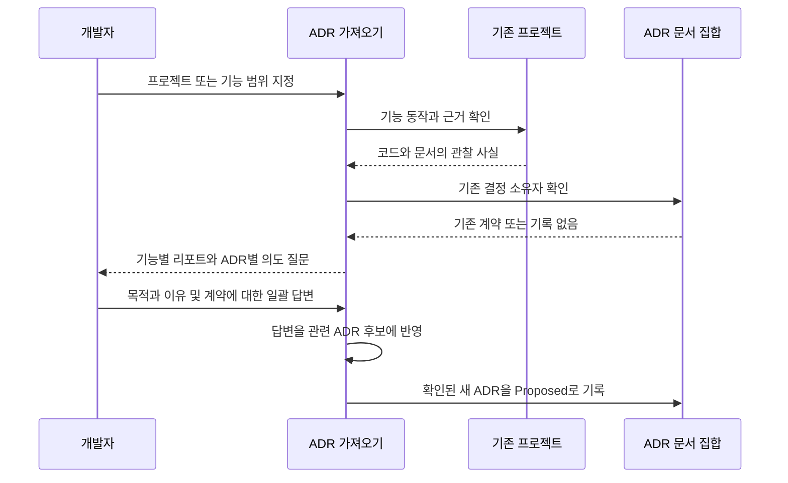

# ADR 0001: 기존 프로젝트의 기능과 계약을 근거 기반으로 ADR에 정리

Date: 2026-09-30

## Status

Accepted (2026-09-30)

## Purpose

기존 프로젝트에 ADR을 도입하려는 개발자는 코드와 문서에 흩어진 기능을 먼저 파악해야 한다. 단일 결정을 작성하거나 이미 있는 ADR을 점검하는 기능만으로는, 어떤 기능을 문서화해야 하고 어떤 요구사항이 빠져 있는지 전체 범위에서 확인하기 어렵다.

ADR Writer는 프로젝트를 읽어 사용자 기능과 지속적인 설계 결정을 발견하고, 유지할 계약을 확인한 뒤 기능별 ADR로 정리한다. 도입 목적과 이유는 대부분 코드에 없을 수 있으므로, 각 ADR에 필요한 질문을 기능별 리포트로 모아 한 번에 받는다. 코드에서 관찰한 동작과 앞으로 지켜야 할 요구사항을 구분해, 우연한 구현 선택이나 결함이 확정 계약으로 기록되는 것을 막는다.

## Decision Drivers

- 개발자는 별도 제품 기획 문서가 없어도 기존 프로젝트의 기능과 설계 결정을 정리할 수 있어야 한다.
- 의도를 ADR마다 따로 질문하는 대화 부담을 줄이면서 기능별로 필요한 답변을 빠뜨리지 않아야 한다.
- 현재 구현만으로 확인할 수 없는 도입 이유와 유지 의무를 사실처럼 기록하면 이후 개발의 기준이 왜곡된다.
- 기존 ADR과 반복 실행을 존중해 하나의 결정을 여러 문서로 늘리지 않아야 한다.

## Decision

ADR Writer는 기존 저장소에서 기능과 결정 후보를 발견하는 가져오기 기능을 제공한다. 저장소 구성과 실행·배포 형태를 먼저 파악하고, DDD의 바운디드 컨텍스트, 즉 같은 업무 용어와 규칙의 경계 안에서 기능을 분류한다. 각 기능은 하나의 사용자 행동과 결과를 잇는 버티컬 슬라이스 또는 사용자 스토리로 구성한다. 코드 분석으로 준비할 수 있는 내용을 먼저 정리한 뒤, 각 ADR의 목적·이유 질문과 계약 후보를 하나의 기능별 리포트로 제시한다. 개발자의 일괄 답변을 해당 ADR들에 반영하고, 확인된 내용으로 ADR과 ADR 색인을 작성한다.

가져오기는 현재 구현을 계약으로 채택할지 확인하는 문서화 경계다. 도입 당시의 이유를 알 수 없으면 그 사실을 밝히고, 현재 선택을 유지할 이유를 제안해 확인받을 수 있다. 이때 새로 확인한 유지 이유를 과거의 의사결정 이력으로 서술하지 않는다.

개발자는 같은 리포트에서 관찰 사실과 계약 후보를 읽고 의도를 답한다. 답변으로 계약이 바뀌거나 중요한 질문이 남으면 해당 항목만 모아 확인한다. 기존 ADR의 변경도 같은 리포트에서 의미 차이를 제시한다.

### Requirement contract

#### 기능 발견과 범위

| 의무                                                                                                                                                     | 관찰 가능한 검증 기준                                                                                                                                                   |
| -------------------------------------------------------------------------------------------------------------------------------------------------------- | ----------------------------------------------------------------------------------------------------------------------------------------------------------------------- |
| 가져오기는 ADR Writer 단독으로 기존 저장소를 입력받아 사용할 수 있다.                                                                                    | ADR과 제품 기획 문서가 없는 저장소에서도 기능 및 결정 후보를 제시한다.                                                                                                  |
| 범위를 지정하지 않으면 현재 저장소 전체를 탐색 대상으로 삼고, 지정하면 해당 기능 또는 하위 프로젝트와 그 계약을 이해하는 데 필요한 관련 범위를 조사한다. | 여러 하위 프로젝트가 있는 저장소에서 전체 요청의 조사 범위가 특정 하위 프로젝트로 조용히 축소되지 않는다. 지정 범위에서는 관련 없는 기능을 생성 대상으로 삼지 않는다.   |
| 저장소·실행 구조 조사와 업무 경계별 기능 조직은 공통 문서 구성 계약을 따른다.                                                                            | 모노레포·멀티레포와 모노리스·마이크로서비스를 별도 축으로 파악한 뒤 바운디드 컨텍스트와 기능별로 정리한다. 접근하지 못한 관련 프로젝트는 미확인 범위로 표시한다.        |
| 코드, 테스트, 저장소 문서와 설정에서 사용자 동작과 결과를 확인하고 기능 단위로 묶는다.                                                                   | 하나의 기능이 화면·요청 처리·데이터 처리에 나뉘어 있어도 같은 버티컬 슬라이스 또는 사용자 스토리에 모으며, 프런트엔드·백엔드·데이터베이스 계층별 ADR로 분리하지 않는다. |
| 각 발견 기능의 처리 결과와 조사하지 못한 범위를 표시한다.                                                                                                | 개발자가 기존 ADR에 포함된 기능, 새 ADR 후보, ADR 대상이 아닌 항목, 근거 부족으로 보류된 항목을 구분할 수 있다.                                                         |

#### 의도 수집과 계약 근거

| 의무                                                                                                                                  | 관찰 가능한 검증 기준                                                                                                                                                                                            |
| ------------------------------------------------------------------------------------------------------------------------------------- | ---------------------------------------------------------------------------------------------------------------------------------------------------------------------------------------------------------------- |
| 독립적으로 가능한 프로젝트 분석과 계약 초안 작성을 마친 뒤, ADR별 의도 질문을 기능 또는 도메인별 리포트 하나로 모아 한 번에 제시한다. | 여러 ADR 후보의 목적이 코드에 없어도 후보마다 대화를 멈추지 않고, 전체 후보와 질문을 함께 검토할 수 있다.                                                                                                        |
| 각 ADR 후보는 확인한 동작, 업무 경계, 유지할 계약 후보, 미확인 목적·이유와 답할 질문을 함께 보여준다.                                 | 사용자가 코드를 다시 읽지 않고 어떤 결정의 무엇을 설명해야 하는지 알 수 있다. 업무 경계에 대한 중요한 질문도 같은 리포트에 포함한다. 이미 제공한 의도는 출처와 함께 재사용하며 같은 내용을 다시 질문하지 않는다. |
| 사용자는 리포트의 질문을 식별해 한 번의 응답으로 여러 ADR의 의도와 계약 확인을 전달할 수 있다.                                        | 여러 답변이 해당 ADR 후보에 정확히 연결된다. 공통 답변은 사용자가 지정한 적용 범위에만 재사용한다.                                                                                                               |
| 질문에 대한 답변과 이해도 확인 문제의 응답은 구분한다.                                                                                | 리포트의 학습용 문제를 풀거나 정답을 확인한 행동이 ADR 의도 응답이나 계약 승인으로 처리되지 않는다.                                                                                                              |
| ADR admission gate로 지속적인 계약과 설계 결정만 ADR 대상으로 삼는다.                                                                 | 교체 가능한 라이브러리나 폴더 구조만 있는 항목은 별도 ADR을 만들지 않는다. 한 기능 안의 독립된 결정은 각각 기록할 수 있다.                                                                                       |
| 현재 동작의 관찰, 이미 확인된 요구사항, 새 계약 제안을 구분해 제시한다.                                                               | 코드에만 나타나는 제한값을 기존 정책으로 단정하지 않고, 정확한 값과 관찰 근거를 제시해 유지 여부를 확인한다.                                                                                                     |
| 도입 이유, 과거 검토 대안, 사업 목적을 근거 없이 만들어 내지 않는다.                                                                  | 과거 이유를 모르면 미확인으로 표시한다. 현재 유지 이유나 대안을 제안할 때 과거 사실과 구분한다.                                                                                                                  |
| 확정할 ADR은 목적, 현재 결정과 이유, 정확한 요구사항 및 구현 독립적인 관찰 기준을 자체적으로 설명한다.                                | 저장소가 없어도 ADR만으로 요구사항을 지키는 재구현과 위반을 구분할 수 있다.                                                                                                                                      |
| 확인된 수치·단위, 허용 상태, 필수 입력, 권한, 순서, 유일성, 실패 보장과 외부 경계를 소유 ADR에 보존한다.                              | 코드에서도 읽을 수 있다는 이유로 요구사항이 빠지지 않으며, 교체 가능한 구현 세부사항은 계약으로 올라오지 않는다.                                                                                                 |

#### 기존 문서와 작성 경계

| 의무                                                                                                             | 관찰 가능한 검증 기준                                                                                                                                                        |
| ---------------------------------------------------------------------------------------------------------------- | ---------------------------------------------------------------------------------------------------------------------------------------------------------------------------- |
| 기존 ADR 색인과 관련 본문에서 같은 결정의 소유자를 먼저 찾는다.                                                  | 이름이나 구현 대안이 달라도 같은 질문과 경계를 소유한 ADR을 재사용하며 중복 ADR을 만들지 않는다.                                                                             |
| 동일한 근거와 계약을 다시 가져오면 의미 변경이 없는 기존 ADR과 색인을 수정하지 않는다.                           | 반복 실행으로 문서, 번호, 날짜 또는 색인 항목이 늘거나 달라지지 않는다.                                                                                                      |
| 의도 수집 리포트에서 새 계약 또는 변경 계약의 확인도 함께 요청하고, 같은 범위의 명시적인 일괄 승인을 재사용한다. | 사용자가 제시된 계약을 확인하고 의도를 답하면 관련 ADR들을 작성하며, 기능마다 같은 확인을 반복하지 않는다. 의도만 답하고 계약 확인을 보류한 응답은 승인으로 취급하지 않는다. |
| 답변 반영 후 새로운 계약 변경, 충돌 또는 중요한 미확인 사항이 생길 때만 영향받는 항목을 모아 후속 확인한다.      | 답변이 끝난 질문은 후속 리포트에서 다시 요구하지 않는다. 무응답이나 “모르겠다”는 근거 또는 승인으로 바뀌지 않는다.                                                           |
| 새 ADR은 Proposed로 기록한다.                                                                                    | 기존 코드나 테스트가 있다는 사실만으로 Accepted가 되지 않는다. Accepted는 기존 구현 완료·필수 검증·최종 리뷰 절차를 통과해야 한다.                                           |
| ADR 색인에는 기능 분류와 ADR 경로·상태·요약 및 실제 선행 계약 관계만 기록한다.                                   | 코드의 import 관계만으로 기능 의존 관계를 만들지 않는다. 자신을 참조하거나 순환하거나 존재하지 않는 선행 범주를 가리키는 관계를 저장하지 않는다.                             |
| 지속적인 탐색 기록이나 별도 승인 저장소를 요구하지 않는다.                                                       | 플러그인과 임시 분석 자료를 제거해도 ADR과 색인만으로 결정과 계약을 읽을 수 있다. 코드 위치는 필요할 때 다시 찾는다.                                                         |

#### 충돌과 미완료 처리

| 의무                                                                                                                    | 관찰 가능한 검증 기준                                                                                      |
| ----------------------------------------------------------------------------------------------------------------------- | ---------------------------------------------------------------------------------------------------------- |
| 코드와 기존 ADR의 계약이 충돌하면 차이와 영향받는 기능을 제시하고 어느 계약을 유지할지 확인하기 전에는 덮어쓰지 않는다. | 관찰된 구현 차이가 기존 계약을 자동으로 바꾸지 않는다.                                                     |
| 계약을 바꿀 수 있는 미확인 사항은 해당 후보의 확정을 보류하고, 독립적으로 확인 가능한 후보는 계속 준비한다.             | 한 기능의 도입 이유나 권한이 불명확해도 다른 기능의 조사는 진행되며, 보류된 기능을 완료로 보고하지 않는다. |
| 가져오기 자체는 대상 애플리케이션 코드나 운영 환경을 변경하지 않는다.                                                   | 문서화 요청이 자동 구현, 배포 또는 운영 데이터 변경으로 이어지지 않는다.                                   |
| 각 ADR과 해당 색인 항목의 일관성을 확인한 뒤 완료를 보고한다.                                                           | 저장이나 검증 실패 시 실패한 항목과 이미 완료된 항목을 구분하며 전체 성공으로 표시하지 않는다.             |

### Alternatives

1. **기존 ADR 동기화에 프로젝트 발견을 통합**
   - 장점: 이미 문서가 있는 프로젝트에서는 점검과 누락 발견을 한 진입점에서 수행한다.
   - 단점: 문서 간 불일치를 고치는 작업과, 기록되지 않은 동작을 새 계약으로 채택하는 작업의 범위 및 승인 기준이 섞인다.

2. **기존 프로젝트 가져오기를 독립 진입점으로 제공**
   - 장점: ADR이 없는 프로젝트와 일부만 문서화된 프로젝트에서 같은 발견 흐름을 사용한다. 의도 질문과 계약 확인을 리포트로 모아 처리하면서 기존 작성·검증 기준을 이어 쓸 수 있다.
   - 단점: 사용자는 프로젝트 전체를 정리할 때와 단일 결정을 작성할 때의 진입점을 구분해야 한다. 분석 범위가 크면 질문 리포트도 길어질 수 있다.

3. **모든 발견 동작을 현재 계약으로 즉시 기록**
   - 장점: 사용자 확인 없이 전체 문서 초안을 빠르게 얻는다.
   - 단점: 결함이나 우연한 구현 선택도 유지 의무가 되고, 근거 없는 도입 이유가 이후 개발을 제약할 수 있다.

## Consequences

### Positive

개발자는 기획 문서 작성부터 다시 시작하지 않고 기존 프로젝트의 기능을 ADR로 정리할 수 있다. 확인된 계약은 기존 개발 주기에 편입되며, 기능별로 문서화된 범위와 남은 질문을 파악할 수 있다.

### Negative

코드에 없는 이유와 정책을 확인하는 데 개발자 판단이 필요할 수 있다. 리포트는 반복 대화를 줄이지만 모든 목적을 코드에서 복구하지는 못한다. 가져오기 직후의 Proposed 상태는 코드가 없다는 뜻이 아니라, 해당 계약에 대한 완료 검증이 아직 끝나지 않았다는 뜻이다.

### Risks

테스트가 현재 구현과 같은 오해를 담으면 관찰 근거가 많아도 계약이 올바르다는 결론은 나오지 않는다. 근거 종류와 확인 범위를 드러내고, 계약 채택을 별도 판단으로 유지해야 한다. 큰 프로젝트에서 발견 누락이 생길 수 있으므로 조사하지 못한 범위를 완료된 범위와 구분한다.

## Related

- [업무 경계와 기능별 문서 구성](../../document-authoring/domain-organization/0001-organize-features-by-bounded-context.md)
- [지속적인 아키텍처 결정만 기록](../decision-boundary/0001-admit-only-architectural-decisions.md)
- [하나의 결정은 하나의 현재 상태 ADR로 유지](../current-state/0001-record-only-the-final-decision-state.md)
