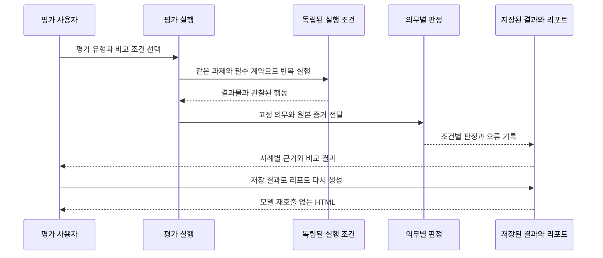

# ADR 0001: Skill 평가의 실행 증거와 비교 결과를 통합

Date: 2026-08-15

## Status

Accepted (2026-09-25)

## Context

정적 테스트는 prompt에 특정 문구가 존재하는지 확인하지만 실제 model이 상충하는 지시 사이에서 어떤 행동을 선택하는지는 확인하지 못한다. Admission, dependency, 요구사항 보존과 review routing은 한 번의 오분류가 잘못된 ADR이나 완료 상태를 만들 수 있다.

Skill 작성자는 어떤 지침이 실패를 줄이는지, 필요한 Skill이 선택되는지, 실제 작업이 끝나는지를 구분해 확인해야 한다. 버전 간 성공률 비교만으로는 Skill이 없는 조건보다 도움이 되는지 알 수 없다. 평가 실행과 결과 해석이 분리되어 있으면 같은 증거를 다시 보기 위해 불필요한 모델 호출을 반복하거나 분류 답변을 작업 완료로 오해할 수 있다.

모든 prompt를 live model로 검사하면 비용과 비결정성이 커지므로 안전 분류에 집중한 비차단 행동 평가와 재사용 가능한 실행 증거가 필요하다.

## Decision Drivers

- 안전 분류는 실제 행동으로 검증하고, 한 시나리오의 개선이 반대 행동을 깨뜨리는지도 확인해야 한다.
- live model 평가는 CI를 불안정하게 만들면 안 된다.
- 재현 가능한 defect는 반복 실행으로 측정하고 실행 오류와 행동 실패를 구분해야 한다.
- Skill의 유지·수정 판단은 같은 과제와 필수 계약을 보존한 사용·미사용 비교에 근거해야 한다.
- 사용자는 평가 결과에서 실패 원인과 원본 증거를 확인하고 모델 재호출 없이 보고서를 다시 열 수 있어야 한다.

## Decision

Skill 평가는 지침에 대한 분류 응답, Skill 선택, 실제 작업 수행을 구분하고 공통 실행·비교·보고 체계로 제공한다. 영속 상태나 계약 소유권을 바꾸는 prompt 분류에는 정적 테스트와 별도의 행동 시나리오를 둔다. 판정 가능한 조건은 결정적으로 검사하고 자연어 의미는 실제 증거를 대조하는 모델 평가로 보완한다.

대상에는 ADR admission, 완전한 PRD 계약 소유권 이전, 반복 import의 semantic no-op, 삭제 계약의 자동 제거 금지, 선행 ADR 차단, 요구사항 값·집합 보존, ALPS 승인 모드와 NFR 보존, implementation-review routing과 계약·안전에 영향을 주는 숨은 미검증 전제 탐지가 포함된다.

요구사항 gap 처리 시나리오는 저장소·도메인 기본값으로 자동 해소할 항목과 여러 제품 선택지가 남아 Decision request가 필요한 항목을 함께 제공해 과소·과잉 escalation을 동시에 검증한다.

변경되지 않은 승인 ADR의 구현 계획은 독립 시나리오로 검증한다. Scorer는 계획이 비차단 진행 상황으로 충분히 공유되고 즉시 진행되는지, 구조화 결과와 사용자에게 보이는 본문 모두에서 routine approval을 요구하지 않는지, 기존 `Accepted` Status를 `Proposed`로 내리지 않는지 확인한다.

행동 시나리오는 실제 skill·agent·hook text를 사용하고 서로 반대되는 기대를 pair로 검증한다. Live model 평가는 CI에 넣지 않고 릴리스 또는 defect 재현 시 여러 번 실행해 hit rate를 기록한다.

### Requirement contract

#### 중요한 분류의 보존

- 영속 상태나 요구사항 계약을 결정하는 새 prompt 분류에는 최소 하나의 행동 시나리오가 있어야 한다.
- 과도 생성과 누락 위험이 모두 있는 분류는 반대 방향 시나리오를 함께 둔다.
- 시나리오는 재구성한 요약이 아니라 shipping prompt text를 사용한다.
- scorer는 문구 일치보다 생성된 artifact와 행동 결과를 우선 평가한다.
- 계약·안전에 영향을 주는 외부 전제가 fixture에 숨어 있으면 scorer는 reviewer가 전제, 실패 영향과 부족한 검증을 드러내고 `PASS`를 거부하는지 확인한다.
- gap-resolution scorer는 자동 해소 항목의 근거와 비차단 진행, 제품 판단 항목의 추천안·대안·영향·ADR 문구를 모두 확인한다.
- 변경되지 않은 승인 ADR의 planning scorer는 완전한 progress update와 즉시 진행을 확인하고 visible report의 routine plan approval 요청과 `Accepted → Proposed` 오판을 거부한다.
- live model eval 실패는 CI 실패로 취급하지 않지만 릴리스 판단 자료에 포함한다.
- 정적 테스트는 scenario shape, scorer의 양·음성 구분과 fixture 유효성을 검증한다.

#### 평가 조건과 격리

- 평가 유형은 분류 응답, Skill 선택, 실제 수행을 구분한다. 관찰 가능한 결과: 분류 답변만 있는 결과에는 실제 작업 완료율을 표시하지 않는다.
- 선택 평가는 실제 배포할 이름·설명과 사용자 요청에서 시작하고 필요한 Skill 본문을 선택한 뒤 읽을 수 있게 한다. 관찰 가능한 결과: 잘못된 Skill 선택과 필요한 Skill 미선택을 각각 구분할 수 있다.
- 선택 평가에는 필요한 사례와 불필요한 사례를 함께 둔다. 관찰 가능한 결과: 불필요한 요청에서 Skill을 선택한 경우도 선택 오류에 포함된다.
- 통제된 선택 환경과 실제 클라이언트의 설치·자동 호출 검증 범위를 구분한다. 관찰 가능한 결과: 통제된 목록 선택 통과를 실제 클라이언트 자동 호출 성공이라고 표시하지 않는다.
- 실제 수행의 성공은 결과물과 관찰된 행동으로 확인한다. 관찰 가능한 결과: 계획·완료 선언만 있고 필요한 변경이나 검증이 없으면 수행 성공으로 채점하지 않는다.
- 권한·승인·상태 변경의 순서가 계약이면 중간 행동도 판정한다. 관찰 가능한 결과: 승인 전 변경을 나중에 되돌려도 최종 파일만으로 성공 판정을 받지 않는다.
- 각 사례·반복·비교 조건은 새 작업공간과 독립 세션에서 실행한다. 관찰 가능한 결과: 다른 실행의 결과·대화·사용자 전역 지침을 읽어 성공한 결과가 통제된 평가에 섞이지 않는다.
- 모델 호출 전에 필요한 배포 지침과 참고 문서를 읽을 수 있어야 한다. 관찰 가능한 결과: 필요한 문서가 없거나 허용된 도구로 읽을 수 없으면 평가 준비 오류가 된다.

#### 비교와 판정의 의미

- 실제 수행 평가는 기준 버전·후보 버전 비교와 Skill 사용·미사용 비교를 지원하고 두 비교를 구분한다. 관찰 가능한 결과: 이전 버전만 비교한 결과에는 Skill 자체의 효과를 표시하지 않는다.
- 미사용 조건은 대상 Skill 실행 지침과 그 보조 Skill·agent·reference·hook 지침에 접근할 수 없다. 관찰 가능한 결과: 다른 경로로 같은 실행 지침을 읽은 결과를 미사용 비교에 포함하지 않는다.
- 비교 양쪽의 사용자 과제, 필수 제품·조직 계약, 초기 파일, 도구 권한, 평가 의무와 실행 한도는 동일하다. 관찰 가능한 결과: Skill 제거와 함께 필수 조건을 제거하거나 평가기를 바꾼 결과는 비교 불충분으로 표시한다.
- 비교는 실제 대상 모델과 판정 모델, 평가 집합, 기준일과 실행 조건의 일치를 확인한다. 관찰 가능한 결과: 확인되지 않거나 서로 다른 조건의 결과는 비교 불충분으로 표시한다.
- Skill Lift는 동일 사례·반복의 유효한 쌍에서 사용 성공률에서 미사용 성공률을 뺀 값이며 단위는 퍼센트포인트다. 관찰 가능한 결과: 미사용 60%, 사용 85%이면 차이는 +25%p이고, 비교에서 제외한 쌍은 별도 집계된다.
- 유효한 쌍이 없는 경우 Skill Lift를 수치로 제시하지 않는다. 관찰 가능한 결과: 실행 오류만 있는 두 조건을 0%p로 표시하지 않는다.
- 보고서는 반복별 결과와 사례별 성공·실패를 보존한다. 관찰 가능한 결과: 같은 사례를 여러 번 실행한 결과를 서로 다른 과제 수로 계산하지 않는다.
- 결과는 성공, 행동 미충족·미검증, 실행·채점 오류, 미실행을 구분한다. 관찰 가능한 결과: 오류와 미실행은 성공률 분모에 들어가지 않고 전체 요청·완료·오류 수에는 남는다.
- 선택 평가는 필요한 Skill을 얼마나 빠짐없이 골랐는지와 선택한 Skill이 얼마나 적절했는지를 각각 표시한다. 관찰 가능한 결과: 필요한 선택의 누락과 불필요한 선택을 별도 분자·분모로 확인하며 분모가 없으면 비율을 비워 둔다.
- 의미 판정은 고정된 의무와 원본 증거를 사용하고 의무별 판정과 근거를 남긴다. 관찰 가능한 결과: 근거 누락·존재하지 않는 인용·판정 모순은 채점 오류가 되며 생성자의 성공 선언으로 대체하지 않는다.
- 결정적 검사와 의미 판정의 결과를 합칠 때 필수 조건의 실패를 평균 점수로 상쇄하지 않는다. 관찰 가능한 결과: 필수 계약 위반 하나가 다른 성공에 가려져 전체 성공으로 처리되지 않는다.

#### 실행과 보고서 제공

- 평가 집합 선택·준비·반복 실행·결과 열기를 일관된 진입점으로 제공한다. 관찰 가능한 결과: 사용자가 평가 유형마다 별도 내부 실행기를 조합하지 않고 원하는 결과를 얻는다.
- 준비·목록·리포트 재생성은 모델을 호출하지 않는다. 관찰 가능한 결과: 실행하지 않은 준비 결과는 미실행으로 남고 저장된 결과를 다시 볼 때 새 평가 비용이 발생하지 않는다.
- live 평가는 명시적으로 요청한 경우에만 실행하고 비용·실행 시간을 보고한다. 관찰 가능한 결과: 금액을 제공하지 않은 호출은 무료로 표시하지 않으며, 준비만 요청했을 때 유료 호출이 없다.
- 지침과 공통 참고 문서의 변경은 관련 평가를 선택한다. 관찰 가능한 결과: 관련 시나리오가 있는 참고 문서만 바꿔도 영향 목록에 해당 시나리오가 표시된다.
- 저장된 원본 결과와 실행 증거를 유지한 채 자체 포함 HTML 리포트를 생성·재생성한다. 관찰 가능한 결과: 리포트에서 전체 판단, 평가 유형·조건, 사례별 결과와 근거로 내려갈 수 있고 재생성 전후 점수·증거·평가 시각이 같다.
- 보고서는 선택 기준과 평가 범위, 미검증 조건, 실행 횟수·모델·소요 시간·알려진 비용, 전체 요청·평가 완료·오류 수를 제공한다. 관찰 가능한 결과: 제외된 실행이나 확인하지 않은 범위가 성공률 뒤에 숨지 않는다.
- 모델·클라이언트 변경 후 같은 평가 집합을 재실행할 수 있어야 한다. 관찰 가능한 결과: 재평가 결과에 사용한 모델·실행 환경과 지침·평가 집합의 버전 근거가 남는다.
- Skill을 폐기해도 과제와 필수 계약 검사는 유지한다. 관찰 가능한 결과: Skill 부재만으로 회귀 사례가 자동 삭제되거나 성공 처리되지 않는다.
- 평가 결과만으로 Skill을 자동 삭제하거나 필수 조직 계약을 완화하지 않는다. 관찰 가능한 결과: 관찰된 작은 성공률 차이는 유지·수정·폐기 판단 자료로 남는다.
- live 평가 결과는 CI 차단 조건으로 사용하지 않는다. 관찰 가능한 결과: 실행·판정 오류와 품질 결과를 구분해 보고하면서 기존 결정적 CI 검사를 유지한다.

공통 보고서 계약의 도메인별 계층, 원본 근거 보존, Mermaid 설명과 선택적 대화형 이해도 확인을 적용한다. 형식 검증과 실제 의미·시각 검토 여부는 구분한다. 평가 입력·결과·실행 계획은 재생성 가능한 임시 산출물이며 제품이나 구현의 추가 권위가 되지 않는다.

### Alternatives

1. **정적 prompt 문구 테스트만 유지**
   - 장점: 빠르고 결정적이다.
   - 단점: model이 지시를 실제로 따르는지 알 수 없다.

2. **모든 prompt 행동 eval을 CI에서 실행**
   - 장점: 모든 변경에 즉시 행동 신호가 생긴다.
   - 단점: 비용과 비결정성 때문에 publication gate가 불안정해진다.

3. **독립된 실행기별 평가와 보고서**
   - 장점: 기존 평가마다 특화된 동작을 유지하기 쉽다.
   - 단점: 성공률의 의미와 비교 조건이 달라 결과를 함께 해석하기 어렵다.

4. **공통 증거·비교 계약을 따르는 비차단 평가**
   - 장점: 평가 유형을 구분하면서 같은 과제의 지침 효과와 회귀를 함께 읽을 수 있다. 저장된 증거로 보고서를 재생성할 수 있다.
   - 단점: 비교 조건을 통제하는 비용이 들고, 통제된 평가가 실제 클라이언트와 모든 사용자 상황을 대신하지는 않는다.

## Consequences

### Positive

- prompt가 말하는 규칙과 model이 실행하는 행동의 차이를 측정한다.
- 반대 방향 회귀를 함께 탐지한다.
- 보고된 defect를 반복 가능한 fixture로 남긴다.
- Skill 효과와 버전 회귀, 선택 오류와 실행 실패를 분리해 해석한다.
- 저장된 증거로 결과를 다시 검토할 수 있어 불필요한 재실행을 줄인다.

### Negative

- live model 실행 비용과 시간이 추가된다.
- 통과는 행동의 수학적 보장이 아니다.
- 사용·미사용 반복 비교는 단일 조건 실행보다 비용이 높다.
- 초기 입력과 조직 계약을 고정한 평가의 결과는 그 평가 집합과 조건에 한정한다.

### Risks

- scorer가 약하면 잘못된 응답을 통과시킬 수 있다. scorer 자체를 stub 응답으로 양방향 검증한다.

## Related

- [도메인별 보고서 제공](../../reporting/domain-navigation/0001-domain-first-report-navigation.md) — 결과 의미와 원본 근거를 보존하며 공통 보고서 구조를 적용한다.
