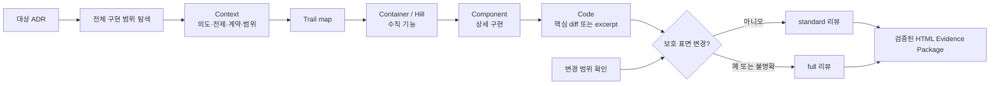

# ADR 0001: 위험에 비례하는 구현 검토와 저위험 리팩토링

Date: 2026-08-15

## Status

Accepted (2026-09-07)

## Context

구현 완료 전 검토는 ADR 충족 여부, 불필요한 변경, 누락된 동작과 검증 강도를 다룬다. 공개 계약이나 상태 전이를 바꾸는 구현에는 독립적인 다관점 검토가 필요하지만, 보호 표면을 건드리지 않는 국소 구현까지 동일한 보고서와 시각화 절차를 강제하면 검토 비용이 변경 위험과 무관해진다.

full 리뷰에서도 모든 PASS 결과에 긴 repair guide, 고정 개수의 다이어그램과 구현 선택 판정을 요구하면 사용자는 실제 위험보다 보고서 형식을 더 많이 읽게 된다. ADR이 정하지 않은 구현 재량은 필요할 때 드러나야 하지만, 여러 agent가 같은 목록을 반복 추출하거나 모든 기본값에 근거와 대안을 요구하면 검토가 새로운 프레임워크가 된다.

구현 전 승인한 ADR을 기준선으로 사용하고, 구현 후에는 계약 대조와 테스트 증거를 항상 유지해야 한다. 상세 설명, 다이어그램과 구현 선택은 판정에 기여할 때만 추가해야 한다.

하지만 다이어그램 사용을 막연한 선택으로만 두고 계약 coverage 표부터 보여주면, 해당 구현을 처음 보는 개발자는 요청 흐름과 실패 지점을 머릿속에서 다시 조립한 뒤에야 증거를 읽을 수 있다. 쉬운 설명은 증거를 줄이는 일이 아니라 결론과 시스템 관계를 먼저 보여주고 상세 증거를 그 뒤에 두는 일이어야 한다.

AI가 큰 diff를 빠르게 만들수록 코드 검토의 병목은 문법 확인보다 사람이 변경의 배경, 핵심 아이디어와 실제 실행 흐름을 자기 mental model로 만들 수 있는지로 이동한다. 사람이 검증 결과만 읽고 코드를 설명하지 못한 채 PR을 보내면 이후 수정과 장애 대응에서 인지부채가 기술부채로 전환된다.

구현 설명의 형식을 완전히 자유롭게 두면 주제마다 중요한 내용을 찾는 위치가 달라지고, 반대로 문단 수·예시 수·다이어그램 수까지 고정하면 단순 변경도 형식 비용을 지불한다. 여러 구현을 반복해서 읽을 때 예측 가능한 순서를 제공하되 각 주제에 필요한 설명 방법은 자유롭게 선택해야 한다.

계약 대조가 자유 형식 요약에 머물면 사용자는 어떤 요구사항이 구현됐고 어떤 항목이 검증되지 않았는지 다시 ADR과 diff에서 조합해야 한다. 구현 재량도 선택한 값과 중요성만 보여주면 그 선택이 ADR 의도와 양립하는지 판단하기 어렵다. 구현 리뷰는 ADR의 각 계약 행을 사람이 읽을 수 있는 달성 상태로 연결하고, ADR이 의도적으로 열어둔 중요한 구현 선택은 의도 적합성과 함께 설명해야 한다.

사람용 리포트가 finding category, ADR ID, 코드 위치와 증거 필드를 기본 읽기 단위로 사용하면 사용자는 정확한 자료를 받고도 무엇을 고쳐야 하는지 다시 조합해야 한다. 일반 코드 리뷰처럼 필수 수정, 사용자 결정, 추가 검증과 참고를 먼저 구분하고 각 항목이 영향, 기대 동작, 현재 동작, 요청 변경, 수정 위치와 완료 조건에 바로 답해야 수정으로 이어질 수 있다. 기계 감사에 필요한 원본 필드는 유지하되 사람 화면의 기본 구조로 강제하지 않아야 한다.

구현 선택 자체가 교체 가능한 재량이어도 그 동작이 provider 보장, 입력 출처, 순서, 유일성이나 trust boundary 같은 외부 전제에 의존할 수 있다. 그 전제가 틀릴 때 계약이나 안전이 깨지는데 검증 근거가 없다면 정상 구현 재량으로 숨기지 않고 완료를 막아야 한다.

리뷰에서 ADR의 빈칸처럼 보이는 항목도 모두 사용자 질문으로 올리면 에이전트가 도메인 지식과 저장소 문맥으로 해결할 수 있는 판단까지 HITL이 된다. 리뷰는 명시 계약의 논리적 결과, 프로젝트 관례와 권위 있는 도메인 기본값을 먼저 분리하고, 여러 제품 선택지가 남는 gap만 사용자가 답할 수 있는 decision packet으로 만들어야 한다.

구현 리뷰의 계약은 필요한 관점, 증거와 완료 판정이다. named agent, generic subagent, main-session pass, 병렬 또는 순차 실행은 그 계약을 실현하는 방법이다. 특정 orchestration 방법을 고정하면 provider capability와 모델 개선이 바뀐 뒤에도 절차가 검토 목적보다 오래 남는다.

완료 리뷰가 코드 동작과 테스트 통과만 확인하고 함수 문서화 형식과 테스트 범주를 보지 않으면 구현 skill의 필수 규칙이 권고로 약화된다. 특히 ideal case만 통과하거나 함수 주석이 구현 내용을 반복하거나 결정 문서를 직접 참조해도 `PASS`할 수 있다. 리뷰는 언어 표준 문서 주석의 `why`·`how`, 계약 용어 일치와 ADR 직접 참조 부재, ideal·edge case 검증을 완료 증거로 다뤄야 한다.

구현 리뷰의 범위를 현재 diff로만 정하면 이미 `Accepted`인 ADR을 독립적으로 다시 검토할 때 현재 브랜치에서 바뀐 파일만 읽고 기존 구현 경로를 놓칠 수 있다. ADR의 계약은 변경 파일 목록이 아니라 현재 시스템 전체가 지켜야 하므로, 리뷰는 diff를 변경 설명과 필요성 판단에 사용하되 계약 충족 여부는 ADR에서 출발해 관련 구현 전체를 다시 찾아야 한다.

사람용 산출물이 모드에 따라 Markdown 또는 HTML로 달라지면 사용자는 같은 명령을 실행하고도 결과를 찾고 읽는 방식이 달라진다. HTML을 생성하고도 열기 시도를 생략하면 사용자는 보고서 생성 여부를 알기 어렵다. 두 모드는 검토 강도만 달라야 하며 최종 Evidence Package의 전달 방식은 같아야 한다.

고정된 `Background`, `Intuition`, `Code walkthrough` 순서는 예측 가능하지만 구현마다 같은 상자를 채우게 만든다. 결과는 배경·아이디어·파일 순서의 나열로 흐르기 쉽고, ADR이 왜 이 구현을 요구했는지보다 작업 순서가 앞에 나온다. 사용자는 구현 순서보다 의도, 가장 중요한 동작과 사용자·운영 결과를 먼저 이해해야 한다.

반대로 계약 coverage와 finding만 강조하면 코드는 맞는지 확인할 수 있어도 주요 알고리즘과 처리 흐름이 어떻게 결과를 만드는지 이해하기 어렵다. 구현 리뷰는 계약 증거와 별도로 핵심 동작의 시작 조건, 처리 단계, 분기, 상태 변화와 관찰 결과를 설명해야 한다. 여러 단계나 구성 요소를 독자가 머릿속에서 다시 조립해야 하는 경우에는 그 관계를 다이어그램으로 보여줘야 한다.

전체 구현 범위를 찾은 뒤 모든 흐름과 계약을 한 번에 설명하고 검증하면 보고서가 읽기 쉽게 정리되어도 리뷰 순간의 인지부하는 한 번의 높은 봉우리로 남는다. 구현 리뷰는 ALPS라는 이름에 맞게 하나의 긴 등반보다 각 기능의 계약·구현·테스트를 독립적으로 확인할 수 있는 낮은 언덕을 여러 번 오르는 Hiking으로 구성해야 한다.

story를 최종 설명에만 사용하면 테스트와 증거는 여전히 계약 목록에서 별도로 선택된다. 각 언덕은 확인된 시작 조건, 동작, 시스템 반응과 관찰 결과를 먼저 연결하고, 그 story를 깨뜨리는 반례와 관련 테스트를 같은 검토 단위에서 선택해야 한다.

다이어그램을 최종 보고서 장식으로 늦게 만들면 scope 탐색에서 빠진 참여자, 상태와 실패 분기를 검토가 끝난 뒤에야 발견할 수 있다. 전체 구현 범위를 확정한 직후 근거 있는 Trail map을 만들고, 그 지도를 언덕 경계와 테스트 계획에 사용한 뒤 실제 증거로 확인된 관계만 최종 Evidence Package에 남겨야 한다.

계약 설명, 구현 내용, 코드 증거와 테스트가 서로 다른 section에 있으면 독자가 한 계약을 판단할 때 화면과 문맥을 반복해서 오가야 한다. 각 계약의 판정 자료는 해당 언덕 안의 한 evidence card에 함께 배치하고, 전체 coverage section은 중복 상세가 아니라 요약과 이동 경로만 제공해야 한다.

리뷰를 곧바로 Hill 목록에서 시작하면 독자는 어떤 조건과 주변 시스템을 전제로 했는지, 무엇이 핵심 설계와 계약인지 먼저 조립해야 한다. 반대로 Context와 각 Hill에 같은 네 칸을 반복하면 큰 의도, 기능 설명, 상세 구현과 실제 코드 근거가 같은 해상도에 놓인다. 보고서는 확대 수준을 단계적으로 내려가며 읽을 수 있어야 한다.

Hill을 수명주기 단계, 기술 계층이나 파일 묶음으로 나누면 하나의 사용자 결과를 이해하려고 여러 Hill을 왕복해야 한다. 각 Hill은 사용자 흐름, 논리 기능 또는 이미 확인된 bounded context처럼 독립적으로 설명 가능한 수직 단위여야 한다. Hill 아래에서는 실제 구현 구성과 핵심 코드 근거를 더 세밀한 확대 수준으로 제공해야 한다.

리뷰 하네스가 없어져도 ADR, 코드, 테스트와 프로젝트 문서만으로 결정과 구현 상태를 읽을 수 있어야 한다. 하네스는 이 자료에서 일시적인 Evidence Package를 파생하며, 서브에이전트 수, 모델 계열, 실행 순서와 중간 분석을 영속 권위로 만들지 않는다.

## Decision Drivers

- 계약과 보호 표면 변경은 실행 경로와 provider가 달라도 강도를 낮추지 않는 필요성·충분성 관점과 증거 검토가 필요하다. 구현 리뷰는 현재 diff 유무와 무관하게 ADR의 모든 결정과 계약 행에서 관련 구현 범위를 다시 찾아야 하며, 그 관점을 확보할 orchestration은 현재 모델이 판단해야 한다.
- 사용자는 승인된 ADR의 각 계약 행별 달성 상태, finding, 테스트와 잔여 위험을 전체 diff 없이 파악하되 충족된 행과 구현 재량마다 별도 판정을 요구받지 않아야 한다. 리뷰는 Context에서 의도·전제·핵심 계약·범위를 제시하고, 모든 계약을 정확히 하나의 사용자 흐름·논리 기능·bounded context별 Container/Hill에 배정해야 한다. 각 Container/Hill은 Component 구현 설명과 Code 근거를 포함하고 전체 verdict에 참여한다. 직접·간접 호출 경로와 테스트를 확인하고, ADR 동작을 구현한 함수의 언어 표준 문서 주석과 ideal·edge case 테스트가 누락되거나 계약과 어긋나면 완료 전에 자동 보완해야 한다.
- 해당 구현을 처음 보는 주니어 개발자가 결론, 영향, 주요 알고리즘과 처리 흐름, 변경의 배경·핵심 직관·코드 흐름과 남은 위험을 상세 증거보다 먼저 이해하고 다시 설명할 수 있어야 한다. Trail map은 scope, 분기, Hill 경계와 테스트 선택을 검토 초기에 외부화하고, 최종 보고서는 확인된 지도와 각 Hill의 계약 evidence를 가까이 배치해야 한다. 각 finding에서는 무엇이 필수 수정인지, 무엇을 결정하거나 검증해야 하는지, 어디를 바꾸고 어떤 결과가 나오면 완료인지 추가 해석 없이 알 수 있어야 한다. 중요한 이해를 확인하지 못한 상태는 코드 적합성 `PASS`와 구분해 PR 전달 전에 드러내야 하며, standard와 full은 같은 독립 실행형 HTML Evidence Package를 기본 브라우저에서 바로 보여줘야 한다. 단순한 국소 PASS에는 고정 형식 비용을 만들지 않아야 한다.
- 구현 재량은 런타임, 운영, 비용이나 향후 변경에 중요한 항목만 한 번 추출해 ADR 의도 적합성을 설명하고, 계약 핵심 경로가 의존하는 외부 전제까지 검증해 틀릴 때 계약·안전이 깨지는 미검증 전제는 완료를 막아야 한다.
- 플러그인 제거 후에도 ADR, 코드, 테스트와 프로젝트 문서가 각각 자기 추상화 수준의 질문에 답할 수 있어야 한다.

## Decision

구현 리뷰를 **standard**와 **full** 두 모드로 운영한다.

`full`은 요구사항 계약, 공개 API나 wire form, 데이터 스키마, 상태와 전이, 권한과 가시성, 보안 경계, 외부 fallback, 동시성·트랜잭션·오류 의미 또는 여러 모듈에 걸친 변경에 적용한다. 구현 전에 승인된 ADR을 기준선으로 사용하고 독립적으로 도출한 필요성·충분성 관점과 재현 증거를 유지한다.

`standard`는 위 보호 표면을 바꾸지 않는 국소 구현과 기존 결정의 강화에 적용한다. ADR decision ledger, 관련 테스트, 충분성 관점과 간결한 결과를 요구한다. 분류가 모호하면 `full`을 선택한다.

모든 리뷰는 **전체 구현 범위**와 **변경 범위**를 분리한다. 전체 구현 범위는 ADR의 Decision과 모든 requirement contract 행에서 도메인 용어와 행위를 추출하고 저장소 검색, 직접·간접 호출 경로, 관련 설정·생성 코드와 테스트를 따라 현재 계약을 구현하는 코드를 확인한 결과다. 변경 범위는 사용자가 준 PR·commit range나 `--base`, 현재 변경사항 또는 기본 branch와의 merge-base diff다.

diff는 변경 전후 설명과 필요성 검토의 입력이지만 전체 구현 범위의 상한이 아니다. 충분성 검토, ADR contract coverage, 구현 설명과 테스트 선택은 전체 구현 범위를 사용한다. `full`의 필요성 검토는 변경 범위가 있으면 변경 단위를 공격하고, 독립적인 기존 구현 리뷰처럼 변경 범위가 없으면 ADR 관련 구현 단위를 대상으로 제거·축소 가설을 검토한다. 관련 구현을 완전히 좁히지 못했거나 핵심 호출 경로를 읽지 못하면 `PASS` 대신 `INCONCLUSIVE`를 반환한다.

모든 리뷰는 전체 과정을 **Review Hiking**으로 구성한다. Review Hiking은 하나 이상의 **Hill**로 이루어진다. 단순한 국소 구현은 하나의 낮은 Hill로 끝날 수 있고, 여러 사용자·운영·상태·실패 흐름을 가진 구현은 각각 독립적으로 이해하고 검증할 수 있는 여러 Hill로 나눈다.

Review Hiking은 **리뷰 확대 단계**를 사용한다. Context, Container/Hill, Component와 Code는 Evidence Package를 읽는 해상도를 나타낸다.

- **Context** — ADR 의도, 사전 조건과 주변 시스템, 핵심 계약, 전체 구현 범위와 위험을 한 번만 설명한다.
- **Container** — 각 Hill을 사용자 흐름, 논리 기능 또는 근거가 확인된 bounded context로 설명한다. Container는 이 수직 기능의 책임, 다른 참여자·상태와의 상호작용, 사용자·운영 결과를 보여준다.
- **Component** — Container 안에서 결과를 만드는 실제 구현 구성을 설명한다. 각 Component는 이름, 책임, 상세 구현과 검증 결과를 가진다.
- **Code** — Component를 뒷받침하는 핵심 코드 근거를 보여준다. 변경 범위가 있으면 최소 하나의 핵심 unified diff를 포함하고, 변경 diff가 없는 기존 구현 리뷰는 핵심 코드 excerpt를 사용한다. 위치, 설명과 관련 테스트를 함께 제공한다.

Hill은 frontend, backend, database 같은 기술 계층, 파일 묶음 또는 조사·설계·구현·테스트 같은 수명주기 단계가 아니다. 하나의 사용자 흐름, 논리 기능 또는 저장소와 ADR에서 근거를 확인한 bounded context를 기준으로 수직 분할하고 사람용 보고서의 Container 확대 수준으로 표시한다. 각 Hill은 수직 단위의 이름과 유형, 하나의 비어 있지 않은 리뷰 질문을 가지며 필요한 UI, API, 데이터, 외부 시스템 경계를 한 Hill 안에서 함께 다룬다.

전체 구현 범위를 확정한 직후, 관점별 판정을 시작하기 전에 확인된 참여자, 상태, 경계와 주요 분기를 **Trail map**으로 외부화한다. Trail map은 scope inventory를 시각화한 공통 검토 자료이며 그 자체가 계약 충족 증거는 아니다. 필요성·충분성 관점은 서로의 결론을 읽지 않는 독립성을 유지하면서 원본 ADR, 코드, 테스트, 확정된 scope와 Trail map의 사실 관계를 입력으로 사용할 수 있다. 최종 Evidence Package에는 코드나 실행 증거로 확인한 node와 edge만 남긴다.

사람용 보고서는 Trail map을 맥락 없는 내부 용어로 표시하지 않는다. 사용자 언어로 `전체 등산 지도 (Trail map)`처럼 역할이 드러나는 제목을 사용하고, 지도 바로 앞에 읽는 법을 설명한다. 읽는 법은 상자가 나타내는 참여자·시스템·상태, 화살표가 나타내는 요청·상태 변화·의존 관계, 각 Hill과 연결되는 구간을 해당 지도에 맞게 짚는다. 지도 생성 근거는 검증용 JSON에만 유지하고 사람용 보고서에 반복하지 않는다. 전체 관계가 한두 문장으로 충분하면 지도를 생략한다.

각 Hill은 하나 이상의 계약 ID와 하나 이상의 Component를 가진다. 모든 `D0`, `R1..Rn`은 정확히 하나의 Hill에 배정하며 누락하거나 여러 Hill에 중복 배정하지 않는다. Hill의 Container 설명은 책임, 상호작용과 관찰 결과를 보여준다. Component는 상세 구현과 검증 결과를 설명하며 하나 이상의 Code evidence를 가진다.

Code evidence는 `diff` 또는 `excerpt` 종류, 파일과 symbol 위치, 실제 코드 내용, 이 근거가 중요한 이유와 관련 테스트를 포함한다. `diff` 내용은 실제 변경의 핵심 줄만 유지하고 전체 파일이나 무관한 변경을 복사하지 않는다. 변경 범위가 비어 있지 않으면 전체 보고서에 최소 하나의 `diff` evidence가 있어야 한다. 변경 범위가 없는 독립 구현 리뷰에서는 `excerpt`로 현재 구현의 핵심 경로를 보여준다. Code는 기본 화면에서 접고 사용자가 상세 구현을 확인할 때 펼친다.

Hill은 관련 계약 행마다 상태, 구현 내용, 코드 또는 실행 증거와 테스트 결과를 기록한 뒤 다음 Hill로 넘어간다. 이는 사용자 승인이나 새로운 lifecycle gate가 아니다. Hill 순서, 중간 진행 상태와 Trail map은 Evidence Package를 만들기 위한 폐기 가능한 review artifact이며 ADR, mapping, 코드나 별도 registry에 저장하지 않는다. 전체 verdict는 모든 Hill의 계약 행과 finding을 종합한 뒤 한 번만 결정한다.

두 모드의 기본 결과는 verdict, 구현 이해 설명, ADR contract coverage, findings, tests와 residual risks다. comprehension check는 사용자가 요청하거나 높은 인지부하·넓은 변경 때문에 실제 이해 확인이 필요할 때만 생성한다. 두 모드는 검증된 evidence에서 자체 포함 HTML을 생성하고, 파일이 비어 있지 않음을 확인한 뒤 내용 fingerprint가 포함된 URL로 기본 브라우저에서 열어 이전 보고서가 재사용되지 않게 한다. 로컬 열기 기능이 없거나 실행에 실패하면 검증된 리뷰 자체는 실패시키지 않고 정확한 경로와 실패 이유를 사용자에게 제공한다.

구현 이해 설명은 최종 `implementation-review.md`와 HTML에 포함한다. 별도 `explanation.md`는 넓거나 복잡한 리뷰에서 중립적인 설명 pass가 도움이 될 때만 만드는 임시 입력이며 필수 artifact가 아니다. 생성한 경우에도 필요성·충분성 reviewer에게 전달하지 않고, validator는 경로가 제공된 경우에만 형식과 내용을 검사한다.

`findings.json`은 판정, Review Hiking의 Hill과 계약 배정, 독립 계약 coverage, finding의 핵심 근거와 사용자 결정을 원본으로 유지한다. metrics, Hill 상태, 반복 요약, 기본 action wording과 표시용 집계처럼 원본에서 결정적으로 계산할 수 있는 값은 materializer와 validator가 파생한다.

ADR contract coverage는 Decision과 requirement contract의 각 독립 행을 그대로 추적한다. 각 행은 `PROVEN`, `VIOLATED`, `UNVERIFIED`, `CONTRADICTED` 중 하나의 상태와 ADR 근거, 구현 내용, 코드 또는 실행 증거, 검증한 테스트를 가진다. `PROVEN`은 실행하거나 확인한 증거가 해당 계약을 지지하고 현재 반례를 찾지 못했다는 뜻이며 수학적 완전 증명을 뜻하지 않는다.

리뷰는 **Evidence Package**를 한눈에 보기, Context, Trail map, Container/Hill, Component, Code, 조치가 필요한 finding과 전체 coverage 요약으로 구성한다. 한눈에 보기는 verdict, 사용자 또는 운영 영향, 필요한 다음 조치와 남은 위험을 평이한 언어로 답한다. Context는 ADR 의도, 전제, 핵심 계약과 범위를 연결한다. 그 뒤에는 Trail map과 Container/Hill을 독자에게 중요한 순서로 배치한다. 각 Container/Hill은 책임·상호작용·결과를 설명하고 Component와 접힌 Code evidence를 이어서 보여준 뒤 관련 계약 evidence card를 배치한다. finding은 Hiking 뒤에 표시하고 전체 coverage section은 계약별 상세를 반복하지 않고 상태 요약과 Hill 이동 경로를 제공한다. 완료 보고는 항상 이 package를 사용자에게 보여주지만 `PROVEN` 행마다 별도 승인을 요구하지 않는다. `VIOLATED`, `UNVERIFIED`, `CONTRADICTED`와 계약 변경만 finding과 escalation 경로로 확장한다.

사람용 HTML은 finding을 `수정 필요`, `결정 필요`, `검증 필요`, `참고` 작업으로 묶고 이 순서로 표시한다. 같은 작업 그룹 안에서는 report writer가 정한 중요도순을 유지한다. 각 작업 카드는 `왜 중요한가`, `기대 동작`, `현재 동작`, `요청하는 변경`, `수정 위치`, `완료 조건`을 기본 화면에 표시한다. finding category, confidence, perspective, ADR 원문, 실제 코드 조각, 재현 명령과 결과는 접힌 `상세 기술 근거`에 둔다. 필수 수정과 제안은 같은 시각적 중요도로 보이지 않게 구분한다.

계약 coverage는 JSON에서 `Contract ID`, `Requirement`, `Status`, `ADR basis`, `Implementation`, `Evidence`, `Tests`를 모두 유지한다. 사람용 HTML은 각 계약의 요구사항, 상태, 구현 내용, 코드 또는 실행 증거와 테스트를 해당 Hill의 한 evidence card에 함께 표시한다. 상태는 사용자 언어로 `충족됨`, `수정 필요`, `검증 필요`, `근거 충돌`에 해당하는 표현을 사용한다. 전체 coverage section은 전체 개수와 상태별 개수, 각 계약이 속한 Hill 링크를 제공하며 같은 상세 evidence card를 다시 만들지 않는다.

사람용 구현 리뷰와 refactor 결과는 해당 코드를 처음 보는 주니어 개발자를 독자로 가정한다. 피할 수 없는 도메인·기술 용어는 처음 한 번만 짧게 설명하고, finding 제목은 내부 category나 symbol보다 사용자·운영 증상을 먼저 말한다. 규칙 ID, 경로, symbol과 정확한 증거는 상세 section에 유지한다.

사람용 구현 리뷰는 한눈에 보기 다음에 Context를 고정하고, 필요한 Trail map 뒤에 하나 이상의 Container/Hill을 둔다. Hill heading은 실제 사용자·운영 상황, 논리 기능이나 확인된 bounded context의 이름을 사용한다. 각 Hill의 Component는 실제 구현 책임과 동작을 설명하고, Code evidence는 핵심 diff 또는 excerpt와 테스트를 접힌 상세로 제공한다. 시간순·파일순·기술 계층순은 Component와 Code 근거를 설명할 때만 사용하고 Hill 경계로 사용하지 않는다. 각 Hill의 contract evidence card는 Component와 Code 뒤에 둔다. 구현 선택, scope와 review metrics는 필요한 독자가 펼쳐 보는 evidence로 제공한다. `Comprehension check`는 마지막의 접힌 section에 둔다.

주요 알고리즘이나 제어·데이터 흐름이 있으면 주제별 설명이 시작 조건, 핵심 단계와 분기, 상태 또는 데이터 변화, 관찰 결과를 하나의 인과 흐름으로 설명한다. 코드와 테스트가 뒷받침하는 경우 작은 예시 입력과 결과를 사용한다. 이 설명은 계약 coverage를 반복하지 않고 구현이 어떻게 동작하는지 보여준다.

사람용 설명과 주제별 heading은 사용자가 현재 사용하는 언어가 명확하면 그 언어로 쓴다. 사용자 언어 신호가 없으면 대상 ADR 본문의 주 언어를 따른다. 고정 artifact anchor와 정밀한 기술 용어는 번역이 정확도를 낮출 때 원문을 유지한다.

`Comprehension check`를 생성하는 경우 리뷰에서 가장 중요한 개념만 골라 1개 이상 5개 이하의 중간 난이도 자유응답 질문을 제공한다. 질문은 symbol 이름이나 줄 번호 암기보다 변경 전후 동작, 인과관계, ADR 계약, 실패·경계 조건과 중요한 trade-off를 확인한다. HTML은 질문을 기본으로 접고, 사용자가 답을 입력한 뒤 명시적으로 self-check를 요청한 경우에만 판정 기준과 근거를 공개한다. 이 self-check는 comprehension readiness를 자동 판정하지 않는다.

구현 verdict와 사람의 comprehension readiness는 서로 다른 판정이다. `PASS`는 코드와 ADR 계약의 검토 결과일 뿐 사용자가 구현을 이해했다는 증거가 아니다. 질문은 HTML Evidence Package에 남지만 일반 완료 응답은 질문, 채점 기준과 답변 요청을 출력하거나 대화형 퀴즈를 자동 시작하지 않는다. 완료 응답은 verdict, 핵심 결과, 테스트와 HTML 경로·열기 결과만 전달한다.

사용자가 명시적으로 이해도 확인을 요청한 경우에만 review artifact의 질문을 한 번에 하나씩 대화형으로 진행한다. 틀리거나 불완전한 답에는 부족한 개념과 근거를 설명하고 같은 핵심 개념을 다시 확인한다. 요청이 없으면 comprehension readiness는 미확인 상태로 남지만 아키텍처 승인, ADR Status 전이, 코드 적합성 verdict와 자동 remediation을 다시 열거나 차단하지 않는다. 퀴즈 진행 상태는 영속 권위로 저장하지 않는다.

다음 중 하나라도 있으면 근거 있는 Mermaid를 포함한다.

- 세 개 이상의 참여자, 처리 단계, 상태 또는 구성 요소 관계
- 비동기 또는 cross-system 요청·이벤트 흐름
- 상태 전이, 실패, 재시도, rollback 또는 fallback
- 데이터 관계 변경이나 여러 call site에 걸친 refactor

리뷰 artifact는 Trail map 필요 여부와 근거를 구조화해 기록한다. 위 조건 중 하나가 있으면 scope 확정 직후 하나 이상의 Mermaid source를 만들고 reviewer가 검토 계획에 사용해야 하며, validator는 최종 narrative에서 검증된 map이 누락되면 거부한다. 전체 관계는 `Trail map`에 두고, 특정 알고리즘·상태·실패 관계는 해당 Hill 안에 필요한 만큼 배치할 수 있다. 생략은 단일 파일의 국소 PASS처럼 전체 관계가 한두 문장으로 분명한 경우에만 허용하고 그 근거를 기록한다.

요청·이벤트 흐름은 `sequenceDiagram`, 상태는 `stateDiagram-v2`, 분기·의존·실패 흐름은 `flowchart`, 데이터 관계는 `erDiagram`을 우선한다. 각 section은 이해에 필요한 가장 작은 다이어그램을 선택하고 독자가 확인할 핵심을 한 문장으로 적는다. 한 다이어그램에 서로 다른 질문을 억지로 합치지 않으며, 여러 다이어그램이 각각 다른 관계를 설명하면 개수를 제한하지 않는다. 자체 포함 HTML은 외부 네트워크 없이 지원 문법을 시각 요소로 렌더링하고, 지원하지 않는 구문은 명시적인 fallback과 함께 `<pre>` source로 보존한다. 모든 node와 edge는 실제 코드나 ADR 근거를 가져야 한다.

사람용 보고서의 각 문장은 의도, verdict, 계약, 근거, 영향, 조치 또는 위험 중 하나에 기여해야 한다. 반복 대조문, 한 번만 쓰는 장식용 영어 명칭, 강제된 첫째·둘째·셋째 구조, `핵심은`·`중요한 것은`·`결국` 같은 연결 문구의 반복, 인접한 문장을 되풀이하는 표·다이어그램·강조문을 제거한다. 사용자 일화, 프로젝트 결과와 인과관계는 ADR, 코드, 테스트나 사용자가 제공한 사실로 확인된 경우에만 사용한다.

상세 repair guide는 `FIX_REQUIRED`나 `BLOCK` finding이 있거나 사용자가 요청할 때만 만든다. 이때 수정 순서, 변경 범위와 완료 기준을 finding에 연결한다.

구현 리뷰는 sufficiency 검토의 code-outward pass에서 **Notable implementation choices**를 한 번만 추출한다. 런타임 동작, 실패 처리, 운영, 비용 또는 향후 변경에 중요한 구현 재량만 `선택된 값이나 동작`, `코드 근거`, `ADR 의도와 양립하는 이유`, `왜 중요한가`로 기록한다. 의도 적합성은 선택의 역사적 이유를 추측하지 않고 해당 선택이 어떤 계약과 경계를 보존하는지 설명한다. admission gate를 통과하는 항목은 `Undecided behavior` finding으로 올린다. 근거나 대안을 코드에서 알 수 없다는 이유만으로 위험으로 만들지 않으며, 안전이나 계약에 영향을 주는 미확정 사항만 `Unverified risk`로 처리한다.

리뷰는 구현자의 내부 사고과정을 재구성하지 않는다. 대신 provider 보장, input provenance, ordering, uniqueness, trust boundary, platform behavior처럼 코드가 의존하는 외부 검증 가능한 전제만 확인한다. 전제가 코드, 테스트, 설정이나 권위 있는 외부 계약으로 확인되면 증거로 사용한다. 확인되지 않았고 틀릴 경우 ADR 계약 행이나 안전 속성을 위반할 수 있으면 `Unverified risk`로 기록하고 해당 coverage를 `UNVERIFIED`로 유지해 `PASS`를 금지한다. finding에는 전제, 틀릴 때 영향받는 계약·안전 속성과 부족한 검증을 명시한다.

충분성 검토는 ADR 동작을 위해 직접 작성하거나 실질 변경한 이름 있는 함수·메서드마다 해당 언어와 저장소의 표준 문서 주석이 있는지 확인한다. 주석은 함수의 존재 이유와 계약 동작·상태·실패 규칙을 설명하고 현재 ADR의 도메인·계약 용어를 가능한 한 그대로 사용해야 한다. 코드와 모든 주석·docstring에 ADR 번호·경로·링크, `ADR` 출처 표기나 결정 문서 직접 참조가 있으면 제거 대상이다. 누락되거나 형식·내용이 불충분한 표준 문서 주석은 즉시 보완할 `Best practice` finding이며, 일반 인라인 주석의 길이 제한을 표준 문서 주석에 적용하지 않는다.

충분성 검토는 구현한 각 ADR 동작에 ideal case와 관련 edge case 자동 테스트가 모두 있는지 계약 행별로 대조한다. ideal case 누락, 요구사항 경계·잘못된 입력·금지 전이·오류·fallback·중복·순서·동시성·부분 실패 중 관련 반례 누락, 또는 실행되지 않은 테스트는 `Test gap`이다. 무관한 edge category를 채우는 것은 요구하지 않지만, 관련 반례가 누락된 상태에서는 `PASS`하지 않는다.

ADR completeness gap을 발견하면 먼저 명시 계약에서 도출되는 의무인지, 저장소 관례나 권위 있는 도메인 규칙으로 정할 수 있는 가역적 기본값인지 판단한다. Derived obligation은 부모 coverage 행의 검증 의무로 포함하고, domain default는 Notable implementation choice로 기록한다. 여러 domain-valid 결과가 남거나 제품 정책·금액·권한·규제·보존기간·비가역 데이터·public contract·durable fallback을 정해야 할 때만 blocking contract issue로 처리한다. 이때 단순히 질문이 필요하다고 보고하지 않고 추천안과 근거, 현실적인 대안, 영향과 정확한 ADR 계약 문구를 하나의 Decision request로 제공한다.

HTML은 한눈에 보기, Context, Trail map, Container/Hill, Component, 접힌 Code evidence, contract evidence card, finding, 전체 coverage summary, 상세 evidence와 comprehension check 순서로 표시한다. 각 finding은 관련 contract ID가 있으면 그 계약이 속한 Hill의 card로 연결한다. `PROVEN` card와 Code evidence는 기본으로 접고, `VIOLATED`, `UNVERIFIED`, `CONTRADICTED` card는 펼친다. 사용자 결정이 필요한 finding에만 ruling control을 표시하고, 읽기 전용 finding과 자동 remediation 대상에는 판정을 요구하지 않는다. standard와 full 모두 같은 renderer와 파일명을 사용한다.

리뷰가 요구하는 것은 관점과 증거의 분리이지 고정된 agent topology가 아니다. 모델은 현재 capability, 변경 위험과 컨텍스트 크기를 보고 named agent, generic read-only subagent, main-session pass 또는 이들의 조합을 선택한다. `full`은 필요성·충분성 관점을 각각 원본 ADR, diff, 코드와 테스트에서 도출하고 종합 전까지 한 관점의 결론을 다른 관점의 입력으로 사용하지 않는다. `standard`는 충분성 관점과 decision ledger를 유지한다. 설명 작성과 보고서 합성도 별도 agent가 필요한 계약이 아니다.

자동 리팩토링은 국소적이고 동작 보존적인 후보만 적용한다. 후보가 `APPLY_NOW`가 되려면 정확한 코드 근거, 보호 표면 비변경, 작은 변경 범위와 전후 테스트가 필요하다. 이 검증을 별도 subagent가 수행했는지는 판정 조건이 아니다. 모델은 독립 컨텍스트가 이득이면 사용하고, 그렇지 않으면 메인 세션에서 근거를 재검증한다. `/adr-impl`은 계약을 바꾸지 않는 증거 기반 결함을 자동 수정하고 같은 검토를 다시 실행한다. ADR 계약 변경, 모순된 전제, 중대한 미검증 위험 또는 파괴적 범위 변경만 사용자에게 판단을 요청한다.

실행 환경이 일부 orchestration 기능을 지원하지 않으면 모델은 사용 가능한 경로로 같은 관점과 증거 계약을 완수한다. 분리된 관점이나 호출 경로를 확보하지 못한 사실이 판정 신뢰도에 영향을 주면 review limits에 기록한다. 지원하지 않는 호출을 반복하지 않지만 provider 이름, agent 수, 모델 계열과 reasoning tier를 완료 계약으로 고정하지 않는다.

### Requirement contract

- 요구사항 값이나 규칙, 공개 계약, 스키마, 상태 전이, 권한, 보안, fallback, 동시성, 트랜잭션 또는 오류 의미가 바뀌면 `full`을 사용한다.
- 여러 bounded context나 광범위한 모듈을 변경하거나 사용자가 전체 검토를 요청하면 `full`을 사용한다.
- 새 ADR이나 변경된 ADR은 구현 전에 Decision, Decision Drivers, requirement contract와 regeneration checklist를 사용자에게 한 번 제시한다.
- 모든 리뷰는 ADR의 Decision과 각 requirement contract 행에서 출발해 현재 전체 구현 범위를 찾고, 직접·간접 호출 경로, 관련 설정·생성 코드와 테스트를 확인한다.
- 사용자가 지정한 diff, 현재 변경사항과 merge-base diff는 변경 범위이며 전체 구현 범위를 제한하지 않는다.
- 충분성 검토, ADR contract coverage, 구현 설명과 테스트 선택은 전체 구현 범위를 사용한다.
- 전체 구현 범위나 핵심 호출 경로를 확인하지 못하면 `PASS` 대신 `INCONCLUSIVE`를 반환한다.
- 모든 리뷰는 Hill 전에 ADR 의도, 사전 조건과 주변 시스템, 핵심 계약, 전체 구현 범위와 위험을 담은 비어 있지 않은 Context를 제공한다.
- Context, Container, Component와 Code는 사람용 보고서의 확대 수준이다.
- 모든 리뷰는 하나 이상의 Hill로 구성하고, 여러 사용자 흐름·논리 기능·bounded context가 있으면 각 기능의 계약·구현·테스트를 독립적으로 확인할 수 있는 여러 낮은 Hill로 나눈다.
- Hill은 기술 계층, 파일 묶음이나 조사·설계·구현·테스트 단계가 아니라 사용자 흐름, 논리 기능 또는 근거가 확인된 bounded context를 기준으로 수직 분할한다.
- 각 Hill은 사람용 보고서의 Container 확대 수준이며 `user-flow`, `logical-capability`, `bounded-context` 중 하나의 유형과 비어 있지 않은 수직 단위 이름, 리뷰 질문을 가진다.
- 모든 `D0`, `R1..Rn` 계약 ID는 정확히 하나의 Hill에 배정하며 누락과 중복을 허용하지 않는다.
- 각 Hill의 Container 설명은 비어 있지 않은 책임, 상호작용과 사용자·운영 결과를 포함한다.
- 각 Hill은 하나 이상의 Component를 가지며 Component ID는 Hill 안에서 `C1..Cn` 순서로 부여한다.
- 각 Component는 비어 있지 않은 이름, 책임, 상세 구현과 검증 결과를 포함한다.
- 각 Component는 하나 이상의 Code evidence를 가지며 Code evidence는 `diff` 또는 `excerpt` 종류, 위치, 실제 코드 내용, 설명과 관련 테스트를 포함한다.
- 변경 범위가 비어 있지 않으면 전체 보고서에 최소 하나의 `diff` Code evidence가 있어야 한다.
- 변경 범위가 없는 기존 구현 리뷰는 핵심 경로를 보여주는 `excerpt` Code evidence를 사용할 수 있다.
- 사람용 Code evidence는 기본으로 접고, 실제 코드 내용은 HTML에서 escape된 `<pre>`로 표시한다.
- 각 Hill은 관련 계약의 상태, 구현 내용, 코드 또는 실행 증거와 테스트 결과를 모두 기록한 뒤 전체 verdict 합성에 참여한다.
- Hill별 진행은 사용자 승인이나 lifecycle gate가 아니며 Review Hiking 계획과 중간 상태를 ADR, mapping, 코드나 별도 registry에 저장하지 않는다.
- 사람용 목차는 Context를 루트로 두고 Container/Hill, Component, Code를 하위 단계로 표시한다.
- 전역 Trail map section과 별도 visualization metadata를 생성하지 않는다.
- `standard`는 decision ledger의 모든 행이 구현됐고 관련 테스트가 통과하며 필수 수정과 미검증 위험이 없을 때만 통과한다.
- `full`은 승인된 ADR을 기준으로 필요성·충분성 관점을 각각 도출하고 증거 검증을 완료해야 한다.
- 모든 리뷰 결과는 verdict, ADR contract coverage, findings, tests와 residual risks를 포함한다.
- 구현 이해 설명은 `implementation-review.md`와 HTML에 포함하고, 별도 `explanation.md`는 선택적 임시 입력으로만 사용한다.
- `findings.json`에 explanation 경로가 있으면 validator가 파일과 설명 구조를 검사하고, 경로가 없다는 이유만으로 리뷰를 실패시키지 않는다.
- 모든 사람용 리뷰 결과는 verdict, 사용자·운영 영향, 필요한 조치와 남은 위험을 담은 한눈에 보기로 시작한다.
- 사람용 리뷰와 refactor 결과는 해당 구현을 처음 보는 주니어 개발자가 이해할 수 있는 평이한 언어를 사용하고, 피할 수 없는 용어는 처음 한 번만 설명한다.
- 사람용 구현 리뷰는 한눈에 보기 다음에 비어 있지 않은 Context를 포함한다.
- 한눈에 보기 뒤에는 Context를 두고, Findings 앞에는 실제 수직 단위를 이름으로 삼은 Container/Hill을 하나 이상 포함한다.
- Hill은 독자에게 중요한 순서로 배치하고 Container → Component → Code 순서로 확대한다.
- 구현 순서, 파일 순서와 기술 계층은 Component와 Code 근거를 설명할 때만 사용하고 Hill 경계로 사용하지 않는다.
- 사람용 prose와 주제별 heading은 명시된 사용자 언어를 우선하고, 없으면 대상 ADR의 주 언어를 사용한다.
- `Comprehension check`는 사용자 요청, 높은 인지부하 또는 넓은 변경이 있을 때만 1개 이상 5개 이하로 제공하고 일반 PASS에서는 생략할 수 있다.
- 퀴즈는 변경 전후 동작, 인과관계, ADR 계약, 실패·경계 조건과 중요한 trade-off 중 해당 구현에 중요한 항목을 다루며 사소한 symbol·줄 번호 암기를 요구하지 않는다.
- 질문별 판정 기준과 ADR·코드·테스트 근거는 artifact에 포함하되 사용자가 답을 입력하고 self-check를 요청하기 전에 정답을 노출하지 않는다.
- HTML self-check는 입력된 답이 있을 때만 판정 기준과 근거를 공개하고 comprehension readiness를 자동 판정하지 않는다.
- 일반 완료 응답은 comprehension question, answer criteria, evidence 또는 답변 요청을 출력하지 않고 대화형 퀴즈를 자동 시작하지 않는다.
- 일반 완료 응답은 verdict, 핵심 결과, 테스트와 HTML 경로·열기 결과만 제공한다.
- 사람용 HTML은 finding을 `수정 필요`, `결정 필요`, `검증 필요`, `참고`로 묶고 같은 그룹에서는 중요도순을 유지한다.
- 각 finding은 왜 중요한가, 기대 동작, 현재 동작, 요청하는 변경, 수정 위치와 완료 조건을 기본 화면에 표시한다.
- finding category, confidence, perspective, ADR 원문, 실제 코드 조각, 증거와 테스트는 접힌 상세 기술 근거에 유지한다.
- 필수 수정과 제안은 시각적으로 구분하며 사용자가 제안을 blocker로 오해하게 만들지 않는다.
- 대화형 comprehension check는 사용자가 명시적으로 요청한 경우에만 시작한다.
- 퀴즈 답은 정확한 문구가 아니라 핵심 개념과 인과관계를 기준으로 판정하고, 틀리거나 불완전하면 부족한 개념과 근거를 설명한 뒤 같은 핵심 개념을 다시 확인한다.
- 코드 리뷰 `PASS`와 comprehension readiness를 구분하고, 명시적으로 시작한 이해도 확인에서는 준비된 모든 질문을 통과하기 전에는 PR comprehension-ready라고 안내하지 않는다.
- comprehension check는 ADR 승인, Status 전이, 코드 적합성 verdict와 자동 remediation을 다시 열거나 차단하지 않는다.
- 사용자가 이해도 확인을 요청하지 않으면 comprehension readiness는 미확인으로 남고 완료 응답을 중단하지 않는다.
- 퀴즈 진행·통과 상태는 ADR, mapping 또는 별도 registry에 저장하지 않는다.
- ADR contract coverage는 Decision과 requirement contract의 각 독립 행을 누락 없이 한 행씩 포함한다.
- 각 contract coverage 행은 `PROVEN`, `VIOLATED`, `UNVERIFIED`, `CONTRADICTED` 상태와 ADR 근거, 구현 내용, 증거와 검증한 테스트를 포함한다.
- `PASS`는 모든 contract coverage 행이 `PROVEN`이고 필수 테스트가 통과하며 미해결 finding과 중대한 미검증 위험이 없을 때만 허용한다.
- 완료 보고는 Evidence Package를 사람에게 항상 제공하되 `PROVEN` 행마다 승인이나 판정을 요구하지 않는다.
- HTML은 한 페이지 목차와 section anchor를 제공하고 top-level 내용을 tabs로 나누지 않는다.
- HTML은 한눈에 보기, Context, Container/Hill, Component, 접힌 Code evidence, contract evidence card와 finding을 나머지 상세 evidence보다 먼저 표시한다.
- 주요 알고리즘이나 제어·데이터 흐름은 시작 조건, 핵심 단계와 분기, 상태 또는 데이터 변화, 관찰 결과를 설명하고 근거 있는 예시가 있으면 함께 보여준다.
- Mermaid는 특정 Component의 알고리즘·상태·실패 관계를 설명할 때만 선택적으로 배치한다.
- 각 Mermaid는 독자가 확인할 관계를 설명하는 `Notice:`를 함께 가진다.
- 모든 contract coverage 행은 정확히 하나의 Hill 안에서 HTML에 한 번 포함하되 `PROVEN`은 기본으로 접고 나머지 상태는 펼친다.
- 각 Hill의 contract evidence card는 요구사항, 상태, 구현 내용, 코드 또는 실행 증거와 테스트를 한곳에 표시한다.
- 전체 contract coverage section은 상태별 요약과 Hill 링크만 제공하고 같은 상세 evidence를 반복하지 않는다.
- contract coverage의 판정과 핵심 근거는 `findings.json`에 유지하고, 반복 요약·metrics·표시용 집계는 deterministic 도구가 파생한다.
- 사람용 coverage 상태는 사용자 언어의 쉬운 표현을 사용하고, 전체 계약 수와 충족·수정·검증·충돌 개수를 먼저 보여준다.
- 전체 구현 범위, 변경 범위, review metrics와 Notable implementation choices는 기본으로 접는다.
- finding은 입력된 독자 순서를 보존하고 관련 contract ID가 있으면 해당 coverage anchor로 연결한다.
- 사용자 결정을 요구하는 finding에만 ruling control과 feedback export를 제공한다.
- 사람용 narrative의 Markdown list, inline code와 fenced code는 HTML 요소로 렌더링하고 code block은 `<pre>`를 사용한다.
- Mermaid source는 HTML 시각 요소로 렌더링하며 지원하지 않는 구문은 경고와 `<pre>` fallback으로 보존한다.
- HTML의 `lang`과 고정 UI 문구는 보고서 언어를 따른다.
- 세 개 이상의 참여자·단계·상태·구성 요소 관계, 비동기·cross-system 흐름, 상태 전이, 실패·재시도·rollback·fallback, 데이터 관계 변경 또는 여러 call site refactor가 있으면 가장 작은 유용한 Mermaid를 포함한다.
- 각 Mermaid 뒤에는 독자가 확인할 핵심을 한 문장으로 적고, 전체 텍스트는 Mermaid 렌더링 없이도 판정 가능해야 한다.
- 단일 파일의 국소 PASS처럼 관계가 한두 문장으로 분명하면 다이어그램을 생략할 수 있고, 개수나 종류를 고정하지 않는다.
- 상세 repair guide는 수정이 필요한 finding이 있거나 사용자가 요청할 때만 생성한다.
- Notable implementation choices는 sufficiency 검토에서 한 번만 추출하고 선택된 값이나 동작, 코드 근거, ADR 의도와 양립하는 이유와 중요성을 기록한다.
- admission gate를 통과한 구현 선택은 `Undecided behavior` finding으로 처리한다.
- 코드에서 선택의 역사적 근거나 대안을 알 수 없다는 이유만으로 `Unverified risk`를 만들지 않는다.
- 안전이나 계약에 영향을 주는 미확정 구현 동작은 `Unverified risk`로 처리한다.
- 구현 재량과 계약 핵심 경로가 의존하는 provider 보장, 입력 출처, 순서, 유일성, trust boundary와 platform behavior 같은 외부 전제를 검토한다.
- ADR 동작을 위해 직접 작성하거나 실질 변경한 이름 있는 함수·메서드는 언어와 저장소의 표준 문서 주석을 가져야 한다.
- 표준 문서 주석은 함수의 존재 이유와 계약 동작·상태·실패 규칙을 설명하고 현재 ADR의 도메인·계약 용어를 가능한 한 그대로 사용해야 한다.
- 코드와 모든 주석·docstring의 ADR 번호·경로·링크, `ADR` 출처 표기나 결정 문서 직접 참조는 `PASS` 전에 제거한다.
- 표준 문서 주석 누락이나 불충분한 `why`·`how`는 즉시 보완할 `Best practice` finding이며 일반 인라인 주석 길이 제한을 적용하지 않는다.
- 구현한 각 ADR 동작은 ideal case와 해당 계약에 관련된 edge case 자동 테스트를 모두 가져야 한다.
- ideal case, 관련 edge case 또는 테스트 실행 증거가 누락되면 `Test gap`이며 `PASS`할 수 없다.
- 외부 전제가 미검증이고 틀릴 경우 계약이나 안전을 위반할 수 있으면 `Unverified risk`로 처리하고 영향받는 coverage를 `UNVERIFIED`로 유지한다.
- `Unverified risk`는 전제, 전제가 틀릴 때 영향받는 계약·안전 속성과 부족한 검증을 명시하며 내부 사고과정을 요구하지 않는다.
- ADR completeness gap은 derived obligation, project/domain default, product decision으로 분류한 뒤 escalation한다.
- Derived obligation은 부모 contract coverage에 연결하고 project/domain default는 구현 재량으로 기록한다.
- Product decision gap은 추천안과 근거, 2~3개 대안, 영향과 정확한 ADR 문구를 포함한 Decision request로 묶는다.
- standard와 full은 artifact validator 통과 후 같은 renderer로 자체 포함된 `adr-impl-review-report.html`을 생성한다.
- 비어 있지 않은 HTML을 확인한 직후 내용 fingerprint가 포함된 URL로 기본 브라우저에서 열어 이전 보고서가 재사용되지 않게 한다.
- 로컬 열기 기능이 없거나 열기 시도가 실패하면 리뷰 verdict를 바꾸지 않고 최종 응답에 HTML 경로와 실패 이유를 제공한다.
- HTML 생성 실패나 빈 파일은 완료로 처리하지 않으며 최종 응답은 항상 생성된 HTML 경로를 제공한다.
- HTML은 review mode, 전체 구현 범위와 변경 범위를 구분하고 상세 evidence를 점진적으로 공개한다.
- `implementation-review.md`와 `findings.json`은 HTML의 검증·재생성용 보조 artifact이며 별도 구현 권위가 아니다.
- 사람용 보고서에서 반복 대조문, 장식용 영어 명칭, 강제된 번호 구조, filler bridge, 근거 없는 일화와 인접한 prose를 반복하는 표·다이어그램·강조를 제거한다.
- 사람용 보고서는 확인된 사실보다 강한 확신을 말하지 않고 관찰, 추론과 제안을 구분한다.
- 필요성·충분성 관점은 종합 전까지 서로의 결론을 입력으로 사용하지 않는다.
- named agent, generic subagent, main-session pass, 병렬·순차 실행과 모델 선택은 현재 모델의 일시적 orchestration 판단이다.
- 지원하지 않는 orchestration 호출은 반복하지 않으며, 사용 가능한 실행 경로로 같은 review contract를 완수한다.
- orchestration 제약이 관점 분리나 증거 강도를 낮추면 review limits에 기록한다.
- `/adr-impl-refactor`의 `APPLY_NOW` 판정은 subagent 사용 여부가 아니라 국소 범위, 동작 보존, 정확한 근거와 전후 테스트로 결정한다.
- 하네스는 private chain-of-thought, 내부 점수 근거나 탐색 transcript를 요구하거나 영속화하지 않는다.
- 하네스를 제거해도 ADR, 코드, 테스트와 프로젝트 문서만으로 결정, 계약과 구현 상태를 읽을 수 있어야 한다.
- Evidence Package와 중간 review artifact는 파생 가능하고 폐기 가능한 읽기 화면이며 구현 권위가 아니다.
- 구현 후에는 ADR이 구현 전 승인 이후 바뀌지 않은 한 재생성 가능성이나 사용자 의도를 다시 묻지 않는다.
- `/adr-impl`은 증거가 있고 계약을 바꾸지 않는 코드·테스트 수정과 국소 리팩토링을 자동 적용하고 같은 검토를 다시 실행한다.
- 어떤 모드에서도 실행하지 못한 핵심 경로나 테스트를 `PASS`로 바꾸지 않는다.
- 자동 반영 후보는 국소적이고 신뢰도가 높으며 ADR 결정과 사용자 관찰 동작을 보존해야 한다.
- 공개 계약, 데이터, 상태, 권한, 검증, 동시성, 트랜잭션, fallback, 자원 수명 또는 오류 의미를 건드리는 리팩토링은 자동 반영하지 않는다.
- 자동 변경 전후 관련 테스트가 통과해야 하며 실패하거나 범위가 넓어지면 제안으로 남긴다.
- 리뷰 결과는 모드, 실행 시간, 관점별 발견 건수, 미검증 위험과 실행한 테스트 수를 기록한다.

#### 관찰 가능한 검증 기준

- 같은 ADR 계약을 리뷰하면 각 독립 계약 행이 Evidence Package에 정확히 한 번 나타나고 상태, 구현 내용, ADR 근거, 증거와 테스트를 함께 보여준다.
- 모든 fixture는 Hill 전에 의도·전제·계약·범위가 비어 있지 않은 Context를 생성한다.
- 여러 사용자 흐름·논리 기능·bounded context를 가진 fixture는 하나의 큰 narrative나 수명주기 단계가 아니라 수직 단위별 여러 Hill을 생성하고, 단일 국소 흐름 fixture는 하나의 Hill로 끝난다.
- 모든 contract ID는 정확히 하나의 Hill에 배정되며 누락, 중복, 존재하지 않는 ID 또는 계약이 없는 Hill은 validator가 거부한다.
- 각 Hill은 허용된 수직 단위 유형, 비어 있지 않은 단위 이름과 리뷰 질문, Container 설명과 하나 이상의 Component를 가진다.
- 각 Component는 상세 구현·검증 결과와 하나 이상의 Code evidence를 가지며, 변경 범위가 있는 fixture는 최소 하나의 실제 핵심 diff를 포함한다.
- Code evidence가 `diff`이면 실제 추가·삭제 줄을 포함하고, `excerpt`이면 변경 범위가 없거나 해당 구현이 변경되지 않은 근거를 기록한다.
- 기술 계층, 파일 묶음 또는 조사·설계·구현·테스트 단계를 Hill 경계로 사용한 fixture는 validator나 behavior eval에서 거부한다.
- 목차 fixture는 Context → Container/Hill → Component → Code 계층을 표시한다.
- Hill 안의 contract evidence card는 요구사항, 상태, 구현 내용, 코드 또는 실행 증거와 테스트를 함께 표시하고 전체 coverage summary는 이를 중복 렌더링하지 않는다.
- 기존 `Accepted` ADR의 구현이 여러 파일과 간접 호출 경로에 흩어진 fixture에서 현재 diff에 없는 관련 코드까지 전체 구현 범위에 포함한다.
- 일부 계약 행의 구현 범위나 핵심 호출 경로를 확인하지 못한 fixture는 `PASS`가 아니라 `INCONCLUSIVE`가 된다.
- 하나라도 `PROVEN`이 아닌 coverage 행이 있으면 artifact validator가 `PASS`를 거부한다.
- 서로 다른 구현 주제의 report fixture가 모두 Context로 시작하고 contract coverage 전에 Container/Hill, Component와 Code 근거를 제공하되 고정된 `Background`, `Intuition`, `Code walkthrough` 형식을 요구하지 않는다.
- 사용자·운영 흐름이 있는 fixture는 그 흐름을 따라 설명하고, 흐름이 없는 국소 변경 fixture는 가장 중요한 동작과 결과부터 설명한다.
- 기계적인 문장 패턴을 넣은 fixture는 반복 대조문, 장식용 영어 명칭, 강제 번호 구조, filler bridge와 중복 시각 요소를 제거한 결과를 만든다.
- 사용자 언어가 주어진 fixture는 그 언어로 설명하고, 언어 지시가 없는 fixture는 ADR 본문의 주 언어를 따른다.
- artifact validator는 comprehension question이 1개 미만이거나 5개를 초과하고, 판정 기준·근거가 없거나 사용자 보고서가 정답을 미리 노출하면 실패한다.
- 일반 완료 응답 fixture는 HTML에 질문이 있어도 메인 세션에 Q1, question text, answer criteria 또는 답변 요청을 출력하지 않는다.
- 복수 finding fixture는 수정·결정·검증·참고 그룹으로 나뉘고 각 카드가 영향, 기대·현재 동작, 요청 변경, 수정 위치와 완료 조건을 보여준다.
- 필수 수정과 참고 finding이 함께 있는 fixture는 두 항목이 다른 작업 그룹과 시각적 중요도로 표시된다.
- 사용자가 명시적으로 이해도 확인을 요청한 fixture만 첫 질문을 출력하고 채점을 시작한다.
- 구현의 중요 동작을 틀리게 답한 fixture는 PR-ready로 안내되지 않고 부족한 개념과 근거를 받은 뒤 재확인 경로로 이동한다.
- 모든 질문에 의미상 맞게 답한 fixture만 PR comprehension-ready 안내를 받으며 이 결과가 구현 verdict나 ADR Status를 바꾸지 않는다.
- 복수 참여자와 실패·재시도가 있는 fixture는 한눈에 보기와 근거 있는 Mermaid를 생성하고, 단일 파일 PASS fixture는 불필요한 다이어그램 없이 끝난다.
- 구현을 처음 보는 개발자는 한눈에 보기와 다이어그램만으로 verdict, 영향, 다음 조치와 위험을 설명할 수 있고, finding과 contract anchor를 따라 상세 근거를 추적할 수 있다.
- HTML fixture는 목차와 section anchor를 포함하고 raw Markdown list나 Mermaid fence를 사람용 본문에 노출하지 않는다.
- PASS fixture의 `PROVEN` coverage와 scope·metrics·구현 선택은 접혀 있고, 예외 coverage는 펼쳐진다.
- 사용자 결정이 없는 fixture는 ruling control과 feedback export를 표시하지 않는다.
- comprehension fixture는 답을 입력하기 전 판정 기준을 보이지 않고, 입력 뒤 self-check에서만 기준을 공개하며 PR-ready 상태를 자동 생성하지 않는다.
- 사용자 언어가 한국어인 fixture는 HTML chrome과 `lang`을 한국어로, 영어인 fixture는 영어로 렌더링한다.
- 중요한 구현 재량이 있으면 Markdown과 HTML이 선택 내용, 코드 근거, ADR 의도와 양립하는 이유와 중요성을 읽기 전용으로 보여준다.
- standard와 full fixture는 모두 artifact 검증 뒤 동일한 이름의 비어 있지 않은 HTML 보고서를 생성하고 기본 브라우저 열기를 정확히 한 번 시도한다.
- explanation 경로가 없는 fixture도 최종 report narrative가 완전하면 validator를 통과하고 같은 HTML을 생성한다.
- 열기 기능이 없는 fixture와 열기 명령이 실패하는 fixture는 검증된 HTML 경로와 실패 이유를 유지하고 review verdict를 바꾸지 않는다.
- 세 단계 처리 흐름을 가진 fixture는 Mermaid가 없으면 validator가 거부하고, 주제별 section에 근거 있는 `flowchart`를 추가하면 HTML 시각 요소로 렌더링한다.
- 서로 다른 요청 순서와 실패 상태를 설명하는 fixture는 한 보고서의 서로 다른 section에서 `sequenceDiagram`과 `stateDiagram-v2`를 모두 렌더링한다.
- 단일 파일의 국소 PASS fixture는 다이어그램 생략 근거를 기록하면 Mermaid 없이 통과한다.
- 한국어 coverage fixture는 `PROVEN`, `VIOLATED`, `UNVERIFIED`, `CONTRADICTED` 대신 `충족됨`, `수정 필요`, `검증 필요`, `근거 충돌`을 기본 화면에 표시하고 원래 상태는 JSON에 유지한다.
- 계약·안전에 영향을 주는 숨은 외부 전제를 fixture에 두면 reviewer가 이를 `Unverified risk`로 드러내고 `PASS`하지 않는다.
- 언어 표준 문서 주석이 없거나 `why`·`how`가 빠지거나 ADR 파일을 직접 참조하는 fixture는 reviewer가 즉시 보완 finding을 만들고 `PASS`하지 않는다.
- ideal case만 있고 관련 edge case가 빠진 fixture는 `Test gap`으로 실패하며, 두 범주와 문서 주석이 모두 충족된 반대 fixture는 해당 축에서 finding 없이 통과한다.
- 하나는 프로젝트·도메인 기본값으로 자동 해소되고 다른 하나는 제품 정책으로 남는 fixture에서 reviewer가 두 경로를 구분한다.
- 사람은 Evidence Package에서 요구사항별 달성 내용을 확인할 수 있고 `PROVEN` 행이나 구현 재량마다 판정을 요구받지 않는다.

### Alternatives

1. **모든 full 리뷰에 고정 보고서와 다이어그램 적용**
   - 장점: 산출물 형식이 항상 같다.
   - 단점: 실제 finding이 없는 변경도 최대 설명 비용을 지불한다.

2. **구현 선택을 여러 agent가 독립적으로 추출하고 사용자가 모두 판정**
   - 장점: 선택 누락 가능성을 낮춘다.
   - 단점: 같은 정보를 반복 생성하고 구현 재량까지 승인 절차로 만든다.

3. **계약 검증은 항상 유지하고 상세 산출물은 필요할 때만 확장**
   - 장점: 완료 안전성을 유지하면서 기본 검토량을 줄인다.
   - 단점: 상세 설명이 필요한지 모델이 판단해야 한다.

4. **계약 coverage를 자유 형식 요약으로만 제공**
   - 장점: 리뷰 artifact 구조가 단순하다.
   - 단점: 사용자가 누락된 요구사항과 증거를 ADR 및 diff에서 다시 대조해야 한다.

5. **고정된 agent 수와 모델 계열을 review contract로 지정**
   - 장점: 실행 모양이 일정하다.
   - 단점: provider와 모델 capability가 바뀌어도 오래된 orchestration 비용이 남는다.

6. **필수 관점과 증거만 고정하고 orchestration은 모델에 위임**
   - 장점: 사용자-visible 판정은 유지하면서 현재 모델과 실행 환경에 맞는 최소 경로를 선택할 수 있다.
   - 단점: 같은 리뷰도 agent 수와 실행 순서가 달라질 수 있다.

7. **구현 설명과 퀴즈 형식을 전부 자유롭게 둠**
   - 장점: 주제별 최적 형식을 제한하지 않는다.
   - 단점: 여러 리뷰를 읽을 때 배경, 핵심 원리, 코드 흐름과 이해 확인 위치를 매번 다시 찾아야 한다.

8. **section 내부 형식까지 고정된 tutorial template 사용**
   - 장점: 모든 보고서 모양이 동일하다.
   - 단점: 단순 변경에도 불필요한 예시·표·다이어그램을 만들고 주제에 맞는 설명 방식을 제한한다.

9. **현재 diff만 구현 검토 범위로 사용**
   - 장점: 읽는 코드와 테스트가 가장 적다.
   - 단점: 기존 ADR의 독립 리뷰와 간접 경로에서 계약 위반을 놓칠 수 있다.

10. **ADR에서 전체 구현 범위를 찾고 diff를 변경 문맥으로 분리**
    - 장점: 현재 변경 여부와 무관하게 ADR 계약 전체를 검토할 수 있다.
    - 단점: 오래되거나 넓은 ADR은 코드 탐색 비용이 늘어난다.

11. **full 모드에만 HTML 생성**
    - 장점: standard 리뷰의 artifact 생성 단계가 짧다.
    - 단점: 같은 명령의 최종 전달 형식이 모드에 따라 달라진다.

12. **검증된 HTML의 절대 경로만 제공**
    - 장점: 사용자의 현재 애플리케이션 포커스를 바꾸지 않는다.
    - 단점: 사용자가 경로를 직접 열어야 하므로 구현 직후 리뷰 확인이 끊긴다.

13. **감사 필드 전체를 사람용 기본 화면에 그대로 표시**
    - 장점: JSON을 열지 않아도 모든 원본 근거를 한 번에 볼 수 있다.
    - 단점: 사용자가 필수 작업, 수정 위치와 완료 조건을 직접 조합해야 한다.

14. **계약 coverage와 finding만 기본 설명으로 사용**
    - 장점: 보고서가 가장 짧고 계약 검증에 집중한다.
    - 단점: 주요 알고리즘과 처리 흐름을 독자가 코드에서 다시 조립해야 한다.

15. **전체 구현을 하나의 narrative와 evidence appendix로 검토**
    - 장점: artifact 구조와 종합 순서가 단순하다.
    - 단점: 여러 흐름의 문맥과 계약 증거를 한 번에 머릿속에 올려야 하고 story, 코드, 테스트를 section 사이에서 반복 대조해야 한다.

16. **Review Hiking으로 인과 흐름별 낮은 Hill을 검증한 뒤 종합**
    - 장점: 각 Hill에서 story, 계약, 코드 증거와 테스트를 함께 이해하고 검증할 수 있다.
    - 단점: Hill 경계와 계약 배정을 검증하고 renderer가 evidence card를 흐름별로 배치해야 한다.

17. **Hill을 리뷰 단계나 기술 계층별로 구성**
    - 장점: 기존 작업 순서와 파일 구조를 그대로 보고서 목차로 사용할 수 있다.
    - 단점: 하나의 사용자 결과와 계약을 이해하려면 여러 Hill을 왕복해야 하고 각 Hill만으로 검증을 완료할 수 없다.

18. **공통 기준선과 수직 Hill마다 같은 네 단계 리뷰 spine 사용**
    - 장점: 독자는 전체 전제를 먼저 이해하고 각 사용자 흐름·논리 기능·bounded context에서 설계, 구현과 검증을 같은 순서로 확인할 수 있다.
    - 단점: artifact schema, validator와 renderer가 공통 기준선과 Hill별 네 항목을 모두 유지해야 한다.

19. **Context → Container/Hill → Component → Code 확대 단계 구성**
    - 장점: 독자는 의도와 계약에서 시작해 수직 기능, 상세 구현과 핵심 코드 근거까지 필요한 깊이만 내려갈 수 있다.
    - 단점: Component와 Code evidence의 참조 무결성, diff/excerpt 구분과 접힘 상태를 validator와 renderer가 유지해야 한다.

## Consequences

### Positive

- 보호 표면 변경은 기존의 독립 검토와 계약 대조 강도를 유지한다.
- PASS 결과와 단순 finding은 짧은 보고서로 검토할 수 있다.
- 사용자는 요구사항별 달성 내용과 검증 근거를 Evidence Package에서 바로 확인할 수 있다.
- 구현을 처음 보는 주니어 개발자도 ADR 의도와 중요한 사용자·운영 흐름을 먼저 이해한 뒤 필요한 증거로 내려갈 수 있다.
- 사용자는 목차와 접힌 evidence를 이용해 긴 PASS 리포트에서 현재 판단에 필요한 부분만 읽을 수 있다.
- 조치가 필요한 finding은 정상 coverage 전체를 지나기 전에 나타난다.
- 사용자는 각 finding에서 필요한 작업, 수정 위치와 완료 조건을 바로 확인할 수 있다.
- 필수 수정, 사용자 결정, 추가 검증과 참고가 분리되어 제안이 blocker처럼 보이지 않는다.
- 사용자는 HTML의 최대 다섯 개 질문을 확인하고 필요할 때만 대화형 이해도 검사를 요청할 수 있다.
- 구현 완료 응답이 자동 질문으로 끝나지 않아 완료 결과와 다음 사용자 입력의 경계가 분명해진다.
- 관계가 복잡한 리뷰는 Mermaid로 흐름을 외부화하고, 단순 리뷰는 같은 형식 비용을 지불하지 않는다.
- 구현 선택이 ADR로 올라가지 않으면서도 중요한 재량과 ADR 의도 적합성을 확인할 수 있다.
- 구현 선택을 한 번만 추출하고 별도 판정을 제거해 prompt와 renderer 유지비가 줄어든다.
- 저위험 리팩토링과 자동 수정의 안전 조건은 유지된다.
- 모델은 현재 capability와 변경 위험에 맞는 최소 orchestration을 선택할 수 있다.
- 언어 표준 문서 주석과 ideal·edge 테스트가 구현자의 선택적 습관이 아니라 완료 검토의 검증 가능한 조건이 된다.
- 기존 ADR을 다시 검토해도 현재 diff 밖의 구현과 간접 호출 경로를 계약별로 확인할 수 있다.
- 사용자는 review mode와 무관하게 같은 HTML Evidence Package를 기본 브라우저에서 바로 확인한다.
- 주요 알고리즘과 여러 단계의 처리 흐름은 계약 표를 읽기 전에 설명과 Mermaid로 이해할 수 있다.
- 독자는 하나의 높은 리뷰 봉우리 대신 인과 흐름별 낮은 Hill에서 계약, 구현과 테스트 결과를 확인할 수 있다.
- story가 테스트 선택을 이끌어 설명과 검증이 같은 사용자·운영 결과를 기준으로 정렬된다.
- Trail map이 scope 단계에서 참여자, 상태와 실패 분기를 외부화해 누락을 최종 보고서 이전에 발견할 수 있다.
- 계약, 구현, 증거와 테스트가 같은 Hill card에 있어 section 사이의 왕복이 줄어든다.
- Context가 세부 Hill 전에 전체 의도, 전제, 핵심 계약과 범위를 연결해 주니어 개발자의 사전 추론 부담을 줄인다.
- 구현과 리뷰가 같은 수직 Hill 경계를 재사용할 수 있어 작업 문맥과 검토 문맥이 어긋나는 비용이 줄어든다.
- 독자는 Context에서 계약과 의도를 파악하고 Container/Hill, Component, Code 순서로 필요한 상세만 확인할 수 있다.
- 핵심 diff가 Component 설명과 함께 표시되어 파일 전체나 전체 diff에서 중요한 변경을 다시 찾는 비용이 줄어든다.
- 플러그인 제거와 모델 교체가 ADR·코드·테스트의 권위 구조를 바꾸지 않는다.

### Negative

- 보고서 형태가 finding과 변경 특성에 따라 달라진다.
- coverage 행을 ADR 계약 행과 정확히 대응시키는 정규화 비용이 생긴다.
- diagram과 상세 guide 필요성을 모델이 판단해야 한다.
- 보고서 작성자는 다이어그램 트리거와 생략 조건을 판정해야 한다.
- 보고서 작성자는 어떤 흐름이 독자의 이해를 돕는지와 어떤 순서가 가장 중요한지 판단해야 한다.
- reviewer는 인과 흐름에 따라 Hill을 나누고 모든 계약을 정확히 한 Hill에 배정해야 한다.
- artifact validator와 renderer는 Hill, narrative와 contract coverage 사이의 참조 무결성을 유지해야 한다.
- artifact 작성자는 각 Hill의 수직 단위 유형, Container 설명, Component와 핵심 Code evidence를 근거 있게 채워야 한다.
- 변경 범위가 넓어도 핵심 diff를 선별해야 하므로 보고서 작성 판단이 추가된다.
- 별도 explanation artifact가 필요할지 판단해야 하며, 불필요한 리뷰에서는 생성하지 않는다.
- 자유응답 판정은 객관식보다 guessing은 줄지만 의미상 맞는 다른 표현을 판단해야 한다.
- 사용자가 대화형 이해도 확인을 요청하지 않으면 comprehension readiness는 계속 미확인 상태로 남는다.
- 읽기 전용 구현 선택 목록은 사용자별 판정 상태를 저장하지 않는다.
- 상세 evidence를 확인하려는 사용자는 접힌 section을 한 번 더 펼쳐야 한다.
- 감사 필드 전체를 한 화면에서 보려면 상세 기술 근거를 펼치거나 `findings.json`을 확인해야 한다.
- HTML의 Mermaid renderer는 지원하는 문법 범위를 벗어나면 source fallback을 보여준다.
- 함수별 문서 주석과 edge case 검토가 추가되어 작은 구현의 완료 비용이 늘어난다.
- 전체 구현 범위를 다시 찾으므로 오래된 ADR이나 넓게 퍼진 구현의 검토 비용이 증가한다.
- standard도 HTML renderer를 실행하므로 파일 생성과 확인 단계가 추가된다.
- 다이어그램 필요 여부를 구조화하고 validator에서 대조하는 비용이 추가된다.
- 모든 리뷰가 로컬 파일 열기를 시도하므로 headless 환경에서는 실패 이유를 보고하는 단계가 추가된다.
- 브라우저가 열리면서 사용자의 현재 애플리케이션 포커스를 바꿀 수 있다.
- 같은 review contract라도 모델과 실행 환경에 따라 agent 수와 실행 순서가 달라질 수 있다.

### Risks

- 모델이 필요한 diagram을 생략할 수 있다. 참여자·단계·상태·경계·실패 흐름의 명시적 트리거를 적용한다.
- 모델이 시각화를 장식으로 남발할 수 있다. 트리거가 없으면 생략하고 모든 node와 edge를 코드 또는 ADR 근거에 연결한다.
- 쉬운 설명이 모호한 요약으로 퇴화할 수 있다. 한눈에 보기는 증거를 삭제하지 않고 verdict, 영향, 조치와 위험만 먼저 배치한다.
- 자유로운 주제별 heading이 보고서마다 일관성을 잃을 수 있다. Context, contract coverage와 comprehension check의 위치는 고정하고 Container/Hill 제목만 주제에 맡긴다.
- story 형식이 근거 없는 일화로 변할 수 있다. ADR, 코드, 테스트와 사용자 제공 사실로 확인된 상황과 결과만 사용한다.
- 기계적인 문장 패턴 점검이 자연스러운 문구까지 지울 수 있다. 패턴은 문맥에서 판단하고 계약과 근거를 보존한다.
- 고정 label과 기술 용어 때문에 언어가 불필요하게 섞일 수 있다. 사람용 prose는 선택한 언어를 유지하고 번역이 의미를 흐리는 용어만 원문으로 둔다.
- 퀴즈가 사소한 암기 문제나 보고서 문장 복사로 퇴화할 수 있다. 중요한 동작, 인과관계, 계약과 실패 경로를 자유응답으로 묻고 판정 근거를 artifact에 유지한다.
- 모델이 보고서 생성 뒤 기존 습관대로 Q1을 자동 출력할 수 있다. 일반 완료 응답에서 질문과 답변 요청을 금지하는 정적 테스트와 behavior eval을 유지한다.
- 사용자가 `PASS`를 comprehension 통과로 오해할 수 있다. 코드 verdict와 PR comprehension readiness를 항상 별도 문장으로 표시한다.
- 모델이 여러 계약을 한 coverage 행으로 묶어 일부 누락을 숨길 수 있다. ADR의 독립 계약 행과 coverage 행을 일대일로 검증한다.
- 구현 선택 목록이 사소한 표현을 나열할 수 있다. 런타임, 운영, 비용과 향후 변경에 중요한 항목만 허용한다.
- reviewer가 코드가 의존하는 외부 전제를 놓칠 수 있다. 계약·안전 결과가 달라지는 숨은 전제 시나리오를 behavior eval로 반복 검증한다.
- reviewer가 주석 존재만 보고 `why`·`how` 품질이나 ADR 직접 참조를 놓칠 수 있다. 정적 계약 테스트와 양방향 behavior eval로 누락 fixture와 충족 fixture를 함께 검증한다.
- reviewer가 모든 일반적 edge category를 요구해 테스트를 부풀릴 수 있다. 계약 행과 실제 반례의 관련성을 근거로 선택하고 무관한 조합은 finding으로 만들지 않는다.
- 검색 키워드가 실제 구현 용어와 다르면 관련 코드를 놓칠 수 있다. 각 계약 행마다 호출자·피호출자, 다른 이름의 symbol, 설정, 생성 코드와 테스트를 교차 확인하고 확인되지 않은 범위는 `INCONCLUSIVE`로 남긴다.
- 전체 구현 범위 탐색이 무관한 코드를 과도하게 포함할 수 있다. ADR 계약 행과 실제 호출 경로로 포함 근거를 남기고 단순 키워드 일치만으로 scope에 넣지 않는다.
- HTML 생성 명령이 성공해도 빈 파일이 남을 수 있다. 생성 후 파일 존재와 비어 있지 않음을 확인한다.
- progressive disclosure가 중요한 근거를 숨긴 것처럼 보일 수 있다. summary에 상태별 개수를 표시하고 모든 행을 목차와 anchor로 접근 가능하게 유지한다.
- Mermaid renderer가 일부 source를 해석하지 못할 수 있다. 관계를 추측하지 않고 warning과 원문 `<pre>`를 제공한다.
- 모델이 주요 알고리즘을 계약 문장의 시각적 반복으로 대체할 수 있다. validator는 Mermaid 존재만 확인하고 report writer는 시작 조건, 단계, 분기, 변화와 결과를 별도 설명하도록 요구한다.
- 모델이 Hill을 기술 계층, 파일 묶음이나 리뷰 수명주기 단계로 나눌 수 있다. validator와 behavior eval은 허용된 수직 단위 유형과 Container·Component 설명을 가진 Hill만 허용한다.
- 모델이 하나의 계약을 여러 Hill에 중복 배정하거나 어떤 Hill에도 넣지 않을 수 있다. artifact validator는 전체 계약 ID의 정확한 일대일 배정을 확인한다.
- Trail map이 scope 추측을 사실처럼 고정할 수 있다. map은 확인된 scope inventory만 표현하고 최종 artifact는 코드·테스트 증거가 없는 node와 edge를 제거한다.
- Trail map의 범례가 모든 다이어그램에 통하는 일반 설명으로 굳을 수 있다. 읽는 법은 현재 map의 node, 화살표와 Hill 연결을 구체적으로 설명한다.
- story가 설명용 서사로 끝나고 테스트 선택과 분리될 수 있다. 각 Hill은 story 또는 관련 반례를 검증하는 테스트를 계약 evidence card에 연결한다.
- self-check가 의미상 정답 판정으로 오해될 수 있다. 판정 기준 비교임을 표시하고 PR comprehension-ready 판정은 대화형 검사를 통해서만 제공한다.
- 모델이 검증 전에 HTML을 열거나 여러 번 열 수 있다. artifact contract와 정적 테스트는 비어 있지 않은 HTML 검증 뒤 정확히 한 번만 열도록 강제한다.
- 상세 guide가 필요한 finding을 짧게 끝낼 수 있다. `FIX_REQUIRED`와 `BLOCK`에는 finding별 변경 범위와 완료 기준을 요구한다.
- orchestration 자유가 관점 누락으로 이어질 수 있다. artifact validator와 behavior eval은 agent 호출 형태가 아니라 coverage, 관점, 증거와 판정을 검증한다.
- Container/Hill이 기술 배포 단위로 오해될 수 있다. 보고서는 사용자 흐름·논리 기능·bounded context라는 수직 단위 정의를 함께 표시한다.
- Code 단계가 전체 diff 복사로 커질 수 있다. Component를 설명하는 핵심 변경 줄만 허용하고 전체 파일과 무관한 변경은 제외한다.
- 변경 범위가 있는데 excerpt만 제공해 실제 변경을 숨길 수 있다. validator는 전체 보고서에 최소 하나의 `diff` Code evidence를 요구한다.

## Related

- 없음
