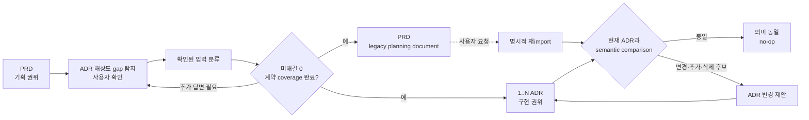

# ADR 0001: PRD 기능 계약의 소유권을 ADR로 이전

Date: 2026-08-15

## Status

Accepted (2026-09-20)

## Context

PRD는 제품 기획 단계에서 사용자 의도, 기능 계약, NFR과 시스템 제약을 모은다. 구현 단계에서도 PRD를 계속 읽고 ADR과 대조하면 두 문서가 같은 계약의 공동 권위가 된다. 독자는 현재 기준을 알기 위해 두 수준을 함께 읽어야 하고, 오래된 PRD 문구가 ADR 변경을 되돌릴 수도 있다.

PRD와 ADR은 같은 시스템을 서로 다른 해상도로 설명한다. PRD가 사용자 문제와 관찰 가능한 동작을 충분히 설명해도, 대안 선택의 근거, 외부 경계, fallback과 구현자가 임의로 정하면 안 되는 계약 값까지 이미 확정했다고 가정할 수는 없다. Importer가 이 차이를 모두 unresolved material로 분류하고 즉시 중단하면 ADR을 구체화하는 단계에 도달하지 못한다.

Handoff 이후에는 ADR만으로 요구사항을 지키는 구현을 재생성하고 검토할 수 있어야 한다. PRD는 삭제하지 않아도 되지만 현재 구현 계약을 관리할 책임은 끝나야 한다. 따라서 importer는 PRD를 그대로 복사하거나 부족한 내용을 추측하지 않고, handoff 중에 ADR 해상도에서 필요한 질문만 사용자와 해결해야 한다.

사용자가 PRD를 수정한 뒤 명시적으로 다시 import할 수는 있다. 이 동작은 지속적인 동기화가 아니라 새 기획 내용을 현재 ADR 계약에 비교하는 변경 제안이어야 한다. 같은 내용이나 표현만 달라진 내용을 반복 import해도 ADR, mapping과 decision log가 바뀌면 안 된다.

## Decision Drivers

- Handoff가 끝난 뒤 ADR만 읽어도 구현 의도와 계약을 복구할 수 있어야 한다.
- PRD의 요구사항 값, 상태, 권한, 실패 보장과 NFR이 handoff 과정에서 손실되면 안 된다.
- ADR admission gate와 one-ADR-one-decision 원칙을 유지하면서 반복 import는 의미가 같은 입력에 대해 멱등적이어야 한다.
- 삭제나 충돌처럼 의도가 불명확한 변경은 현재 ADR 계약을 자동으로 약화하면 안 된다.
- adr-writer는 PRD를 직접 읽지 않는 독립성을 유지해야 한다.

## Decision

`/feature-to-adr`는 PRD에서 구현에 필요한 내용을 ADR 집합으로 이전하는 **소유권 handoff**를 수행한다.

Importer는 최종 분류 전에 **gap-driven enrichment**를 수행한다. PRD에서 확인된 계약은 그대로 보존하고, regeneration test로 ADR만 읽을 때 빠질 수 있는 요구사항 값과 규칙, 상태와 권한, 실패 보장, 외부 경계와 fallback, Decision Driver, 대안 선택 근거와 observable evidence를 찾는다.

누락된 항목이 ADR이 소유할 계약이나 지속적인 결정이면 importer는 그 항목만 짧게 질문하거나 근거 있는 제안을 승인할 계약에 포함한다. 정성적인 아키텍처 선택에는 최대 세 개의 현실적인 대안과 trade-off를 제시하되 사용자의 답을 대신하지 않는다. “적절하게 정해 달라”는 말은 제안의 위임이며, 계약 여부의 분류나 구체 값의 승인을 뜻하지 않는다. 값의 변경이 사용자 동작, 권한, 상태, 실패 보장이나 지속적인 경계를 바꾸면 요구사항으로 유지하고, 제안한 값과 근거를 사용자 확인 전까지 미확정으로 둔다. 같은 계약과 경계를 보존하며 자유롭게 바꿀 수 있는 값만 implementation tuning으로 분류한다. 교체 가능한 SDK, library, adapter와 내부 구조는 구현 재량이므로 보완 질문을 만들지 않는다.

사용자가 이전할 범위를 명확히 요청한 경우 분석 순서와 규모는 진행 알림으로 전달한다. Feature 개수만을 이유로 추가 승인을 요구하지 않는다. 대상이 불명확하거나 새 비용·계약·승인 범위의 변화가 있을 때만 필요한 결정을 확인하며, 각 ADR의 계약 승인과 파괴적 변경의 승인은 유지한다.

사용자가 확인한 답은 일시적인 handoff input으로 사용하고 ADR에 이전한다. 별도 enrichment report를 저장하거나 PRD를 자동으로 다시 쓰지 않는다. `/adr-new`에는 이미 확인된 계약, 근거, 대안과 evidence를 전달하며 같은 질문을 반복하지 않는다. `/adr-new`가 새 gap을 발견한 경우에만 그 항목을 다시 사용자에게 묻는다.

Enrichment 뒤 importer는 각 입력과 확인된 답을 다음 중 하나로 분류한다.

1. ADR이 소유할 motivation, Decision Driver 또는 requirement contract
2. 코드가 자유롭게 정할 수 있는 implementation discretion
3. 구현에 필요하지 않은 legacy planning context
4. 소유 위치나 의미가 확정되지 않은 unresolved material

모호하거나 빠진 항목은 즉시 최종 `BLOCKED`로 처리하지 않는다. 먼저 enrichment question으로 해결하고 분류를 다시 실행한다. 사용자가 답을 보류하거나 답만으로도 제품 동작, 계약, 경계 또는 채택 결정을 확정할 수 없는 항목만 unresolved material로 남긴다.

모든 구현 관련 입력이 앞의 세 분류에 들어가고 unresolved material이 0일 때만 handoff를 완료한다. 이 시점부터 ADR 집합이 구현 의도와 계약의 유일한 권위다. PRD는 삭제하거나 수정할 필요가 없는 legacy planning document로 남는다. 일반적인 `/adr-impl`, `/adr-impl-review`, `/adr-sync` 흐름은 PRD를 읽지 않는다.

이전 대상으로 선택된 구현 가능한 Feature는 requirement contract를 소유하는 ADR을 최소 하나 가진다. 이 ADR은 빈 placeholder가 아니라 사용자 관찰 동작, 불변식, 실패 보장과 구현 독립적인 observable evidence를 소유한다. 서로 독립적으로 바뀌는 결정은 같은 category의 별도 ADR로 분리한다. 라이브러리, SDK와 같은 교체 가능한 구현 수단은 ADR 후보에서 제외하지만, 이를 이유로 Feature 계약 자체를 버리지 않는다. 제품 계약 없이 구현 교체만 기술한 항목은 transferable Feature가 아니라 implementation discretion으로 분류한다.

구현에 필요한 Feature prerequisite는 실제 category 간 `dependsOn`으로 이전한다. 단순 코드 재사용이나 작업 편의를 위한 순서는 저장하지 않는다. 이전된 Feature마다 계약 소유 ADR이 있으므로 prerequisite 보존을 위해 빈 ADR을 만들 필요가 없다.

사용자가 PRD 재import를 명시하면 importer는 PRD를 일시적 입력으로 읽고 현재 ADR을 target state로 비교한다. 문장 순서, 표현과 설명만 달라지고 요구사항 값, 상태, 권한, 순서, 실패 보장, 경계와 트레이드오프가 같으면 no-op이다. 변경된 계약은 기존 소유 ADR의 current state 변경 제안으로, 새 계약은 decision identity check를 거친 추가 제안으로 처리한다. PRD에서 사라진 계약은 자동 삭제하지 않는다. 사용자가 변경을 승인하기 전에는 현재 ADR이 계속 권위다.

ADR 본문과 mapping은 PRD 경로, section 번호와 Feature ID를 저장하지 않는다. Import completeness와 semantic comparison 결과는 handoff 순간의 일시적 evidence이며 별도 권위 문서가 아니다.

### Requirement contract

- Handoff 전에는 PRD가 기획과 구현 입력의 권위이며, 완료 후에는 ADR 집합이 구현 의도와 계약의 유일한 권위다.
- 완료된 handoff 이후 PRD는 보존할 수 있지만 구현, 리뷰와 sync의 입력으로 읽거나 ADR과 지속적으로 동기화하지 않는다.
- 이전 대상으로 선택된 구현 가능한 Feature는 requirement contract를 소유하는 ADR을 1개 이상 가진다.
- Feature 계약 ADR은 사용자 관찰 동작, 요구사항 값과 규칙, 불변식, 실패 보장과 구현 독립적인 observable evidence를 포함한다.
- Importer는 최종 분류 전에 regeneration test로 PRD와 완전한 ADR 사이의 계약·결정 gap을 찾는다.
- 빠진 ADR 소유 계약이나 지속적인 결정은 즉시 최종 차단하지 않고 사용자에게 해당 gap만 질문한 뒤 다시 분류한다.
- 미정 계약은 질문하거나 근거 있는 제안을 승인할 계약에 포함하며, 요구사항 값, 규칙, 상태, 권한, 실패 보장과 경계를 사용자 확인 없이 확정하지 않는다.
- 제안의 위임은 계약 분류나 구체 값의 승인이 아니다. 분류는 값이 사용자 동작과 지속적인 경계에 미치는 영향으로 결정한다.
- 요청한 이전 범위가 명확하면 분석 순서·규모를 안내하고 진행하며, Feature 개수만으로 추가 승인 단계를 만들지 않는다.
- 교체 가능한 구현 수단과 개발자가 자유롭게 정할 tuning 값에는 enrichment question을 만들지 않는다.
- 사용자가 확인한 enrichment 답은 handoff input으로 ADR에 이전하며 별도 report나 registry로 저장하거나 PRD에 자동 반영하지 않는다.
- `/adr-new`는 importer가 이미 확인한 계약과 결정을 다시 질문하지 않고 새로 발견한 gap만 확인한다.
- 서로 독립적으로 변경 가능한 결정은 하나의 ADR에 합치지 않는다.
- 교체 가능한 라이브러리, SDK, framework, credential wiring과 module layout은 기능에 포함돼도 ADR을 만들지 않는다.
- 제품 계약 없이 구현 교체만 기술한 입력은 transferable Feature가 아니라 implementation discretion으로 분류한다.
- 모든 구현 관련 입력은 ADR 소유, implementation discretion 또는 legacy context로 분류하고 unresolved material이 하나라도 있으면 handoff를 완료하지 않는다.
- PRD에서 확인한 motivation, 요구사항 값, 허용 집합, 전이, 필수성, 권한, 가시성, 순서, 유일성, 단위, NFR, 외부 경계, fallback과 관련 non-goal은 손실 없이 적절한 ADR section으로 이전한다.
- 구현에 필요한 Feature prerequisite는 실제 category 간 `dependsOn`으로 이전하고, 단순 코드 재사용과 작업 편의 순서는 저장하지 않는다.
- 일반적인 ADR 구현과 유지 흐름은 PRD를 읽지 않는다.
- PRD 재import는 사용자가 명시적으로 요청할 때만 수행한다.
- 동일한 PRD와 동일한 현재 ADR 상태를 반복 import하면 ADR 파일, `.mapping.json`과 decision log에 변경이 없어야 한다.
- 표현, 순서와 설명만 달라진 입력은 계약 변경으로 취급하지 않는다.
- 변경된 계약은 기존 결정 소유 ADR의 current state 변경 제안으로 처리하며 사용자 승인 전에는 기존 ADR이 계속 권위다.
- 새 계약은 decision identity check 뒤 기존 소유자 갱신 또는 새 ADR 후보로 처리한다.
- PRD에서 사라진 계약은 자동 삭제하지 않고 명시적 contract change로 확인한다.
- ADR 본문과 `.mapping.json`은 PRD 경로, 구간 번호와 기능 식별자를 저장하지 않는다.
- Import completeness와 comparison report는 저장하지 않는 일시적 evidence다.

### Alternatives

1. **PRD와 ADR의 계약을 계속 동기화**
   - 장점: PRD 변경이 항상 구현 경로에 노출된다.
   - 단점: 두 문서가 공동 권위가 되고 구현자가 두 수준을 함께 읽어야 한다.

2. **Admission decision만 0..N개 전달**
   - 장점: 아키텍처 결정이 없는 기능에 ADR을 만들지 않는다.
   - 단점: PRD를 읽지 않으면 사용자 관찰 계약과 feature prerequisite의 소유자가 사라진다.

3. **완전한 소유권 이전과 명시적 멱등 재import**
   - 장점: ADR만으로 구현과 리뷰가 가능하고 PRD는 legacy 문서로 남길 수 있다.
   - 단점: importer가 쓰기 전에 전체 coverage를 분류하고 재import 시 semantic comparison을 수행해야 한다.

## Consequences

### Positive

- 구현과 리뷰가 PRD 없이 ADR만 읽고 진행된다.
- PRD를 역사적 기획문서로 보존하면서 현재 계약의 권위를 분리한다.
- PRD가 ADR보다 덜 구체적이어도 handoff가 필요한 질문을 통해 계약과 결정을 완성한다.
- 반복 import가 의미 없는 ADR churn을 만들지 않는다.
- 요구사항 계약과 feature prerequisite가 handoff 뒤에도 영속 소유자를 가진다.
- adr-writer는 PRD를 직접 읽지 않는다.

### Negative

- importer가 전체 transfer coverage와 semantic no-op을 판단해야 한다.
- 불완전한 PRD는 handoff 중 추가 사용자 상호작용이 필요하다.
- 구현 가능한 Feature는 순수 아키텍처 결정이 없어도 실제 requirement contract를 소유하는 ADR이 필요하다.

### Risks

- 입력 분류가 누락되면 handoff가 불완전해질 수 있다. importer는 unresolved material이 0이고 모든 구현 관련 입력의 분류가 보일 때만 완료를 선언한다.
- importer가 질문 대신 합리적인 기본값을 채우면 제품 계약을 발명할 수 있다. 요구사항과 경계는 사용자 확인 전까지 enrichment question 또는 unresolved material로 유지한다.
- 모든 세부사항을 질문하면 PRD와 코드 해상도를 ADR로 끌어올릴 수 있다. regeneration test를 통과하는 ADR 소유 항목만 묻고 implementation discretion은 제외한다.
- 재import에서 표현 변경을 계약 변경으로 오인할 수 있다. 비교는 문구가 아니라 값, 상태, 권한, 순서, 실패 보장, 경계와 트레이드오프를 기준으로 한다.
- PRD에서 사라진 계약을 폐기로 오인할 수 있다. 삭제는 자동 적용하지 않고 명시적 contract change로 확인한다.

## Related

- [ADR admission gate](../../adr-authoring/decision-boundary/0001-admit-only-architectural-decisions.md)
