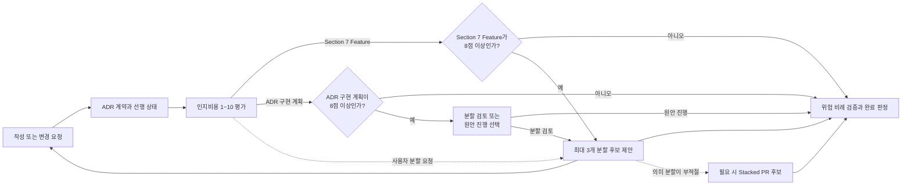

# ADR 0001: 안전하고 비례적인 개발 워크플로우

Date: 2026-08-15

## Status

Accepted (2026-09-07)

## Context

개발 흐름은 ADR 작성, 선행 결정 확인, 구현, 검증, 완료 판정으로 이어진다. 각 단계가 독립적으로 안전해도 선행 결정이 구현되지 않은 상태에서 downstream 구현을 허용하거나, 변경 위험과 무관하게 동일한 검증 비용을 요구하면 전체 흐름은 신뢰하기 어렵다.

ADR의 의도와 재생성 가능성을 구현 후에 다시 확인하면 작성·수정 단계의 승인이 완료 게이트에서 반복된다. 반대로 구현 검토가 찾은 명확한 결함마다 사용자 선택을 기다리면 에이전트가 스스로 수정하고 완료할 수 없다.

이미 승인된 ADR revision이 그대로인데도 구현 계획마다 승인을 기다리면 계약 승인과 코드 작업 순서 승인이 중복된다. 계획은 진행 범위와 검증 방법을 알리는 읽기 화면이어야 하며, 계약이나 안전을 바꿀 수 있는 새로운 전제가 발견됐을 때만 결정 게이트가 되어야 한다.

반대로 ADR에 적히지 않은 모든 세부사항을 구현 재량으로만 취급하거나 사용자에게 그대로 되묻는 것도 충분하지 않다. 명시 계약에서 도출되는 의무, 저장소 관례와 권위 있는 도메인 규칙으로 해소할 수 있는 기본값은 에이전트가 채우고, 여러 제품 선택지가 남는 항목만 사람이 판단할 수 있는 형태로 압축해야 한다.

개발 게이트는 잘못된 상태를 다음 단계로 넘기지 않으면서 검증 비용을 변경 위험과 실제 저장소 변경에 비례시켜야 한다. 의도 확인은 구현 전에 끝내고, 구현 후에는 승인된 계약에 대한 자동 검토와 수정으로 완료 여부를 판정해야 한다.

구현된 함수의 역할이 코드 구조만으로는 드러나지 않거나 테스트가 이상 경로만 증명하면 다음 개발자는 함수의 존재 이유, 계약 용어와 실패 경계를 다시 추론해야 한다. 반대로 장문의 자유 형식 주석은 언어 도구와 문서 생성기가 인식하지 못하고 동작 설명이 테스트와 분리되어 drift할 수 있다. 구현 단계는 언어가 제공하는 표준 문서 주석과 이상·경계 동작을 실행 가능한 테스트로 함께 남겨야 한다.

ALPS와 ADR 플러그인은 요구사항을 AI를 통해 코드로 전환하고 그 과정의 인지부하를 관리하도록 돕는 워크플로우다. 모델이 스스로 처리할 수 있는 판단까지 고정 절차, 상태와 승인 단계로 만들면 모델이 개선된 뒤에도 사용자가 같은 절차 비용을 계속 부담한다. 인지부하 관리는 안전 경계를 늘리는 프레임워크가 아니라, 작업의 이해 비용을 짧게 평가하고 필요할 때 더 작은 의미 단위로 나눌 수 있게 하는 안내여야 한다.

하네스는 이 워크플로우의 권위가 아니라 제거 가능한 관리 계층이어야 한다. 플러그인을 제거하거나 새 모델로 교체해도 PRD, ADR, 코드, 테스트와 프로젝트 문서가 각 추상화 수준의 의도와 계약을 충분히 보존해야 한다. 하네스가 서브에이전트 수, 모델 계열, 병렬 실행과 내부 사고 순서를 영속 규칙으로 고정하면 모델의 자체 판단을 대체하고 제거 후 남는 문서의 자립성을 약화시킨다.

ADR 구현 계획의 인지비용이 매우 높아도 사용자가 먼저 요청할 때까지 분할 여부를 묻지 않으면 큰 작업이 그대로 구현에 들어갈 수 있다. 반대로 점수만으로 구체적인 분할 후보를 즉시 생성하면 하나의 어려운 결정을 억지로 나누거나 불필요한 선택지를 늘릴 수 있다. `8/10` 이상에서는 분할 검토 여부만 먼저 확인하고, 사용자가 분할을 선택한 뒤에만 의미 있는 후보를 만들어야 한다.

Feature나 ADR을 의미상 더 나누면 vertical slice 또는 one-ADR-one-decision 경계가 깨질 수 있다. 이 경우 하나의 결정이 만드는 큰 구현 diff를 단일 PR로 전달하면 리뷰 순간의 인지부하는 여전히 높다. 구현 전달 단계를 dependency 순서의 Stacked PR로 나누면 상위 문서 경계를 바꾸지 않고 각 리뷰가 하나의 구현 질문에 집중할 수 있다.

구현 계획을 설정, 도메인 로직, API, UI, 테스트 같은 기술 단계로 나누면 각 단계가 끝날 때도 사용자가 얻는 결과와 계약 충족 여부를 확인할 수 없다. 구현 자체도 리뷰와 같은 Hiking 경계를 사용해 사용자 흐름, 논리 기능 또는 bounded context별 수직 Hill로 진행해야 한다. 각 Hill 안에서 전제와 계약을 확인하고 필요한 계층을 함께 구현한 뒤 관련 테스트 결과를 확인해야 다음 Hill의 문맥을 새로 시작할 수 있다.

## Decision Drivers

- 선행 결정과 승인된 ADR 계약이 유효하지 않은 상태에서 downstream 구현이 완료 상태가 되면 안 된다.
- 완료 상태는 변경 위험에 비례한 테스트와 구현 리뷰를 반영하고 해결 가능한 발견을 자동 수정해야 한다. ADR 동작을 구현하는 함수는 언어 표준 문서 주석만 읽어도 존재 이유와 동작 방식을 이해할 수 있고, 이상 경로와 관련 edge case가 자동 테스트로 검증되어야 한다.
- 저장소 상태가 바뀌지 않으면 검증을 반복하지 않고, 일반 대화가 ADR 인덱스 전체를 소비하지 않으며, drift 근거 없는 작은 변경에 깊은 동기화를 강제하지 않아야 한다. 모델이 개선되면 prompt를 축소할 수 있도록 평가 결과를 영속 권위로 만들지 않는다.
- 인지부하 평가는 피처와 ADR을 비교하고 분할 후보를 찾을 만큼 일관되어야 한다. ADR 구현 계획이 8점 이상이면 사용자가 분할 검토와 원안 진행 중 하나를 선택해야 한다. 구현은 점수와 무관하게 사용자 흐름·논리 기능·bounded context별 수직 Hill로 진행하고, 각 Hill에서 컨텍스트·설계와 계약·구현·테스트 결과를 함께 확인해야 한다. 의미상 분할할 수 없는 큰 구현은 ALPS나 ADR을 인위적으로 쪼개지 않고 코드 전달 단계에서 리뷰 가능한 단위로 나눌 수 있어야 하며, 이 선택이 새 상태나 완료 게이트를 만들면 안 된다.
- 하네스를 제거해도 PRD, ADR, 코드, 테스트와 프로젝트 문서가 단독으로 자신의 질문에 답하고 다음 모델이 필요한 문맥을 복구할 수 있어야 한다. 사용자-visible 계약과 안전 경계는 유지하되 서브에이전트 수, agent 종류, 병렬·순차 실행, 모델 선택과 내부 분석 순서는 현재 모델이 판단한다.

## Decision

개발 흐름은 **필수 안전 경계**와 **선택적 이해 지원**을 분리한다.

필수 안전 경계는 ADR-first 계약, 선행 결정 유효성, 테스트와 위험 비례 완료 검토처럼 잘못된 결과를 완료 상태로 만들지 않기 위해 필요한 규칙만 유지한다. 인지부하 평가는 이 경계와 별개인 읽기 보조 정보이며 저장, 승인, 구현이나 상태 전환을 막지 않는다.

플러그인의 skill, hook, reviewer와 eval은 **비침습적 하네스**다. 하네스는 observable artifact, 외부 action, 승인·상태 전이와 증거 기준을 정의한다. 모델의 private chain-of-thought, 내부 탐색 순서, 사용할 agent 수, named agent 대 generic agent 선택, 병렬·순차 실행과 모델 계열은 정의하지 않는다. 현재 모델은 capability, 위험, 컨텍스트 크기와 비용을 보고 이 실행 전략을 선택한다.

지속되어야 하는 문맥은 소유 추상화 수준에 남긴다. 제품 의도는 PRD, 승인된 아키텍처 결정과 requirement contract는 ADR, 구현 사실과 테스트는 코드, 저장소 공통 규약은 README·AGENTS·CONTRIBUTING이 소유한다. 하네스가 만드는 계획, mapping snapshot, reviewer transcript, agent topology와 평가 결과는 폐기 가능한 파생 정보다. 플러그인을 제거해도 남은 artifact를 순서대로 읽으면 같은 결정과 계약을 복구할 수 있어야 한다.

이 원칙은 현재 사용자-visible 동작을 축소하지 않는다. 인지비용 평가, 8점 이상 분할 선택, dependency gate, 승인된 ADR 기준선, standard/full review, Evidence Package와 자동 Status 전이는 유지한다. 하네스 구현은 이 결과를 만드는 action-level orchestration만 모델 재량으로 둔다.

ADR 구현은 **Implementation Hiking**으로 진행한다. Implementation Hiking은 하나 이상의 낮은 Hill로 구성하며, 각 Hill은 사용자 흐름, 논리 기능 또는 ADR과 저장소에서 이미 확인된 bounded context 중 하나를 수직 단위로 삼는다. frontend, backend, database 같은 기술 계층, 파일 묶음 또는 계획·코딩·테스트 같은 수명주기 단계는 Hill 경계가 될 수 없다.

각 Implementation Hill은 다음 순서로 진행한다.

1. **사전 조건·주변 컨텍스트** — 사용자나 호출자의 시작 상태, 선행 계약, 관련 시스템과 경계를 확인한다.
2. **핵심 설계·계약** — 이 Hill이 만족시킬 ADR 결정과 requirement contract, 파생 의무와 실패 보장을 연결한다.
3. **구현된 내용** — 해당 수직 결과에 필요한 UI, API, 데이터, 외부 시스템 경계를 함께 구현한다.
4. **검증 방법·결과** — ideal case와 관련 반례의 targeted test를 실행하고 명령과 관찰 결과를 기록한다.

한 Hill의 관련 구현과 targeted test 결과를 확인하기 전에는 다음 Hill을 주 구현 단위로 시작하지 않는다. 이는 새 승인·상태·영속 checkpoint가 아니라 작업 중 문맥을 낮게 유지하기 위한 실행 순서다. 모든 Hill의 결과를 확인한 뒤 전체 프로젝트 테스트와 위험 비례 구현 리뷰를 실행하며, Review Hiking은 가능하면 같은 수직 Hill 경계를 재사용해 구현과 리뷰의 문맥 전환을 줄인다. Hill 계획, 순서와 중간 상태는 폐기 가능한 실행 정보이며 ADR, `.mapping.json`이나 별도 registry에 저장하지 않는다.

ALPS Feature와 ADR을 제시하거나 구현 계획을 세울 때 현재 내용을 기준으로 **예상 인지비용을 1~10점**으로 표시한다. 모델은 다음 다섯 축을 각각 `0~2`로 내부 평가해 합산하고, 합계가 0이면 1점으로 표시한다.

1. **개념 범위** — 서로 다른 사용자 행동이나 결정의 수
2. **계약 밀도** — 요구사항 값, 상태, 권한, 불변식과 실패 보장의 수와 상호작용
3. **상태·흐름 복잡도** — 분기, 상태 전이, 비동기 흐름, 재시도와 부분 실패
4. **경계 결합도** — bounded context, 데이터 경계, 외부 시스템과 사용자 접점의 연결
5. **불확실성·검증 부담** — 미확정 전제, 오류·동시성·마이그레이션 위험과 검증하기 어려운 경로

축별 점수와 근거는 출력하지 않는다. 기본 출력은 `인지비용: N/10` 한 줄이다. 점수는 정밀한 측정값이나 품질 판정이 아니라 현재 독자가 예상할 이해 비용의 휴리스틱이며, 내용이 바뀌면 다시 계산한다.

모델은 점수를 계산할 때 다음 10점 보정 가이드를 내부 기준으로 사용한다. 전체 rubric을 사용자에게 반복 출력하지 않는다.

1. **1점** — 단일 문구나 규칙 하나만 확인하면 된다. 독립 Feature로 유지할 이유는 확인하되 자동 병합하지 않는다.
2. **2점** — 사용자 행동 하나와 성공 조건 하나로 끝나는 매우 단순한 단위다.
3. **3점** — 소수의 흐름과 예외만 있는 단순한 단위다.
4. **4점** — 일반적인 Feature 또는 ADR의 적정 범위 하한이다.
5. **5점** — 하나의 vertical slice나 결정을 구현·시연·검토하기 가장 균형 잡힌 크기다.
6. **6점** — 복잡하지만 한 번에 이해할 수 있는 적정 범위 상한이다.
7. **7점** — 이해 비용이 높지만 자동 분할 제안 기준에는 미치지 않는다.
8. **8점** — 이해 비용이 매우 높다. Section 7 Feature 분할을 권장한다.
9. **9점** — 여러 행동이나 계약이 강하게 결합됐을 가능성이 높다. 독립 사용자 행동 경계가 있으면 분할을 강하게 권장한다.
10. **10점** — 한 번에 검토하기 가장 어려운 수준이다. 여러 Feature나 결정이 섞였는지 우선 확인하되 본질적으로 하나라면 유지할 수 있다.

`4~6점`은 권장 범위다. `1~3점`은 낮은 부하, `7~8점`은 높은 부하, `9~10점`은 매우 높은 부하다. 낮은 점수는 자동 병합 근거가 아니다. 높은 점수도 승인·저장·완료 불가 판정은 아니지만, ADR 구현 계획이 8점 이상이면 분할 여부를 선택할 때까지 구현을 시작하지 않는다.

Section 7 Feature의 인지비용이 **8점 이상이면** 승인 전에 최대 세 개의 더 작은 Feature 후보를 자동 제안한다. 제안은 현재 Feature를 대체하거나 승인을 막지 않는다. 사용자는 후보를 선택하거나 원래 Feature를 그대로 유지할 수 있다.

Feature 후보는 독립적으로 시연 가능한 사용자 행동 경계가 있을 때만 제안한다. 사용자가 분할을 선택하면 Section 6과 Section 7의 Feature 경계를 함께 조정한다. 어떤 경우에도 frontend/backend 같은 기술 계층으로 vertical slice를 분할하지 않는다.

ADR 구현 계획의 인지비용이 8점 이상이면 `/adr-impl`은 구현 전에 사용자에게 분할을 검토할지 원안대로 진행할지 묻고 응답을 기다린다. 이 질문은 구체적인 분할 후보를 포함하지 않는다. 사용자가 분할 검토를 선택하거나 직접 분할을 요청하고 여러 독립 결정이 섞였을 때만 최대 세 개의 ADR 후보를 생성한다. 8점 미만에서는 사용자가 요청하지 않는 한 분할 여부를 묻거나 후보를 생성하지 않는다.

하나의 본질적으로 어려운 결정은 하나의 ADR로 유지한다. 사용자가 인지부하 감소나 작업 분할을 요청했고 Feature 또는 ADR 분할이 적절하지 않으면, `/adr-impl`은 같은 ADR을 구현하는 dependency-ordered Stacked PR 후보를 제안할 수 있다. 각 PR은 하나의 review question과 그 단계를 검증하는 테스트에 집중한다. 전체 Stack은 하나의 승인된 ADR 계약을 공동으로 구현하며 PR별 ADR이나 placeholder ADR을 만들지 않는다.

Stacked PR 후보도 기술 계층이나 파일 수가 아니라 Implementation Hill 또는 그보다 작지만 독립적으로 검증 가능한 수직 사용자 결과를 기준으로 한다. Stacked PR은 점수 임계값만으로 자동 생성하지 않는다. Stack 계획, 브랜치 관계와 리뷰 진행 상태는 구현 전달을 위한 일시적 정보이며 ALPS, ADR, `.mapping.json`이나 별도 registry에 저장하지 않는다. 실제 PR 생성은 사용자가 게시를 요청하고 현재 GitHub 환경이 지원할 때만 수행한다. 지원하지 않으면 같은 수직 구현 단계 계획을 유지하되 GitHub Stack 절차를 강제하지 않는다.

`SessionStart` 훅은 세션 시작·재개·초기화와 context compaction 복구 시점에만 짧은 ADR admission 지시를 주입한다. 일반 사용자 메시지마다 다시 실행하지 않는다. `.mapping.json` 내용은 훅에 포함하지 않으며, 요청이 admission gate를 통과한 경우에만 메인 세션이 전체 mapping과 plausible ADR 본문을 읽어 기존 결정 소유자와 선행 상태를 판정한다. mapping 파일이 없으면 훅은 조용히 종료하고, 파일이 존재하지만 JSON 파싱에 실패하면 ADR 작업 전에 복구하도록 경고한다.

새 ADR을 작성하거나 기존 ADR의 결정·요구사항 계약을 바꾸면 구현 전에 현재 Decision, Decision Drivers, requirement contract와 regeneration checklist를 제시하고 사용자에게 의도 일치를 한 번 확인받는다. 이 승인은 command가 아니라 정확한 ADR revision에 귀속된다. `/adr-new`나 `/feature-to-adr`에서 승인한 ADR 내용이 바뀌지 않았다면 `/adr-impl`은 그 기준선을 재사용하고 의도·재생성 질문을 다시 하지 않는다. 승인 후 ADR이 바뀌지 않았다면 구현 완료 뒤에도 같은 질문을 반복하지 않는다.

승인된 ADR revision이 바뀌지 않았다면 `/adr-impl`은 구현 계획을 범위, 구현 단위, 테스트, 인지비용과 중요한 전제를 포함한 **비차단 진행 상황**으로 공유하고 응답을 기다리지 않고 진행한다. 단, 인지비용이 8점 이상이면 분할 검토와 원안 진행 중 하나를 먼저 선택받는다. 사용자가 원안 진행을 선택하거나 분할 경계를 확정한 뒤에는 응답을 더 기다리지 않고 진행한다. 그 밖에는 계획 중 새 계약이나 결정, 모순된 전제, 틀릴 경우 계약·안전을 훼손할 수 있으나 검증되지 않은 외부 전제, 승인 범위 밖의 파괴적·광범위 변경을 발견한 경우에만 사용자 판단을 요청한다.

계획과 구현 중 발견한 요구사항 빈칸은 다음 순서로 해소한다.

1. 명시 계약과 안전 경계에서 논리적으로 도출되는 의무
2. 저장소 관례와 sibling behavior
3. 권위 있는 protocol, platform, 규제 또는 도메인 규칙
4. ADR 해상도 아래의 가역적이고 저위험한 일반 기본값

명시 계약의 논리적 결과는 derived obligation으로 구현·테스트하고, 프로젝트·도메인 기본값은 근거와 함께 구현 재량으로 기록한다. 금액, 권한, 법률·규제, 보존기간, 비가역 데이터 의미, public contract, durable fallback처럼 여러 정답이 있는 제품 정책은 자동 확정하지 않는다. 이런 gap은 누락 결정, 추천안과 도메인 근거, 현실적인 대안, 사용자·데이터·보안·운영 영향과 정확한 ADR 계약 문구를 하나의 Decision request로 묶어 사용자에게 한 번 요청한다.

ADR 동작을 위해 직접 작성하거나 실질 변경한 이름 있는 함수와 메서드는 GoDoc, Python docstring, JSDoc/TSDoc, Rustdoc, JavaDoc/KDoc처럼 해당 언어와 저장소가 채택한 표준 문서 주석 형식을 사용한다. 문서 주석은 함수가 왜 필요한지와 어떤 계약 동작·상태·실패 규칙으로 작동하는지를 함께 설명한다. 검색 가능한 용어 일치를 위해 현재 ADR의 도메인·상태·권한·실패·fallback 용어를 가능한 한 그대로 사용하지만, ADR 번호·경로·링크, `ADR`이라는 출처 표기나 결정 문서에 대한 직접 참조는 코드와 모든 주석·docstring에 남기지 않는다. 표준 문서 주석은 필요한 `why`와 `how`를 완결하기 위해 일반 인라인 주석의 짧은 길이 가이드보다 길 수 있다.

구현한 각 ADR 동작은 최소 하나의 ideal case와 해당 계약에서 실제로 발생 가능한 edge case를 자동 테스트로 갖는다. edge case는 무관한 조합을 채우는 목록이 아니라 요구사항 값의 경계, 빈 값·잘못된 입력, 금지된 상태 전이, 오류·fallback, 중복·순서 변경·동시 실행·부분 실패 중 해당 계약에 관련된 반례를 선택한다. ideal case만 있거나 관련 edge case가 빠진 구현은 완료되지 않으며, 테스트 기반 자체가 없으면 완료를 선언하기 전에 저장소에 맞는 최소 자동 테스트 경로를 마련한다.

선행 ADR이 있는 구현은 모든 prerequisite가 `Accepted`일 때만 진행한다. 사용자가 downstream 구현을 먼저 요청해도 완료 가능한 구현으로 취급하지 않는다. 완료된 PRD handoff는 이전된 각 Feature에 실제 requirement contract 소유 ADR을 두므로 구현에 필요한 Feature prerequisite를 category `dependsOn`으로 보존한다. 단순 코드 재사용과 작업 편의 순서는 dependency로 저장하지 않으며 빈 placeholder ADR을 생성하지 않는다.

검증은 보호 표면과 변경 범위에 따라 표준 또는 전체 구현 리뷰를 선택한다. 저장소 상태가 바뀌지 않은 검증 기준선은 재사용하고, 깊은 ADR 동기화는 drift 근거가 있거나 주기적 감사가 필요할 때 수행한다.

별도 refactor pass도 위험과 변경 신호에 비례한다. 여러 call site, 중복, 비효율, 복잡한 제어 흐름이나 넓은 diff처럼 독립적인 효율 검토가 가치 있는 경우에만 `/adr-impl-refactor`를 실행한다. 단일 파일의 국소 변경처럼 final sufficiency review가 같은 축을 충분히 다룰 수 있으면 별도 pass를 생략하고 그 근거를 완료 evidence에 남긴다.

구현 검토가 계약을 바꾸지 않는 증거 기반 코드·테스트 결함이나 국소 리팩토링을 찾으면 구현 세션이 자동으로 수정하고 테스트와 같은 검토 모드를 다시 실행한다. ADR 계약 변경, 모순된 전제, 중대한 미검증 위험 또는 파괴적 범위 변경만 사용자에게 판단을 요청한다. 검토가 통과하면 `Proposed` 대상은 추가 승인 없이 `Accepted`로 전환한다. 기존 `Accepted` ADR의 계약이 바뀌지 않은 보강 작업은 구현과 검토 동안 Status를 그대로 유지하고 전이 script를 실행하지 않는다.

### Requirement contract

- 새 ADR이나 결정이 변경된 ADR은 구현 전에 현재 결정, Drivers, requirement contract와 regeneration checklist를 사용자가 한 번 승인해야 한다.
- 승인된 ADR revision이 바뀌지 않으면 command 경계를 넘어 같은 의도 기준선을 재사용한다. ADR 내용이 바뀐 경우에만 새 revision 승인을 받는다.
- `dependsOn`의 모든 선행 category는 현재 mapping에 존재하고 target 구현 전에 `Accepted`여야 한다.
- `Proposed` 또는 dangling prerequisite가 있으면 downstream 구현을 완료 경로로 진행하지 않는다.
- 완료된 PRD handoff의 이전 대상 Feature는 실제 requirement contract 소유 ADR을 가지며 구현에 필요한 Feature prerequisite는 category `dependsOn`으로 보존한다.
- 단순 코드 재사용과 작업 편의 순서는 `dependsOn`으로 저장하지 않고, dependency 표현을 위한 빈 placeholder ADR을 만들지 않는다.
- 구현 리뷰 모드는 계약, 공개 표면, 상태, 권한, 보안, 데이터, 외부 fallback, 동시성 및 변경 범위의 위험으로 선택한다.
- 최종 구현 리뷰가 필수 수정이나 미검증 위험을 남기면 구현은 완료 상태가 될 수 없다.
- 증거가 있고 ADR 계약을 바꾸지 않는 구현·테스트 결함과 국소 리팩토링은 자동 수정 후 재검증한다.
- 별도 refactor pass는 중복·효율·복잡도·다중 call site 신호가 있을 때 실행하며, 국소 변경에서는 final review에 통합할 수 있다.
- 구현 후 사용자 판단은 ADR 계약 변경, 모순, 중대한 미검증 위험 또는 파괴적 변경에만 요청한다.
- 계약이 바뀌지 않은 기존 `Accepted` ADR의 보강 작업은 구현과 검토 동안 `Accepted`를 유지하며 `Proposed`로 내리지 않는다.
- 완료 리뷰가 통과하면 `Proposed` 대상만 `Accepted`로 전환하고, 변경 없는 `Accepted` 대상에는 Status 전이 script를 실행하지 않는다.
- 구현 전 승인 이후 ADR 계약이 바뀌지 않았으면 spec-fitness와 regeneration 질문을 반복하지 않는다.
- 정확히 같은 승인된 ADR revision의 구현 계획은 비차단 진행 상황으로 공유하고 별도 승인을 요구하지 않는다.
- 구현 계획은 범위, 구현 단위, 테스트, 인지비용과 중요한 외부 전제 또는 위험을 포함한다.
- ADR 동작을 위해 직접 작성하거나 실질 변경한 이름 있는 함수·메서드는 언어와 저장소의 표준 문서 주석 형식을 사용한다.
- 표준 문서 주석은 함수가 필요한 이유와 계약 동작·상태·실패 규칙을 설명하고, 현재 ADR의 도메인·계약 용어를 가능한 한 그대로 사용한다.
- 코드와 모든 주석·docstring에는 ADR 번호·경로·링크, `ADR` 출처 표기나 결정 문서 직접 참조를 남기지 않는다.
- 표준 문서 주석은 `why`와 `how`를 완결하기 위해 일반 인라인 주석의 짧은 길이 가이드에서 제외한다.
- 구현한 각 ADR 동작은 최소 하나의 ideal case와 해당 계약에 관련된 edge case 자동 테스트를 가져야 한다.
- edge case 테스트는 요구사항 값 경계, 잘못된 입력, 금지 전이, 오류·fallback, 중복·순서·동시성·부분 실패 중 실제 계약에 관련된 반례를 검증한다.
- ideal case 또는 관련 edge case가 누락되거나 자동 테스트를 실행하지 못한 구현은 완료 상태가 될 수 없다.
- ADR 구현은 하나 이상의 Implementation Hill로 구성한다.
- 각 Implementation Hill은 `user-flow`, `logical-capability`, `bounded-context` 중 하나의 수직 단위와 비어 있지 않은 이름을 가진다.
- 기술 계층, 파일 묶음 또는 계획·코딩·테스트 같은 수명주기 단계는 Implementation Hill 경계로 사용하지 않는다.
- 각 Implementation Hill은 `사전 조건·주변 컨텍스트`, `핵심 설계·계약`, `구현된 내용`, `검증 방법·결과`를 순서대로 다룬다.
- 각 Implementation Hill은 수직 결과에 필요한 UI, API, 데이터와 외부 시스템 경계를 함께 구현하고 ideal case와 관련 반례의 targeted test 명령·결과를 기록한다.
- 한 Hill의 관련 구현과 targeted test가 완료되기 전에는 다음 Hill을 주 구현 단위로 시작하지 않는다.
- 모든 Hill의 구현과 targeted test 결과를 확인한 뒤 전체 프로젝트 테스트와 위험 비례 구현 리뷰를 실행하고, Review Hiking은 가능하면 같은 수직 Hill 경계를 재사용한다.
- Implementation Hill 계획, 순서와 중간 상태는 승인·lifecycle gate가 아니며 ADR, `.mapping.json`, 코드나 별도 registry에 저장하지 않는다.
- 명시 계약에서 도출되는 의무는 사용자 재질문 없이 구현·테스트하고 부모 계약 근거를 진행 상황에 표시한다.
- 저장소 관례나 권위 있는 도메인 규칙이 하나의 가역적·저위험 기본값을 지지하면 구현 재량으로 자동 선택하고 근거를 표시한다.
- 여러 제품 선택지가 남는 gap은 추천안, 근거, 2~3개 대안, 영향과 정확한 ADR 계약 문구를 포함한 하나의 Decision request로 묶는다.
- 계획 중 새 계약·결정, 모순, 계약·안전에 영향을 주는 미검증 전제, 승인 범위 밖의 파괴적·광범위 변경 또는 8점 이상 ADR 구현 계획의 분할 여부가 있을 때만 구현 전에 사용자 판단을 요청한다.
- 동작이 바뀌지 않은 검증 기준선은 재사용할 수 있다. 자동 변경이 없으면 같은 대상 테스트를 다시 실행하지 않는다.
- 깊은 ADR 동기화는 drift, 넓은 구조 변경, 수동 ADR 변경 또는 주기적 감사 근거가 있을 때 수행한다.
- ALPS Feature와 ADR의 예상 인지비용은 개념 범위, 계약 밀도, 상태·흐름 복잡도, 경계 결합도, 불확실성·검증 부담의 다섯 축을 각 0~2점으로 내부 평가해 1~10점으로 표시한다.
- 모델은 1점부터 10점까지의 보정 가이드를 내부 채점 기준으로 사용하고 전체 rubric을 사용자에게 반복 출력하지 않는다.
- 1점은 단일 문구나 규칙, 2점은 행동과 성공 조건이 하나인 매우 단순한 단위, 3점은 소수 흐름과 예외만 있는 단순한 단위로 해석한다.
- 4점은 적정 범위 하한, 5점은 가장 균형 잡힌 크기, 6점은 한 번에 이해할 수 있는 적정 범위 상한으로 해석한다.
- 7점은 높은 부하, 8점은 매우 높은 부하, 9점은 여러 행동이나 계약의 강한 결합 가능성, 10점은 여러 Feature나 결정이 섞였는지 우선 확인할 최대 부하로 해석한다.
- 1~3점은 자동 병합 근거가 아니다. 7~10점은 승인·저장·완료 불가 판정이 아니지만 ADR 구현 계획이 8점 이상이면 분할 여부를 선택할 때까지 구현을 시작하지 않는다.
- 인지비용의 기본 출력은 `인지비용: N/10` 한 줄이며 점수 근거나 축별 계산을 함께 출력하지 않는다.
- Section 7 Feature의 인지비용이 8점 이상이면 승인 전에 최대 세 개의 의미 있는 Feature 분할 후보를 자동 제시한다.
- Section 7 Feature 분할 제안은 권고이며 추가 mandatory checkpoint를 만들거나 승인과 저장을 중단하지 않는다.
- 사용자는 분할 후보를 선택하거나 원래 Section 7 Feature를 유지할 수 있다.
- Feature 분할은 독립적으로 시연 가능한 사용자 행동을 기준으로 Section 6과 Section 7을 함께 조정하며 기술 계층으로 나누지 않는다.
- Section 7 Feature의 인지비용이 8점 미만이면 사용자가 요청하지 않는 한 분할 후보를 제시하지 않는다.
- ADR 구현 계획의 인지비용이 8점 이상이면 구체적인 후보를 생성하기 전에 분할 검토와 원안 진행 중 하나를 사용자에게 묻고 응답을 기다린다.
- ADR 구현 계획의 인지비용이 8점 미만이면 사용자가 요청하지 않는 한 분할 여부를 묻지 않는다.
- ADR 분할 후보는 사용자가 분할 검토를 선택하거나 직접 분할을 요청한 경우에만 최대 세 개를 생성한다.
- ADR 분할은 여러 독립 결정이 섞였을 때만 제안한다. 하나의 어려운 결정은 하나의 ADR로 유지하고 설명 순서나 구현 단계만 나눌 수 있다.
- 사용자가 분할을 요청했지만 Feature와 ADR의 의미 경계를 유지해야 하면, 하나의 ADR 구현을 dependency-ordered Stacked PR 후보로 제안할 수 있다.
- 각 Stacked PR 후보는 하나의 수직 Implementation Hill 또는 독립적으로 검증 가능한 그 하위 사용자 결과와 review question에 집중하며, 전체 Stack은 하나의 승인된 ADR 계약을 구현한다.
- 인지비용 점수만으로 Stacked PR을 자동 생성하지 않는다. 실제 PR 생성은 사용자가 게시를 요청하고 현재 GitHub 환경이 지원할 때만 수행한다.
- Stack 계획, 브랜치 관계와 리뷰 상태는 ALPS 문서, ADR 본문, `.mapping.json`, status 또는 별도 registry에 저장하지 않는다.
- 개별 Stack layer는 ADR을 완료 상태로 만들지 않는다. 전체 Stack이 최종 테스트와 구현 리뷰를 통과한 뒤에만 ADR을 `Accepted`로 전환한다.
- 인지비용 점수는 ALPS 문서, ADR 본문, `.mapping.json`, 상태 또는 별도 권위 문서에 저장하지 않는다. 현재 내용을 바탕으로 대화에서 다시 계산하는 일시적 안내다.
- 인지비용 점수는 품질, 구현 가능성, 승인 여부나 완료 상태를 판정하지 않는다.
- 인지부하 관리는 8점 이상 ADR 구현 계획의 분할 여부 질문 외에 새 mandatory checkpoint, 승인 모드, status 또는 registry를 만들지 않는다.
- 훅은 세션 시작·재개·초기화와 context compaction 복구 시점에만 compact admission directive를 주입하고, 일반 사용자 메시지마다 실행하지 않는다.
- 훅은 mapping의 category, path, status, summary를 렌더하지 않는다.
- admission gate를 통과한 요청은 코드 변경 전에 전체 `.mapping.json`과 plausible ADR 본문을 읽어 기존 소유자와 `dependsOn` 상태를 확인한다.
- `.mapping.json`이 없으면 훅은 추가 context를 주입하지 않으며, 파일이 손상되어 파싱할 수 없으면 ADR 작업 전에 복구 경고를 표시한다.
- 플러그인과 하네스는 PRD, ADR, 코드, 테스트와 프로젝트 문서 외에 구현 권위를 갖는 상태를 만들지 않는다.
- 승인 상태, 실행 계획, reviewer transcript, agent 수·종류·실행 순서와 평가 중간 결과는 영속 registry에 저장하지 않는다.
- 하네스 지시는 observable output, action boundary, 증거와 escalation 조건을 규정하고 private chain-of-thought나 내부 분석 절차를 요구하지 않는다.
- 서브에이전트 사용 여부와 개수, named/generic/main-session 경로, 병렬·순차 실행과 모델 선택은 현재 모델이 capability와 위험에 따라 정한다.
- orchestration 선택이 달라도 dependency gate, 승인 경계, 인지비용 동작, review mode, Evidence Package와 Status 전이 계약은 동일해야 한다.
- 플러그인을 제거한 뒤에도 각 artifact는 자신의 추상화 수준에서 독립적으로 읽을 수 있고, 다음 모델은 저장된 권위 문서와 결정적 도구만으로 필요한 문맥을 재구성할 수 있어야 한다.

### Alternatives

1. **모든 구현에 동일한 전체 게이트 적용**
   - 장점: 실행 경로가 하나다.
   - 단점: 국소 변경에도 최대 검토 비용을 지불한다.

2. **사용자 확인으로 선행 게이트 우회 허용**
   - 장점: downstream scaffold를 빠르게 작성할 수 있다.
   - 단점: 일부 동작이 비어 있는 구현이 완료 경로에 들어갈 수 있다.

3. **선행 상태는 엄격히 막고 검증 강도만 위험에 비례**
   - 장점: 무효 상태는 차단하면서 작은 변경의 비용을 줄인다.
   - 단점: 리뷰 모드 선택 기준을 명시하고 검증해야 한다.

4. **구현 후 모든 발견과 의도를 사용자에게 다시 확인**
   - 장점: 사용자가 마지막 순간에 모든 선택을 통제한다.
   - 단점: 이미 승인된 ADR과 명확한 수정까지 반복 확인해 자동 완료를 막는다.

5. **모든 인지비용 구간을 고정 단계와 강제 checkpoint로 제어**
   - 장점: 모든 작업이 동일한 세부 절차를 따른다.
   - 단점: 낮거나 중간 수준의 작업도 불필요하게 중단하고 워크플로우를 프레임워크로 만든다.

6. **인지비용을 표시하고 높은 Section 7 Feature에 분할 후보 제시**
   - 장점: 이해 비용이 큰 Feature를 승인 전에 발견하면서 분할 여부는 사용자에게 남긴다.
   - 단점: 점수는 모델 판단에 의존하므로 경계값 근처에서 제안 여부가 달라질 수 있다.

7. **의미 분할이 부적절한 구현을 선택적 Stacked PR로 전달**
   - 장점: Feature와 ADR 경계를 유지하면서 큰 구현 diff의 리뷰 부담을 시간과 질문별로 나눌 수 있다.
   - 단점: 의존 PR의 순서와 base 관계를 관리해야 하며 GitHub 환경에 따라 사용할 수 없다.

8. **고정된 agent topology와 모델 계열을 workflow contract로 지정**
   - 장점: 실행 모양이 일정하다.
   - 단점: 모델과 provider가 개선되어도 오래된 orchestration 비용이 남고 플러그인 제거 후에는 그 절차를 복구할 권위가 없다.

9. **artifact 계약을 유지하고 action-level orchestration은 모델에 위임**
   - 장점: 사용자-visible 안전과 증거는 유지하면서 현재 모델의 capability를 활용하고 플러그인을 제거해도 권위 문서가 남는다.
   - 단점: 같은 작업의 agent 수와 실행 순서가 모델과 환경에 따라 달라질 수 있다.

10. **구현을 기술 계층이나 수명주기 단계별로 진행**
    - 장점: 저장소 구조와 익숙한 개발 순서를 그대로 작업 목록으로 만들 수 있다.
    - 단점: 각 단계에서 사용자 결과와 계약 충족을 독립적으로 확인할 수 없고 다음 단계까지 미완성 문맥을 유지해야 한다.

11. **Implementation Hiking으로 수직 Hill을 하나씩 구현·검증**
    - 장점: 사용자 흐름·논리 기능·bounded context마다 설계와 계약, 필요한 계층의 구현과 targeted test 결과를 함께 확인할 수 있다.
    - 단점: 구현 전에 수직 경계를 식별하고 Hill별 targeted test를 선택해야 한다.

## Consequences

### Positive

- downstream 구현은 구현된 선행 결정 위에서만 완료된다.
- 이전된 Feature의 구현 prerequisite가 ADR-only 흐름에서도 보존되고 빈 placeholder ADR은 생기지 않는다.
- 작은 변경은 표준 리뷰를 사용하고 보호 표면 변경은 전체 리뷰를 유지한다.
- 완료 상태와 실제 검증 결과가 일치한다.
- 구현 후 반복 승인 없이 검토 발견을 수정하고 완료 결과를 받을 수 있다.
- 승인된 ADR이 유지되는 구현은 계획 승인 대기 없이 바로 시작된다.
- 사용자는 도메인 상식과 프로젝트 관례로 해소 가능한 빈칸 대신 실제 제품 판단이 필요한 선택지만 받는다.
- 함수의 존재 이유와 계약 동작이 언어 도구가 인식하는 표준 문서 주석에 남고, 관련 이상·edge 동작은 실행 가능한 테스트로 보존된다.
- 코드 검색은 ADR의 도메인·계약 용어로 함수와 테스트를 찾을 수 있지만 코드와 주석은 ADR 파일 위치나 번호에 결합되지 않는다.
- ADR과 무관한 턴은 전체 ADR 인덱스를 반복해서 소비하지 않는다.
- 사용자는 Section 7 Feature의 예상 이해 비용을 확인하고 8점 이상이면 바로 분할 후보를 비교할 수 있다.
- 사용자는 높은 점수에서도 원래 Feature를 그대로 유지할 수 있다.
- 사용자는 8점 이상 ADR 구현 계획에서 분할 후보를 읽기 전에 분할 검토와 원안 진행 중 하나를 선택할 수 있다.
- 하나의 Feature와 ADR로 유지해야 하는 구현도 요청 시 review question별 Stacked PR 후보로 전달할 수 있다.
- 인지부하 관리가 문서 상태나 강제 절차로 굳지 않아 모델 개선에 따라 prompt를 단순화할 수 있다.
- 서브에이전트와 모델 orchestration이 권위 문서에서 분리되어 새 모델이 현재 capability에 맞는 최소 실행 전략을 선택할 수 있다.
- 플러그인을 제거해도 PRD, ADR, 코드, 테스트와 프로젝트 규약이 의도와 구현 계약을 보존한다.
- 구현자는 하나의 낮은 수직 Hill에서 컨텍스트, 계약, 구현과 테스트 결과를 확인한 뒤 다음 문맥으로 이동할 수 있다.
- 구현과 최종 리뷰가 같은 Hill 경계를 공유해 구현 내용을 다시 기술 단계에서 사용자 흐름으로 재조립하는 비용이 줄어든다.

### Negative

- 선행 구현이 끝나기 전에는 downstream 작업이 대기할 수 있다.
- 리뷰 모드 분류가 잘못되면 검증이 과하거나 부족할 수 있다.
- 구현 전 ADR 승인이 형식적으로 수행되면 잘못된 계약을 기준으로 자동 완료할 수 있다.
- 모든 변경 함수에 의미 없는 boilerplate 문서 주석을 붙이면 실제 역할 설명의 신호가 약해질 수 있다.
- edge case 범위를 무관한 입력 조합까지 확장하면 테스트 비용이 계약 위험과 비례하지 않을 수 있다.
- admission을 통과한 뒤 mapping을 읽으라는 지시를 모델이 따르지 않으면 기존 결정 소유자나 선행 상태를 놓칠 수 있다.
- 같은 작업을 모델마다 다르게 채점할 수 있고 점수 자체가 새로운 검토 대상이 될 수 있다.
- 점수 보정 문구를 절대 기준으로 오해하면 서로 다른 도메인의 난이도를 기계적으로 비교할 수 있다.
- 8점 경계에서 불필요한 Feature 분할 제안이 나타날 수 있다.
- 8점 이상 ADR 구현 계획은 사용자의 선택을 기다리므로 즉시 구현하는 흐름보다 한 번 더 중단된다.
- Stacked PR은 아래 PR의 변경과 리뷰 지연이 위 PR에 전파되어 전달 순서를 관리해야 한다.
- orchestration 형태가 고정되지 않아 실행별 비용과 agent 수가 달라질 수 있다.
- 수직 Hill 경계와 각 Hill의 관련 반례를 식별하는 계획 비용이 추가된다.

### Risks

- 구현자가 변경 위험을 낮게 분류할 수 있다. 보호 표면 조건 중 하나라도 해당하면 전체 리뷰를 선택한다.
- 자동 수정 범위가 넓어질 수 있다. 계약 변경·모순·중대한 미검증 위험과 파괴적 변경은 반드시 사용자 판단으로 분리한다.
- on-demand mapping 조회가 누락될 수 있다. 훅과 행동 eval은 admitted 요청에서 코드보다 먼저 전체 mapping과 plausible ADR을 읽는지를 검증한다.
- 점수가 정밀한 생산성 지표처럼 사용될 수 있다. 점수는 비영속 휴리스틱이며 품질이나 완료 판정에 사용하지 않는다.
- 10점 보정 가이드가 품질 등급처럼 읽힐 수 있다. 모든 점수는 이해 비용만 나타내며 낮은 점수의 병합과 높은 점수의 차단을 자동화하지 않는다.
- 모델이 분할 여부 질문과 구체적인 분할 후보 생성을 혼동할 수 있다. 8점 이상에서는 선택지만 묻고 사용자가 분할을 선택한 뒤에만 후보를 생성한다.
- 높은 점수만 보고 vertical slice나 하나의 결정을 잘못 분할할 수 있다. 분할 제안은 사용자 행동 경계와 one-ADR-one-decision 기준을 먼저 적용한다.
- 자동 제안이 강제 분할로 오해될 수 있다. 제안과 함께 원래 Feature 유지 선택을 항상 제공하고 승인이나 저장을 차단하지 않는다.
- Implementation Hill이나 Stack을 기술 계층, 파일 수 또는 수명주기 단계로 나누면 작은 단위가 여러 개여도 사용자 결과를 재조립해야 한다. 각 단위는 수직 사용자 결과와 하나의 review question을 가져야 한다.
- 모델이 targeted test가 끝나기 전에 다음 Hill의 구현을 넓힐 수 있다. skill은 현재 Hill의 구현과 관련 반례 테스트 결과를 확인한 뒤 다음 Hill로 이동하도록 요구한다.
- GitHub Stack 지원 여부와 인터페이스는 변할 수 있다. 워크플로우는 provider 명령을 계약으로 고정하지 않고 실행 시 capability를 확인한다.
- 모델이 orchestration 자유를 관점 생략으로 오해할 수 있다. behavior eval과 artifact validator는 agent 호출 수가 아니라 필수 관점, 계약 coverage, 증거와 사용자-visible 결과를 검사한다.
- 모델이 표준 문서 주석을 단순 동작 재진술로 채우거나 ADR 파일을 직접 인용할 수 있다. 완료 리뷰는 `why`와 `how`, 계약 용어 사용, ADR 직접 참조 부재를 함께 확인한다.
- 모델이 ideal case 하나를 전체 테스트로 오인하거나 edge case 목록을 기계적으로 채울 수 있다. 완료 리뷰는 각 계약 동작과 실제 반례의 관련성을 대조한다.
- 하네스 설명이 권위 문서에만 있고 artifact 자체가 불완전하면 플러그인 제거 후 문맥이 사라진다. single-level read test와 regeneration test는 필요한 의도와 계약을 각 소유 artifact에 남긴다.

## Related

- [구현 리뷰](../../adr-cycle/implementation-review/0001-validated-low-risk-refactoring.md)
- [PRD 기능을 ADR 결정으로 전달](../../alps-authoring/spec-handoff/0001-admission-aware-feature-handoff.md)
- [저장소 보호](../repository-protection/0001-protect-main-with-pr-and-ci.md)
