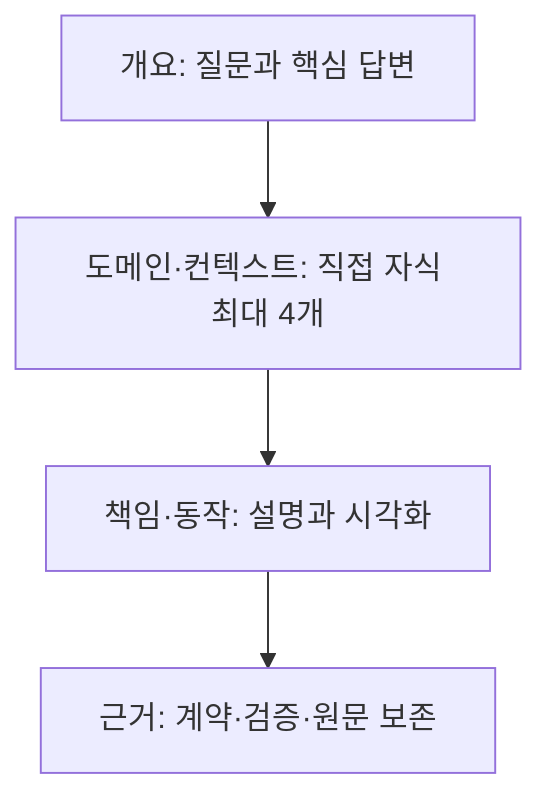

# ADR 0001: 도메인별 확대 구조로 보고서를 제공

Date: 2026-09-19

## Status

Accepted (2026-09-20)

## Context

플러그인의 리뷰·평가·분석 리포트는 사용자가 핵심 판단과 다음 행동을 이해하게 해야 한다. 현재는 일부 구현 리뷰에만 읽기 순서와 확대 단계가 있고, 다른 리포트는 평면적인 절·표·목록을 사용한다. 출력 형식이나 진입 경로가 달라도 같은 읽기 원칙을 적용해야 한다.

사용자는 모든 리포트에 공통 작성 스킬을 적용하고, 추상적인 답변에서 도메인별 구체적인 근거로 내려가는 계층을 요구했다. 같은 수준의 세부 항목이 다섯 개 이상이면 내용을 버리지 않고 설명 범위를 다시 나눠야 한다.

독자가 보고서를 읽은 뒤 핵심 내용의 의미와 적용 조건을 스스로 확인할 수 있어야 한다. 사용자는 문서의 핵심 내용을 다루는 중간 난이도 퀴즈를 보고서 작성 기능이 생성하도록 요구했다. 퀴즈의 목적은 이해도를 높이고 인지부하, 즉 내용을 이해하는 동안 한꺼번에 기억하고 연결해야 하는 부담을 줄이는 것이다.

## Decision Drivers

- 독자는 전체 판단을 먼저 이해하고 필요한 도메인과 근거만 선택해 읽을 수 있어야 한다.
- 가독성을 높이는 과정에서 사실·조건·검증 결과를 잃거나 존재하지 않는 시스템 경계를 만들어서는 안 된다.
- 직접 요청, 내부 리뷰, 자동 생성과 출력 형식이 달라도 작성·검증 기준이 일관돼야 한다.
- 이해도 확인은 핵심 개념에 집중하고 문제 수와 정보 공개 순서를 제한해야 한다. 사소한 암기 문제나 정답의 조기 노출은 이 목적에 맞지 않는다.

## Decision

두 플러그인이 생성하는 사람용 리포트는 공통 보고서 작성 기능을 거친다. 리포트의 조직 원리는 결론을 포함한 개요에서 시작해, 확인한 도메인·서브도메인·바운디드 컨텍스트와 그 안의 업무 책임을 따라 상세 설명과 근거로 내려가는 것이다.

C4의 확대 아이디어를 읽기 구조로 사용하되 모든 리포트에 특정 C4 다이어그램이나 기술 계층을 강제하지 않는다. DDD의 도메인 경계는 보고서의 주제와 책임을 묶는 근거로 사용한다. 보기 좋게 나누기 위해 실제 시스템에 없는 바운디드 컨텍스트를 채택한 것처럼 서술하지 않는다.

공통 보고서 작성 기능은 핵심 내용에 대한 이해도 퀴즈의 생성·배치·자가 확인을 담당한다. 구현 리뷰를 포함한 개별 보고서 기능은 이 공통 규칙을 사용하며, 자신의 검토 범위·판정·승인 규칙을 유지한다.

### Requirement contract

#### 1. 적용 범위와 의미 보존

- 직접 작성·수정 요청과 리뷰·동기화·통합·평가 등 내부 기능의 사람용 리포트는 공통 작성 스킬을 적용한다. HTML, Markdown, 텍스트와 다른 전달 형식에서도 같은 의미·구조·품질 원칙을 사용한다.
- 자동 생성 리포트도 같은 구조와 검증 계약을 따른다. 사용자 동의 없이 추가 유료 모델 호출을 도입하지 않으며, 수행하지 않은 의미 검토나 시각 검증을 완료했다고 주장하지 않는다.
- 기계용 원본 데이터와 PRD·ADR의 기존 필수 스키마는 보존한다. 사람용 리포트 보기와 설명을 재구성하되 요구사항, 정확한 값·단위, 허용 상태·권한·순서, 실패 보장, 검증 결과와 원본 근거를 누락하지 않는다.
- 단순 인사·질문·진행 알림을 긴 보고서로 만들지 않는다. 보고서 요청에는 공통 기능을 자동으로 선택할 수 있어야 하며, 각 플러그인은 단독 설치 상태에서도 이를 사용할 수 있어야 한다.

#### 2. 도메인 계층과 항목 상한

- 루트는 독자의 질문에 대한 답, 중요한 영향·제약과 다음 행동을 먼저 전달한다. 이후 관련 도메인을 선택해 책임·상호작용·구현과 근거로 내려간다.
- 계층의 묶음은 확인한 서브도메인·바운디드 컨텍스트를 우선 사용하고, 내부에서는 그 컨텍스트의 업무 책임과 개념으로 세분한다. 기술 계층, 파일 순서, 작업 순서나 임의의 번호 구간을 도메인 경계로 대신하지 않는다.
- 한 노드의 직접 하위 설명 단위는 최대 4개다. 하위 절, 독립 목록·카드와 비교 항목이 5개 이상이면 의미 있는 상위 묶음 또는 추가 깊이를 만든다. 상한은 전체 정보의 개수를 줄이는 근거가 아니다.
- 묶음의 범위와 부모·자식 관계를 제목과 탐색 구조에 드러낸다. 근거가 부족한 분류는 읽기용 분류로 구분하고 실제 시스템의 확정된 구조처럼 주장하지 않는다. 원본 증거는 완전하게 보존하되 탐색 계층의 제한을 피하려고 거대한 설명 덩어리를 숨기지 않는다.

#### 3. 시각 설명과 이해도 확인

##### 시각 설명

- 여러 참여자의 요청·응답·시간 순서가 이해의 핵심이면 Mermaid 시퀀스 다이어그램을 제공한다. 흐름·분기, 상태 변화, 데이터 관계에는 해당 관계를 더 정확히 보여주는 Mermaid 종류를 선택한다.
- 그림은 선택한 도메인과 확대 수준의 질문에 답해야 한다. 복잡하면 개요와 하위 흐름으로 나누고 필요한 세부 그림으로 연결한다. 그림을 형식 채우기나 인접 문장의 반복으로 사용하지 않는다.
- 그림 옆에 읽는 법과 확인할 동작을 짧게 설명하며, 확인한 근거와 구분되는 추정·미검증 관계를 숨기지 않는다. 참여자, 호출 순서, 상태와 실패 경로를 지어내지 않는다.
- 전달 형식에 맞는 렌더링과 원문을 제공한다. 렌더링이 안 된 경우 그 사실과 원문을 표시하며 성공한 그림처럼 안내하지 않는다. 원문이나 직접 인용은 가독성을 이유로 의미를 바꾸지 않는다.

##### 핵심 내용과 문항 수

- 보고서 작성 시 핵심 내용을 이해하는 데 도움이 되는 퀴즈를 생성한다. 사용자가 제외를 요청했거나 단순 완료 안내처럼 확인할 핵심 내용이 없는 경우에는 생략한다. 문항 수는 전체 보고서에서 1개 이상 5개 이하이며, 도메인마다 최대치를 다시 적용하거나 개수를 채우려고 문제를 추가하지 않는다.
- 각 문항은 문서에 설명된 핵심 개념·인과관계·적용 조건·중요한 선택 중 하나를 상황에 적용하는 중간 난이도 문제다. 정답과 해설은 문서 및 그 근거로 확인할 수 있어야 한다. 문서 밖의 지식, 사소한 이름·줄 번호 암기, 말장난과 함정을 요구하지 않는다.
- 각 문항은 서로 다른 선택지 정확히 4개와 정답 정확히 1개를 가진다. 오답은 핵심 내용에 관한 그럴듯한 오해를 반영하며 문장 길이나 표현으로 정답을 드러내지 않는다.
- 질문은 관련 도메인의 설명 뒤에 배치한다. 다섯 문항이 필요한 경우 실제 주제별로 묶어 직접 하위 설명 단위 최대 4개 규칙을 유지한다. 독자는 문항과 관련 설명을 연결해서 읽을 수 있어야 한다.

##### 단계별 자가 확인

- HTML은 질문과 짧은 회상 안내를 먼저 보여준다. 사용자가 선택지 보기를 요청한 뒤 네 선택지를 공개한다. 하나를 선택하면 자가 확인 전에 선택 이유를 한 문장으로 설명해 보라는 안내를 제공하며 별도 입력이나 채점을 요구하지 않는다.
- 사용자가 정확히 하나의 답을 선택하고 자가 확인을 요청한 뒤에만 정답, 선택에 대한 중립적인 피드백, 해설과 근거를 공개한다. 점수·등급·축하·능력 평가를 사용하지 않는다.
- 전체 질문 중 핵심 질문 1개 이상 2개 이하를 나중에 다시 확인할 대상으로 표시한다. 전체 질문이 한 개면 그 질문을 표시한다. 재확인 안내에는 정확한 시간 간격, 알림, 완료 이력이나 진행 상태의 영속 저장을 추가하지 않는다.
- 인쇄물은 질문과 네 선택지를 포함하되 정답·피드백·기존 선택 표시·조작 버튼을 제외한다. Markdown이나 텍스트에서도 질문·선택지와 정답·해설을 분리하며 자동 채점이나 숨김 동작을 지원한다고 주장하지 않는다.

##### 판정과 완료의 경계

보고서에 퀴즈를 포함하는 것과 대화형 퀴즈를 실행하는 것은 구분한다. 일반 완료 응답은 보고서 위치와 결과를 전달하고 퀴즈를 자동 시작하지 않는다. 사용자가 명시적으로 요청하면 한 번에 한 문항씩 진행하며, 오답에는 근거와 부족한 개념을 설명한 뒤 같은 문항을 다시 제시한다.

퀴즈는 이해도를 높이고 인지부하를 줄이기 위한 지원이다. 생성 여부나 정답 선택만으로 학습 효과를 측정했다고 주장하지 않는다. 퀴즈는 원래 작업의 승인, 코드 적합성 판정이나 완료를 차단하지 않으며 진행·통과 상태를 영속 권위로 저장하지 않는다. 구현 리뷰의 코드 판정과 사람이 변경을 이해했다는 판정은 별도로 유지한다.

#### 4. 품질 검토와 완료

문단은 주체·논점·예시가 바뀌는 의미 경계에서 나눈다. 조건과 결과는 함께 읽고 문장마다 강제 줄바꿈하지 않는다. 자동 줄바꿈은 화면 폭·행간·문단 여백으로 조절하며 수치·단위·부정·원문 의미를 훼손하지 않는다. 제목·표·그림과 인쇄에서의 분리도 검토한다.

중요한 수식은 입력·단위·가정, 대입·계산과 결과 해석을 함께 제공하고 검산한다. 문체 비교는 제공된 실제 참고 자료와 현재 선호에 근거하며 블로그 전용 형식을 일반 보고서에 강제하지 않는다.

문서 품질의 High·Medium·Low와 보고 대상 시스템의 finding severity를 구분한다. 문장·흐름, 주제·근거, 반복·문체를 검토하고 수정을 허용한 작업은 최신 전체 결과의 High·Medium 문제가 없을 때까지 재검토한다. 검토 전용 요청에서는 수정하지 않는다. 검토를 통과하려고 시스템 위험을 삭제하거나 등급을 낮추지 않는다.

- 근거 없는 과장, 상투적 도입, 장식용 용어, 반복 결론·대조와 의미 없는 연결문을 문맥에 따라 수정한다. 같은 표현이 실제 대화나 논리 연결 역할을 하면 보존한다.
- 각 부분에서 행위자, 조건, 동작, 관찰 결과와 필요한 판단이 드러나게 쓰며 낯선 용어는 처음 필요한 곳에서 설명한다. 사실, 근거 있는 해석과 제안을 구분한다.
- 최종 전달물의 제목·목차·문단·표·다이어그램·접힌 상세를 실제 읽기 순서로 검토한다. 구조 검증이나 금지어 검색만으로 AI Slop 제거와 이해도 검토를 통과했다고 판단하지 않는다.
- 의미·근거·읽기 흐름을 방해하는 중대한 문제는 수정 후 다시 검토한다. 확인할 수 없는 근거는 한계로 표시한다. 내용 검토와 형식별 구조·렌더링 검증의 실제 수행 범위를 결과에 맞게 보고한다.

### Alternatives

1. **스킬별 독립 지침 유지**
   - 장점: 기존 작성 흐름을 적게 바꾼다.
   - 단점: 형식과 진입 경로마다 읽기 방식과 품질이 달라진다.
2. **평면적인 고정 양식**
   - 장점: 일정한 위치에서 정보를 찾을 수 있다.
   - 단점: 도메인과 복잡도가 달라도 긴 동급 목록이 생긴다.
3. **공통 작성 기능과 도메인별 확대**
   - 장점: 독자는 필요한 도메인과 수준까지 읽을 수 있다.
   - 단점: 적절한 범위를 나누고 형식별 결과를 검증하는 비용이 필요하다.

이해도 퀴즈도 공통 작성 기능에서 생성한다. 구현 리뷰에만 퀴즈를 두면 다른 보고서의 핵심 내용을 확인할 수 없고 생성 조건이 진입 경로마다 달라진다. 공통 생성은 이 차이를 줄이지만, 작성자가 문서의 핵심과 적절한 오답을 고르는 검토 비용이 추가된다.

## Consequences

- 보고서의 분량보다 독자가 한 번에 해석해야 하는 책임과 관계를 관리한다.
- 검증 결과와 원본 근거는 보존하면서 같은 내용을 여러 요약·표·그림으로 반복하는 일을 줄인다.
- 기존의 평면적인 보고서 작성 지침·렌더러·검증 규칙은 공통 계약에 맞춰 조정해야 한다. 보고서 작성과 검증은 핵심 내용에 맞는 퀴즈와 단계별 정답 공개를 포함하며, 문항 수를 제한하고 풀이를 완료 조건으로 강제하지 않아 추가 부담을 제한한다.
- 사람의 이해와 생산성 향상은 목표이며, 형식 검사 통과만으로 실제 향상 정도를 측정했다고 주장하지 않는다.

## Related

- [구현 리뷰의 검토 강도와 증거](../../adr-cycle/implementation-review/0001-validated-low-risk-refactoring.md) — 그 검토와 판정을 유지하고 사람용 보고서 구성에 공통 규칙을 적용한다.
