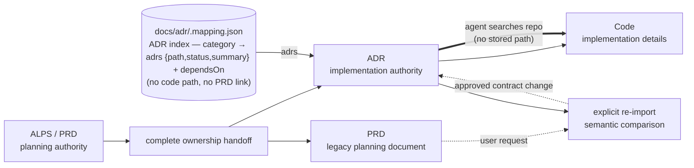

# Dependency model — PRD → ADR → code

ALPS (PRD), ADRs, and code form a one-way ownership handoff followed by a dependency chain. Before handoff the PRD owns planning intent. A complete `/feature-to-adr` transfer moves every implementation-relevant contract into ADRs; afterward code depends on ADRs and the PRD remains a legacy planning document. No layer references another physically.

`.mapping.json` records the ADR index (category → ADRs) plus `dependsOn`, and stores neither code paths nor a PRD reference. The ADR → code link is not stored anywhere: an agent finds the code by reading the ADR and searching the repo. The handoff and re-import reports are also ephemeral; neither becomes a second mapping or authority.

Confirmed term meanings follow the same ownership transfer. ALPS keeps them in an
optional trailing appendix; handoff moves only definitions needed by the selected
work into `docs/adr/glossary.md`, without upstream links. Later ADR authoring
maintains that file when needed. It is supporting material within the ADR level,
not an indexed ADR or a second contract owner. Required values and rules remain in
the owning ADR, with enough explanation for independent reading. Equivalent
re-import does not change the glossary; conflicting meanings need user resolution.

- **Ownership lifecycle**: before handoff the PRD is authoritative. Handoff commits only when every implementation-relevant item is owned by an ADR, classified as implementation discretion, or identified as legacy context, with no unresolved material. After commit the ADR set alone drives implementation, review, and sync.
- **Explicit re-import**: a later PRD change does not propagate automatically. When the user requests re-import, alps-writer compares semantic obligations against current ADRs. Equivalent wording is a no-op; additions and changes become ADR proposals; removals never weaken the ADR automatically.
- **No physical references in any direction** — not just ADR↔code, but ADR↔PRD too:
  - **ADR → code**: ADR bodies don't reference files / functions / line numbers — at most a folder when unavoidable (see [Code references — folder level only](../plugins/adr-writer/templates/adr/authoring-rules.md#code-references--folder-level-only)), and the mapping stores no code paths at all. The code an ADR governs is located by reading the ADR and searching the repo, so a rename or refactor never forces an ADR or mapping edit.
  - **Code → ADR**: code does not embed ADR IDs or paths in comments, constants, or imports. ADR numbers move (split, rollup, supersede); if those IDs are baked into code, restructuring ADRs forces matching code edits even when the decision is unchanged. When the **decision itself** changes, code changes — that's the entire point of the dependency.
  - **ADR → PRD**: ADR bodies do not embed ALPS paths, section numbers, or Feature IDs. An ADR absorbs the motivation and independently reviewable obligations, then stands alone when the legacy PRD becomes stale or moves.
  - **PRD → ADR**: the ALPS document never names specific ADR IDs or paths. It does not track its downstream artifacts after handoff.
- **Linking lives in an external mapping layer**: `docs/adr/.mapping.json` is the single ADR index (categories → `adrs` with path/status/summary) plus `dependsOn`; it stores no code paths and no PRD reference. It deliberately does **not** store code paths — the ADR ↔ code link is resolved on demand by searching the repo. The PRD and ADR bodies stay clean; ADR restructures (split / rollup / supersede) are absorbed by the mapping file, and code refactors touch neither the mapping nor the ADRs.

**Admission gate before the arrows**: not every code choice deserves a node at the ADR level. A decision enters the ADR layer only when it changes a requirement contract, durable system/data/security boundary, external provider/model or fallback, key design, algorithm, consistency model, or cross-implementation trade-off. If another library, SDK, framework, module layout, credential provider, signer, or adapter can replace the current one while those contracts and boundaries stay intact, it remains at the code level.

**Stability gradient as the litmus test**: while the PRD is active planning input, change frequency slopes `Code >> ADR >> PRD`. After handoff the live dependency is `Code >> ADR`; a legacy PRD revision joins it only through explicit re-import. Code is authoritative for implementation facts, while requirement contracts and gray-zone decisions remain the ADR's authority.

This split is mirrored in the packaging: **alps-writer** owns the PRD layer, **adr-writer** owns the ADR layer as a standalone plugin, and the `.mapping.json` — the ADR index owned by the user's repo, holding no PRD link — lives in the user's own `docs/adr/`, never inside either plugin.
