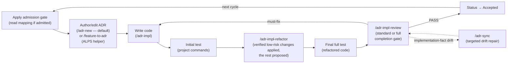
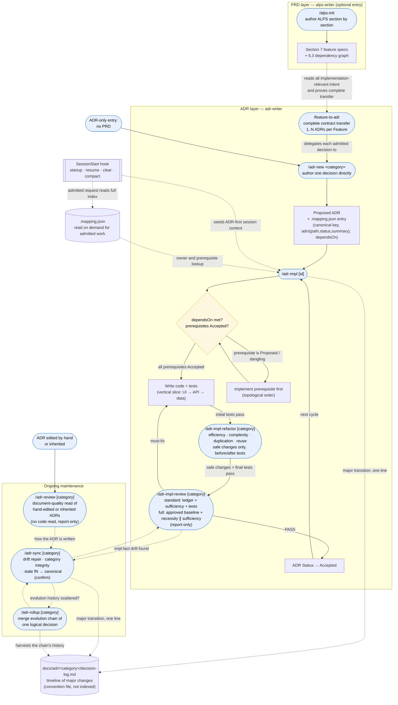

# Usage guide

This guide covers the product-document and development flows, the shared skills, the ADR-first hook, and the mapping file. Invoke a skill as `$skill-name` in Codex or `/skill-name` in Claude Code.

For installation see the [README Quick Start](../README.md#quick-start). For the MCP server in other MCP clients see [MCP server](./mcp-server.md). For the same lifecycle, critical command paths, routing, and efficiency review as diagrams, see [ADR process overview](./adr-process.md).

## Development cycle



ADRs are the primary artifact the adr-writer plugin manages. The default authoring path is `/adr-new <category>` — write the decision directly, with or without an ALPS PRD. `/feature-to-adr` transfers each implementable Section 7 Feature's complete contract into one or several ADRs and delegates each new decision owner to `/adr-new`. After handoff, normal implementation no longer reads the PRD.

The default for the same logical decision is edit-in-place plus a decision-log entry for a major transition. Add a new ADR when the topic is a distinct durable decision or the old decision must remain separately referenceable. Use `/adr-rollup` only when one logical decision's evolution history was already scattered across several ADRs.

## End-to-end flow — from ALPS to ADR management

The loop above is the steady-state summary. The full picture — from an ALPS PRD through ownership handoff, dependency-gated implementation, and ongoing maintenance — is below.



**How to read it:**

- **Two entry points.** PRD-first starts at `/alps-init` and crosses into the ADR layer via `/feature-to-adr`. A successful transfer makes ADRs the implementation authority and leaves the PRD as a legacy planning document. ADR-only skips the PRD box entirely and starts at `/adr-new`.
- **`/feature-to-adr` owns the ownership handoff.** It classifies every implementation-relevant item as ADR-owned, implementation discretion, legacy context, or unresolved. Transfer commits only with full coverage and no unresolved material. Each transferred Feature has `1..N` real ADRs, including at least one requirement-contract owner; replaceable implementation means stay in code. Explicit re-import compares a changed PRD with current ADRs, leaves equivalent semantics untouched, and never removes a contract automatically.
- **The gate is mandatory.** `/adr-impl` never skips straight to coding — it reads `dependsOn`, walks prerequisites transitively, and refuses to build on a `Proposed` or dangling prerequisite until you implement it first (in topological order). Status flips to `Accepted` only after tests and final review pass — it records a fact, not an intent.
- **Planning is informative unless the contract changes or load is very high.** When the exact ADR revision is already approved, `/adr-impl` reports scope, tests, comprehension load, derived obligations, and chosen project/domain defaults. At `8/10` or higher it asks whether to review a split or proceed with the original ADR, without generating split candidates yet; candidates appear only after the user chooses split review. Below that threshold it proceeds without another approval. It first fills gaps implied by the explicit contract, sibling conventions, and authoritative reversible domain defaults. Only unresolved product-policy choices become one Decision request with a recommendation, alternatives, impact, and exact ADR wording.
- **Implementation documentation and test categories are completion requirements.** Every named function or method created or materially changed for ADR behavior uses the repository's language-standard documentation form, such as GoDoc or a Python docstring, and explains why the function exists and how it behaves. It reuses contract vocabulary for searchability but never cites an ADR number, path, link, or source label. Every implemented behavior has an ideal-case test and all relevant edge cases; happy-path-only coverage cannot pass completion review.
- **Stacked PR is a requested delivery fallback, not a new specification layer.** When the user asks to lower review load but splitting the Feature or ADR would break its semantic boundary, `/adr-impl` can keep the same approved ADR and offer dependency-ordered PR layers with one review question each. It never derives or publishes a Stack from the score alone, and no Stack state is stored in ALPS, ADRs, or `.mapping.json`.
- **Verified refactoring happens before completion.** After the initial implementation tests pass, `/adr-impl` invokes `/adr-impl-refactor`. A model-selected review path checks concrete execution efficiency, complexity, coupling, duplication, and reuse already justified by current same-semantics code. The main session applies only high-confidence local behavior-preserving candidates with exact evidence and before/after tests, and leaves wider opportunities as proposals. Subagent availability alone does not decide `APPLY_NOW`; if no code changed, the passing targeted baseline is reused.
- **The final review is risk-based, report-only, and completion-gating.** Localized changes that touch no protected surface use `standard`: decision ledger, sufficiency perspective, and targeted tests. Requirement, public contract, schema, state, permission, security, fallback, concurrency, transaction, error-semantic, or broad changes use `full`: the implementation-before-approved baseline plus separately grounded necessity and sufficiency perspectives and the detailed repair artifact. The model chooses named, generic, or main-session execution from current capability. Intent and regeneration completeness are approved before implementation, so neither mode repeats a routine human gate afterward. Unclear cases use `full`.
- **Maintenance is a separate, repeating phase.** `/adr-sync` reconciles ADRs with shipping code, repairs drift, checks category/`dependsOn` integrity, and proposes canonicalizing any legacy `fN` naming (applied only after you confirm). `/adr-rollup` is reached from sync only when one decision's evolution history is scattered across several ADRs. `/adr-review` sits alongside them on a different axis: it reads ADRs **as documents** against the authoring rules and never opens the code, so it is entered from a hand-edited or inherited ADR rather than from an implementation.
- **Evolution history lives in the decision log, not in the ADR body.** An ADR body describes the current state, so when the same decision evolves the default is to overwrite it in place — and if the transition is major (replacing the adopted alternative, changing the core algorithm or architecture, inverting a Driver), one line goes newest-first into the per-category `docs/adr/<category>/decision-log.md`. `/adr-impl` and `/adr-sync` write those lines; `/adr-rollup` harvests a scattered chain's history into the log and leaves one current-state ADR. The log is a **convention file** — it is not registered in `.mapping.json`, and the harness checks only that its ADR pointer still resolves on disk (a rollup renumber can orphan it and no other oracle sees it). Three layers preserve different things: ADR body = current state, `decision-log.md` = timeline of major changes, Git = the verbatim diff.
- **The hook runs underneath all of it.** `SessionStart` injects a compact ADR admission directive on startup, resume, clear, and compaction recovery. This preserves the cycle across replaced context without running on every user message. Only an admitted request reads the full mapping and plausible ADR bodies before code changes.

## Walkthroughs

### A. Lite ALPS — independent PoC authoring

1. `/lite-alps-init` → write or resume a 4-section document for a minimum PoC and its demo.
2. Confirm the target user, core problem, and Desired Business Impact. Lite works backward from that input: AI proposes the minimum Solution Strategy and Essential User Experiences, then proposes a concrete Demo Scenario with starting state, input, user actions, and visible results.
3. Build and validate the mockup or PoC from the exported Lite ALPS document.

Section 3 records explicit exclusions and is optional. Section 4 is the required Demo Scenario. Do
not invent exclusions or classify an unresolved choice as out of scope. When no exclusion was
stated and the boundary is not materially ambiguous, skip Section 3 without a dedicated question;
the Markdown export omits the unwritten optional Section.

Lite ALPS deliberately contains no technology stack, architecture, API, database, deployment,
library, code-structure, or implementation-planning inputs. It does not ask the user to design the
minimum solution or demo flow from scratch; only protected product decisions such as permissions,
safety, external promises, or acceptance boundaries trigger an additional question. Lite reuses
Full's approval pattern, but neither reads the other document, shares approval or completion state,
uses the other as source material, or treats the other as a next step.

### B. PRD-first — start from a Full ALPS spec (both plugins)

1. `/alps-init` → use atomic confirmation by default, or explicitly opt into batch confirmation for complete structured input. Batch items remain separate save units.
2. After Section 7, run `/feature-to-adr` → it transfers each implementable Feature's complete contract into `1..N` real ADRs, preserves required Feature prerequisites as `dependsOn`, and leaves replaceable means to code.
3. `/adr-impl <category>` → receive a non-blocking plan update, resolve contract implications and safe project/domain defaults, answer only any consolidated product-policy Decision request, then implement with language-standard why/how function documentation plus ideal and relevant edge tests.
4. `/adr-impl-refactor <category>` runs when multi-call-site, duplication, efficiency, complexity, or broad-diff signals justify a separate pass; local changes may cover the same axis in the final sufficiency review.
5. `/adr-impl-review <category>` derives the complete implementation scope from every ADR decision and contract row, tracing direct and indirect call paths plus related tests; a supplied or discovered diff remains separate change context and never limits sufficiency coverage. It selects `standard` or `full` from the protected surfaces and complete scope. The report uses the user's language when established, otherwise the target ADR's dominant language. It starts with verdict, impact, action, risk, and `ADR intent`, follows subject-specific narrative sections ordered by importance, then groups findings into fix, decision, verification, and suggestion tasks. Each task shows why it matters, expected and observed behavior, the requested change, edit target, and completion criteria; category, confidence, exact ADR/code evidence, and test results stay collapsed. Each Hill assigns question-level diagrams or records a concrete local omission. Sequence views explain call order, component views explain responsibility and boundaries, and state diagrams serve lifecycle-specific questions. Shared Context diagrams link to their Hills. Required diagrams must render as actual SVG relationships; source fallback is not completion. Both modes validate and generate `adr-impl-review-report.html`, then open it once in the default browser. The optional comprehension check uses one to five medium-difficulty four-option questions: it shows the question before the choices, adds a non-graded one-sentence explanation cue after selection, and marks one or two core questions for a later re-check without storing schedules or progress. Interactive grading still begins only when the user explicitly requests it. `PASS` promotes a `Proposed` ADR to `Accepted` independently of comprehension readiness.
6. Run `/adr-sync` only when review finds implementation-fact drift, after broad refactors or manual ADR edits, or as a periodic audit.

After handoff the PRD remains on disk as a legacy planning document, but implementation, review, and sync read only ADRs. Re-run `/feature-to-adr` only when you explicitly want to import a changed PRD. Equivalent semantics are a no-op; additions and changes become ADR-first proposals; removals require confirmation. Current ADRs remain authoritative until a change is approved.

### C. ADR-only — no PRD (adr-writer standalone)

1. `/adr-new <category>` → apply the ADR admission gate, then describe a durable requirement or architectural decision directly. Replaceable libraries, SDKs, frameworks, and credential/auth wiring stay in code. No ALPS document required.
2. `/adr-impl <category>` → continue from a non-blocking plan update, auto-resolve derived obligations and established reversible defaults, request only unresolved product policy, then build it with language-standard why/how function documentation and ideal plus relevant edge tests, run a separate refactor pass only when risk signals justify it, and invoke the report-only adversarial review as the completion gate.
3. A passing `/adr-impl-review` promotes a `Proposed` ADR to `Accepted`. An unchanged existing `Accepted` ADR is not demoted or re-promoted; a must-fix verdict preserves the target's current lifecycle state.
4. As you keep working, the ADR-first hook restores the compact admission gate when session context starts or is replaced. An admitted request reads the full ADR map before code changes. Run `/adr-sync` when drift evidence or periodic maintenance calls for it.

**Apply the ADR admission gate before the cycle.** A pure refactor is exempt, as are replaceable implementation changes such as swapping a library, SDK, framework, credential provider chain, signer, or adapter while preserving the same contracts and boundaries. A bug fix is exempt when it restores already intended behavior. A change to a requirement value, allowed state, transition, permission, key design, provider/model boundary, adopted algorithm, security trust boundary, or external-dependency fallback enters the cycle and updates the relevant ADR first.

### D. Inherited or hand-edited ADRs — review them as documents

Run `/adr-review [category]` when an ADR set arrives without the context of whoever wrote it: a repo you inherited, an ADR edited by hand, or one changed by another session. It reads the ADRs against the authoring rules (abstraction level, requirement preservation, alternatives) without opening the code and reports a punch list — it never edits the ADRs, the mapping, or code. It is deliberately **not** run right after `/adr-new`, which judges its own draft against the same rules.

In all flows the hook runs automatically once adr-writer is installed. Session startup, resume, clear, and compaction recovery inject the compact admission directive; admitted work reads the ADR map on demand.

## Slash commands

### alps-writer

| Command                | Role                                                                                                              |
| ---------------------- | ----------------------------------------------------------------------------------------------------------------- |
| `/alps-init`           | Author or resume Full ALPS with atomic confirmation by default and explicit batch confirmation when appropriate   |
| `/lite-alps-init`      | Author or resume an independent 4-section Lite ALPS for minimum PoC scope, behavior, and demo                     |
| `/feature-to-adr [id]` | Transfer a Full ALPS Feature's complete implementation contract into `1..N` ADRs; re-import semantic changes only |

### adr-writer

| Command                                               | Role                                                                                                                                                                                                                                                                                                                                                                                                                                                                                                                                  |
| ----------------------------------------------------- | ------------------------------------------------------------------------------------------------------------------------------------------------------------------------------------------------------------------------------------------------------------------------------------------------------------------------------------------------------------------------------------------------------------------------------------------------------------------------------------------------------------------------------------- |
| `/adr-new <category>`                                 | Apply the admission gate and author a durable decision directly; implementation-only choices create no ADR                                                                                                                                                                                                                                                                                                                                                                                                                            |
| `/adr-impl [category]`                                | Implement an ADR with language-standard why/how function documentation and ideal plus relevant edge tests; comments reuse contract vocabulary but never cite an ADR. Unchanged approved ADRs proceed from a non-blocking plan update; derived obligations and established domain defaults are automatic, while unresolved product policy is returned as one Decision request. On request, use Stacked PR delivery when semantic Feature/ADR splitting is inappropriate. With no argument, lists Proposed ADRs and asks which to build |
| `/adr-impl-refactor [category]`                       | Review concrete efficiency and proportionate reuse, apply only high-confidence local behavior-preserving refactors with before/after tests, and leave wider or weakly verified opportunities as proposals                                                                                                                                                                                                                                                                                                                             |
| `/adr-impl-review [category] [--mode standard\|full]` | Find the complete ADR implementation rather than stopping at the diff, explain ADR intent plus the major algorithm or flow, require grounded Mermaid for multi-step relationships, group findings into action cards, and open the standalone HTML report once in the default browser. Questions remain collapsed; interactive grading is available only by explicit user request                                                                                                                                                      |
| `/adr-review [category]`                              | Review **hand-edited or inherited** ADRs as documents against the authoring rules — no code read, report-only. Lead with the outcome and visualize cross-ADR conflict, dependency, or duplication when useful. No arg → every ADR                                                                                                                                                                                                                                                                                                     |
| `/adr-sync [category] [--quick]`                      | Detect/repair drift between code and ADR, lead with semantic changes, and visualize complex decision, dependency, or unresolved contradiction flows                                                                                                                                                                                                                                                                                                                                                                                   |
| `/adr-rollup [category]`                              | Consolidate only ADR groups whose evolution history of one logical decision is split (no arg → all)                                                                                                                                                                                                                                                                                                                                                                                                                                   |

## Hook behavior

One hook supports the main Claude Code session — **with no external LLM calls**; the main model classifies text and makes decisions itself.

| Hook           | When it fires                          | Role                                                                                                                                          |
| -------------- | -------------------------------------- | --------------------------------------------------------------------------------------------------------------------------------------------- |
| `SessionStart` | Startup, resume, clear, and compaction | Inject a compact ADR admission directive without mapping contents; admitted work reads `docs/adr/.mapping.json` on demand before code changes |

The directive tells the model to apply the ADR admission gate first. Only changes to durable requirements, boundaries, provider/model choices, key designs, algorithms, trust policies, or fallbacks read the full mapping and plausible ADR bodies before code; replaceable implementation means remain code-level. Classification is left to the main model — the hook never blocks an edit.

Claude Code auto-discovers the hook file and Codex registers it once in its own manifest. Both clients expose only `SessionStart`; there is no per-prompt `UserPromptSubmit` hook.

## Deterministic self-test

Six dependency-free scripts verify ADR structure and deliver review artifacts without an LLM judgment call. Two cover ADR well-formedness. `adr-impl-review-materialize.mjs` derives repeated Markdown evidence sections from `findings.json`, so the model writes the narrative once instead of maintaining duplicate tables and prompts. `adr-impl-review-validate.mjs` then requires a report language, non-empty At a glance handoff, `ADR intent`, at least one subject-specific narrative section before Findings, one to five questions with hidden grading criteria, finding-to-contract references, and requirement-by-requirement `contractCoverage`. It rejects `PASS` unless every row is `PROVEN`, validates notable implementation choices with ADR-intent fit, and checks any evidence-required repair guidance. After validation, `adr-impl-review-report.mjs` generates the progressive standalone HTML report and `adr-impl-review-open.mjs` validates it before one default-browser open attempt.

**A fresh draft is not reviewed twice.** `/adr-new` authors under the same rules the reviewer applies (R1-R20), so it self-checks at its step 6 and saves rather than spawning a reviewer — a review one turn after being handed the rules re-derives a judgment just made, and its punch list is mostly items the author already got right. `/adr-review` is the independent read, and it exists because that authoring context does not survive the session: an ADR **edited by hand or by another session** has nobody who knows what its author was told. Run it on request, on an inherited ADR set, or after hand-editing — not automatically after `/adr-new`.

```bash
node <adr-writer-plugin>/scripts/adr-structure-lint.mjs [category]   # structure + invariants
```

That one command covers both ADR-well-formedness scripts, since the lint invokes the oracle and folds its exit code in. See the full per-script check list in the [adr-writer README](../plugins/adr-writer/README.md#deterministic-self-test-harness).

## ADR index (.mapping.json)

`docs/adr/.mapping.json` is the single ADR index (categories → `adrs` objects `{path, status, summary}`) plus contract-level `dependsOn`. It stores no code paths, Feature IDs, or PRD references. A completed `/feature-to-adr` handoff writes an edge only when one transferred Feature contract cannot be satisfied before another; SDK reuse and convenient work order remain implementation discretion.
