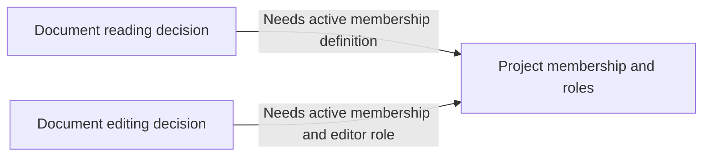

# Resolve ADR cycles through one domain-grouped decision report

Read this reference when project import finds a decision-prerequisite cycle or
a category projection that loses the meaning of decision-level guarantees.
It complements `decision-questions.md`; keep the caller's write permissions,
existing schema and lifecycle rules. Discuss architectural decisions and their
contracts, not implementation interfaces, adapters or module rearrangements.

## Establish what is cyclic

Preserve the observed graph and each edge's required guarantee, owner and
evidence. Distinguish business interaction from a genuine prerequisite, and a
decision-level cycle from a cycle introduced by category grouping. A round trip
or shared vocabulary alone does not establish a prerequisite. Explain a proven
misclassification; do not rename a real dependency or move it to `Related` to
hide it from `dependsOn` checks.

Group mutually dependent decisions for review, using strongly connected
components when useful. A review group is not automatically one ADR, one
bounded context or one deployment unit. Preserve all affected decisions and
contract owners, including edges crossing the group boundary.

## Compare three distinct options

Show these three options for each unresolved cycle group. Mark an option
inapplicable with its concrete reason rather than inventing a policy or an
abstraction to fill the table. Recommend one applicable option, with the
remaining risks and contract changes. If none is supportable, leave the group
pending and identify the missing decision in the same batch.

1. **Extract an independent shared concept.** Give a common architectural or
   domain contract its own owner C, so A and B depend on C while retaining their
   independent decisions. State C's meaning, exact rules and guarantees, what
   moves from A/B, and what each consumer still owns. C must stand independently
   of the consuming decisions' results; C depending back on A/B merely moves the
   cycle. Apply the **ADR admission gate** and **decision identity check**: reuse
   an existing owner when found, and create a new ADR only for a genuinely
   independent durable decision. A glossary label or implementation interface
   alone does not establish an architectural contract.
2. **Merge one inseparable decision.** When A and B are parts of the same
   architectural choice, combine their full contracts and still-valid reasons
   into one current-state ADR. Name the survivor and proposed removals. Do not
   merge independent decisions solely because their graph is cyclic.
3. **Orient around an existing owner.** Assign the base or duplicated contract
   to its natural existing owner A; leave B's independent additional rules in B
   and make B depend on A. Explain which definition or guarantee A takes back
   from B and why A no longer needs B's decision. Preserve both ADRs when both
   still own independent decisions. If nothing independent remains in B, this
   is a merge, not a distinct one-way alternative. Deleting an edge while leaving
   its required guarantee unresolved is not a solution.

For every applicable option, prepare reviewable contract changes and a before/
after graph with explicit arrow meaning. Trace each original obligation to its
retained or proposed owner and identify any actual change of meaning, including
values, states, permissions, ordering and failure guarantees. Show added,
retained, moved and removed documents, exact path changes and affected index/
Related links. Preserve concurrent edits and follow the owning workflow's
destructive-change rules; choosing a label alone is not approval of unstated
deletions or requirements.

Check both the decision graph and its projection into existing category
`dependsOn`. A newly independent C must not leave an unexplained return edge or
another affected cycle. A genuine category-only conflict may need a separately
approved grouping change; do not merge unrelated decisions to repair a display
problem. Do not change the dependency schema or bypass prerequisite completion
rules. An impossible pair of temporal preconditions needs an explicit contract
change, not just an extra node.

## Explain an abstraction through its contract

Use a relevant, clearly labeled example when the proposed shared concept is
unfamiliar. The following is hypothetical, not a default product policy.

Suppose the intended rules are that active project members may read documents
and active members with an editor role may edit them. ADR A delegates member
eligibility to editing policy B, while B delegates eligibility back to reading
policy A. A candidate common concept is **project membership and roles**:
membership state, activation/termination conditions, and authority to assign or
withdraw roles. Its validity comes from independent membership rules, not from
whether reading or editing happened to succeed.

Arrows mean consumer decision → prerequisite owner. A retains reading rules;
B retains editing rules; C owns the shared eligibility contract. Explain the
actual activation, role and revocation obligations supported by the project's
evidence, and confirm any new policy in the batch. Do not import this example's
roles or states into an unrelated project.

If membership has no independent architectural decision and the two policies
are one authorization choice, a merge may fit better. If reading eligibility is
the natural base contract and editing adds a restriction, orienting B around A
may suffice. The subject's actual decision boundaries choose the option, not a
preference for more or fewer ADR files.

## Ask once after preparing all independent groups

Finish independent discovery and reviewable drafts across the requested scope
before asking. Put all pending cycle groups in one report organized by domain
and bounded context, with visible report-local question IDs. Reuse user-supplied
IDs and answers. Do not interrupt after each ADR, cycle or bounded context.
For a cross-context cycle, show one joint review group naming all affected
contexts and owners; link to it from other scopes rather than asking twice.
This report grouping does not create a new business context or registry.

Each group's question follows its evidence, three-option comparison, recommended
draft, exact contract/document changes and validation limits. The user may select
options by ID, revise a proposal, defer items, or approve the recommendations for
an explicit group of IDs. Reuse approval covering the same exact content and
scope. After the answer, apply and validate independent authorized work without
another routine proceed question; only newly material changes or unresolved
questions need follow-up. Keep still-blocked groups as drafts, with their
observed cycles intact, rather than claiming the whole import complete.
