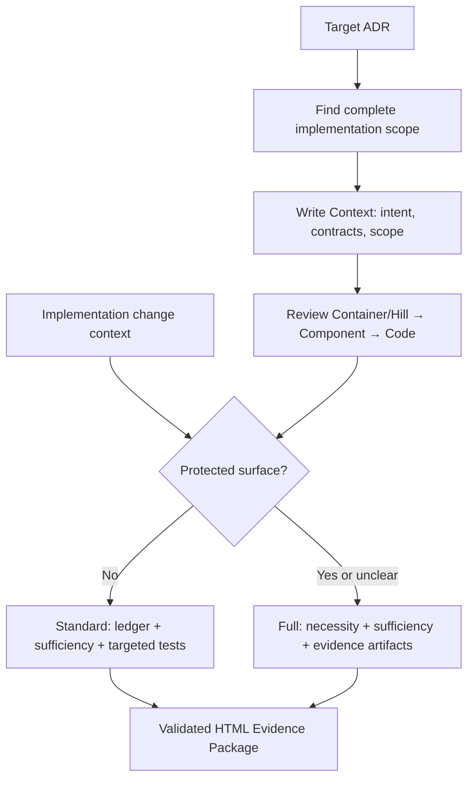

# adr-impl-review

Disprove the implementation in this order.

In full mode, the necessity and sufficiency perspectives are grounded separately and do not see each other's conclusions before synthesis (section 3). They may run in parallel or sequentially. Standard mode runs only the sufficiency perspective defined below. The user's intent and the ADR's regeneration checklist are settled before implementation; this command consumes that baseline and does not reopen it as a routine post-implementation gate.

This procedure is not a proof of mathematical necessity and sufficiency. It is **a disproof-based review that hunts for unnecessary changes and missing behavior from two different perspectives.** A passing test is only evidence that no counterexample was found among the cases actually executed — not a proof of completeness.

> **Language**: this skill and every other harness prompt are written in English. Write the human-facing review report in the language the user explicitly requests or currently uses. If the conversation does not establish a language, use the target ADR's dominant language. Keep stable artifact anchors and technical terms when translation would reduce precision. Any user-facing phrasing below is a guide, not a literal string.

Apply `${CLAUDE_PLUGIN_ROOT}/references/non-invasive-harness.md`: review mode,
required perspectives, evidence, and verdicts are contractual. Subagent count,
named/generic/main-session execution, parallelism, and model selection are chosen
by the current model.

The review has two outputs:

- **Implementation verdict** — whether the code and tests honor the ADR.
- **PR comprehension readiness** — whether the reader can explain the important
  behavior and causal path.

`PASS` never implies comprehension readiness. Do not send the PR until the
check passes, and never turn it into an ADR or code verdict.

## The abstraction ladder — which level owns each disagreement

Most findings in this review are a disagreement between the ADR and the code, and **every routing call below is really the question "which level owns this fact?"** So hold the principle (`authoring-rules.md` / `concepts.md` "The abstraction ladder") while reading the findings.

PRD, ADR, and code are the same system at three resolutions, and each level exists to be **read alone**. The ADR's question is "why this decision, and what must the result honor?"; the code's is "how is it done?" That split decides every category:

| Disagreement                                          | Level that owns it          | Category                   | Route                                    |
| ----------------------------------------------------- | --------------------------- | -------------------------- | ---------------------------------------- |
| The ADR's contract is not honored in code             | ADR (the contract)          | `Spec violation`           | fix the code                             |
| Names, signatures, wire form, field names differ      | Code (implementation facts) | `Impl-fact mismatch`       | remove ADR detail via sync               |
| The code adds an ADR-worthy behavior no level decided | neither yet                 | `Undecided behavior`       | escalate only if contract choice remains |
| The code implemented a different coherent decision    | contested                   | `Decision changed in code` | escalate, then log it                    |

So the recurring judgment is **not "is the code good?" but "at which resolution does this belong?"** Two guards follow, and they are the same guards `/adr-new` writes under, seen from the other side:

- **Never absorb a contract violation as an implementation fact.** An allowed value set or transition rule differing is `Spec violation` (the ADR owns it); only the identifier name or representation is `Impl-fact mismatch`. Routing a set difference to `/adr-sync` silently rewrites the contract to match whatever the code did.
- **Never treat code that enforces a contract as removable.** Cap checks, transition guards, permission checks, and required-field validation are the code level's job of honoring the ADR level's contract, so "it passes without this" is not evidence.
- **Never promote implementation discretion into `Undecided behavior`.** Before raising extra code to the ADR, apply the ADR admission gate. Replaceable libraries, SDKs, frameworks, middleware, module layouts, credential provider chains, signers, authentication adapters, and tuning choices are expected code-level decisions when contracts and architecture/security boundaries stay unchanged. They are not findings merely because the ADR does not name them.
- **Do not hide material implementation discretion either.** The sufficiency pass records Notable implementation choices once from code outward. Keep only choices that affect runtime behavior, failure handling, operations, cost, or future maintenance, with the selected value or behavior, code evidence, why it fits the ADR intent, and why it matters. Explain intent fit only through the contract and boundaries the choice preserves; never invent historical rationale. Separately inspect externally checkable premises the choice relies on, such as provider guarantees, input provenance, ordering, uniqueness, trust boundaries, or platform behavior. Missing historical rationale or alternatives is not a risk by itself, but an unverified premise whose falsehood could violate safety or the ADR contract is an `Unverified risk`, not an ordinary implementation choice.

A note on scope: `/adr-impl-review` judges the **code** level against the ADR level. Whether the ADR itself is written at the right resolution is `/adr-review`'s question, and the implementation cycle confirms the decision and regeneration checklist before code begins. Never rewrite an ADR from inside this command to make a finding go away.

## Invariant principles

- **Report-only**: never auto-modify code, ADRs, or the mapping. Write only the Markdown/JSON/HTML review artifacts.
- **Independently grounded conclusions**: in full mode, necessity and sufficiency derive conclusions from the original ADR, complete implementation scope, separate change scope, code, tests, and approved baseline without reading each other's results before synthesis. In standard mode, preserve the same grounding for sufficiency. A fixed number or type of agent is not required.
- **The approved ADR is the behavioral spec**: right after implementation, the ADR's admitted decision and requirement contract are authoritative because the implementation cycle confirmed their intent and regeneration checklist before code began. Implementation facts such as API names and actual field names should not be in that spec; when they appear, separate them as `Impl-fact mismatch` and route them for removal. If review finds concrete evidence that the ADR baseline itself is incomplete or contradictory, return it as a blocking contract issue; do not perform a routine confirmation or silently fix the ADR inside impl-review.
- **Evidence over assertion**: every finding includes the applicable basis among an ADR quote, the actual diff or code location, and a reproduction procedure or execution result. Report a conjecture you could not reproduce only as `Unverified risk`. For an assumption risk, state the externally checkable premise, the contract or safety consequence if it is false, and the missing verification; never request or fabricate private chain-of-thought.
- **Escalation is exceptional**: ask for human judgment only when the approved contract must change, premises contradict, a material risk cannot be verified, or the repair would exceed the approved scope. Evidence-backed implementation and test defects are remediation work, not approval questions.

Before planning execution, read `${CLAUDE_PLUGIN_ROOT}/references/subagent-dispatch.md` completely. Choose the smallest available strategy that preserves the selected perspectives and evidence. Record only material isolation limits.

## 1. Fix the target, implementation scope, and change scope

ADR identification follows the same rules as `/adr-impl`.

- If it is a file path, use that ADR.
- If it is a category key, look it up in `docs/adr/.mapping.json`.
- With no argument, show the list of `Accepted` ADRs and take a selection.
- If it is a `Proposed` ADR invoked by `/adr-impl` after implementation, refactoring, and tests, treat it as the selected pre-promotion completion review and do not ask whether it is partial. For any other `Proposed` target, confirm once whether this is a partial-implementation review.

Determine the **change scope** by this priority:

1. A PR / commit range the user supplied, or `--base`.
2. The current staged + unstaged changes.
3. For a clean worktree, the merge-base diff between the current branch and the default branch.

The change scope explains before/after behavior and is the primary input to a
change-focused necessity pass. It is never the ceiling of the implementation review.

Independently build the **complete implementation scope** for the selected ADR:

1. Enumerate `D0` and every `R1..Rn` contract row from the ADR.
2. Extract domain terms, behaviors, states, boundaries, providers, and failure
   results from each row.
3. Search the repository from those terms, open the actual code, and trace
   direct and indirect callers and callees. Check differently named symbols,
   configuration, generated code, and surviving older paths where relevant.
4. Find every related ideal and edge-case test. Cross-check each contract row
   from decision to implementation and from implementation back to its entry
   points.
5. Record the confirmed production files, tests, and call paths as the
   implementation scope. A caller-provided file list is a starting floor, never
   a search limit.

Do not infer scope from the ADR category name or the current diff. If any
contract row or core call path cannot be fully narrowed, record the search
limit, mark the affected coverage `UNVERIFIED`, and return `INCONCLUSIVE` rather
than `PASS`.

If the change scope mixes several implementations and cannot be mapped onto the
ADR, do not guess about the necessity pass — get the base/range confirmed. The
complete implementation scope still comes from the ADR itself. After fixing
both scopes, prepare the following original material.

- The full ADR text and its entry in `.mapping.json`
- The complete implementation file/test inventory and confirmed direct and indirect call paths
- The raw diff and changed-file list as separate change context
- **The seeded rule docs the repo actually holds** — `docs/adr/concepts.md` (the abstraction ladder, the requirement gate, the source-of-truth split) and `docs/adr/authoring-rules.md`, falling back to `${CLAUDE_PLUGIN_ROOT}/templates/adr/`. These decide **which level owns a disagreement**, so a reviewer working from remembered defaults can route a contract violation as an implementation fact. A project may have hand-edited or pinned its copy, and if the stamp lags the installed plugin (`rules-doc-stale`) or `concepts.md` is missing because the repo predates the split (`rules-doc-layout-legacy`, in which case that material sits inside `README.md`), **say so in the final report's review limits** — the reviewers judged against those docs, so the reader needs to know which version.
- Whichever project conventions exist among `AGENTS.md`, `CONTRIBUTING.md`, `CLAUDE.md` — note these are the **project's own** conventions file, a different thing from `docs/adr/concepts.md` above
- An executable project test command

Create one review artifact directory and pass its path to every agent that follows. To avoid dirtying the repository, the default location is `${TMPDIR:-/tmp}/adr-impl-review-<adr-slug>-<timestamp>/`. Record the review start time when this directory is created. The final artifact records the selected mode and rationale, elapsed time, per-perspective finding counts, unverified-risk count, and executed test-command count.

### 1.1 Build the Review Hiking route

Read `references/review-hiking.md` completely. It owns Context,
Container/Hill, Component, Code evidence, contract assignment, test selection,
ephemeral state, and perspective isolation. Produce `reviewHike.context` and
`reviewHike.hills` before mode selection. If
`/adr-impl` supplies Implementation Hill boundaries, reuse them when they match
shipping user flows, capabilities, or bounded contexts; adjust only when final
evidence shows a different vertical boundary.

### 1.2 Select the review mode

Use `full` when any of these surfaces changes: requirement values or rules, public API or wire form, schema or persistence, state or transitions, permissions or visibility, security boundaries, external fallback, concurrency, transactions, resource lifetime, or error semantics. Also use `full` when the complete implementation scope spans bounded contexts or broad modules, when the user requests a full review, or whenever classification is unclear.

Use `standard` only for localized implementation or reinforcement of an existing decision that changes none of those protected surfaces. An explicit `--mode standard` never overrides the criteria; upgrade it to `full` and explain why. An explicit `--mode full` is always honored.

Record `reviewMode` and the classification evidence in the artifacts.

### 1.3 Prepare optional explanation input

For broad or high-load reviews, optionally apply the `adr-impl-explainer` role
to the ADR, complete and change scopes, and related tests. Save optional
`explanation.md`; skip it when the report can explain the Hills directly.

The explanation starts with `Context`, then follows each Container/Hill through
Component and Code evidence in
reader-priority order. Apply
`references/review-hiking.md`; do not default to file order.

Later headings name the actual vertical behavior, capability, or bounded
context. Their content remains subject-specific.
Do not stop to show it or ask the user to reconfirm. Never pass it to either
review perspective.

When selected, prepare one to five medium-difficulty four-option,
single-answer questions about material behavior, causal paths, contracts,
boundaries, failures, test conditions, or excess scope. Each question applies
the explanation to a concrete situation. Do not ask symbol or line-number
trivia, use trick wording, or add filler.

For each question, keep these machine-readable fields:

- `id` — `Q1` through `Q5` in order
- `question` — the visible application prompt
- `options` — exactly `A` through `D`; each option has visible `text` and hidden,
  neutral `feedback`
- `correctOptionId` — exactly one of `A`, `B`, `C`, or `D`
- `explanation` — why the correct option follows from the contract and causal path
- `evidence` — the ADR, code, or test evidence used to grade it

The visible report initially contains only `id`, `question`, and the four
options. The standalone HTML may reveal the selected option's feedback, the
correct answer explanation, and evidence only after the reader selects one
option and explicitly requests self-check. Use neutral outcomes such as
`Correct` and `Review this concept`; never add a score, grade, celebration,
ability judgment, praise, or gamification. This local comparison does not mark
the PR comprehension-ready.

## Standard mode

For `standard`, execute this section and then continue at section 7. Sections 2-6 are the full-mode path.

1. Build a decision ledger containing every ADR decision and each independently reviewable requirement-contract row, including its implementation-independent observable evidence. The sufficiency pass also extracts Notable implementation choices once from the complete implementation scope.
2. Apply the `adr-impl-sufficiency-reviewer` role to the original material, Hills, and ledger with the smallest suitable execution strategy.
3. Review Hills in reader-priority order; record contract status, implementation evidence, and targeted test results. An unexecuted core path yields `INCONCLUSIVE`.
4. Verify and synthesize findings using section 4's evidence rules. Standard mode has no necessity pass, separate report-writing requirement, fixed Mermaid quota, or post-implementation spec-fitness gate.
5. Continue at **Report and artifact stage** below. In standard mode,
   `reviewMode` is `standard`, `necessityFindingCount` is zero, and `PASS`
   requires every contract-coverage row to be `PROVEN`, all required targeted
   tests passing, no evidence-backed must-fix finding, and no unverified core
   risk.

## Full mode

The rest of sections 2-6 applies only to `full`.

## 2. Build the review baseline without a post-implementation gate

Create `review-baseline.md` from:

- the current ADR and mapping summary
- the Decision, Decision Drivers, every numeric and non-numeric requirement row, explicit out-of-scope items, and recorded risk tolerance
- any decision-changing assumption recorded in Context or a Decision Driver, including what must be reconsidered if it is false
- the pre-implementation approval summary supplied by `/adr-impl`, when available
- a regeneration checklist marking where each contract is stated in the ADR
- the implementation-independent observable evidence recorded for each contract row

Self-check the baseline against `authoring-rules.md` R18a/R19. A missing contract that can be recovered from the already approved ADR wording is corrected in the baseline. Concrete evidence that the ADR itself is incomplete, contradictory, or requires a new product choice is a blocking contract issue routed to ADR authoring before any code repair; it is not a reason to ask the routine three confirmation questions again. When `/adr-impl-review` is invoked standalone and no approval summary exists, record that limit and use the current ADR as the review baseline.

Before declaring an ADR-completeness gap, apply the same resolution ladder as `/adr-impl`: derive obligations already required by an explicit contract, reuse established project conventions, apply authoritative domain rules, and accept reversible low-risk defaults below ADR resolution. Attach a derived obligation to its parent `D0` or `Rn` coverage row rather than inventing a new contract ID. Keep a domain default as a Notable implementation choice. Only a gap with multiple domain-valid outcomes or protected product-policy impact becomes a blocking contract issue.

For every blocking contract issue, return one consolidated **Decision request** to the caller. Each item states the missing decision, a recommended option with its domain basis, two or three realistic alternatives, user/data/security/operational impact, and exact ADR contract wording. Do not merely say "ask the user" and do not interrupt once per gap.

## 3. Derive the two review perspectives independently

Give both perspectives, in common, **only the original ADR, complete
implementation scope, separate change scope, tests, project rules, and
`review-baseline.md`.** Do not give either perspective `explanation.md` or the
other perspective's result. That is what keeps them from anchoring on an earlier
interpretation. The model may run them in parallel or sequentially and may use
zero, one, or several subagents.

### 3.1 The necessity review

Apply the `adr-impl-necessity-reviewer` role contract.

- The question: "is each review unit strictly necessary to achieve the ADR's goal?"
- Success condition: finding changes that can be removed or shrunk, with evidence.
- Forbidden: style preferences, a taste for future extensibility, unjustified "make it simpler". Also forbidden is filing **code that enforces a requirement the ADR records** (cap checks, counters, expiry handling, and likewise transition guards, permission checks, duplicate prevention, required-field validation) as unnecessary — whether it is a number, a value set, or a permission, that is contract.
- The core attempt: when a change scope exists, test each changed unit. For a
  standalone existing-implementation review with no meaningful change scope,
  test each ADR-related implementation unit. In both cases ask, "does the ADR
  and the approved review baseline still hold if this is deleted?"

### 3.2 The sufficiency review and tests

Apply the `adr-impl-sufficiency-reviewer` role contract.

- The question: "is there a counterexample that makes this implementation fail?"
- Success condition: accounting for every row of the ADR decision ledger, and reproducing omissions, boundaries, errors, races, and partial failures.
- **Compare requirement values value by value** — put each limit, quota, cycle, retention period, cap, and target the ADR records as its own ledger row and compare it directly against the number in the code. "There is limit logic" is not an accounting. A value mismatch or an unenforced value is a `Spec violation`. For a self-imposed value absent from the ADR, apply the admission gate: admitted requirement or boundary choices become `Undecided behavior`; replaceable choices go into Notable implementation choices; an unknown becomes `Unverified risk` only when it could affect safety or the ADR contract.
- **Compare non-numeric requirements item by item too** — allowed value sets, transition rules, mandatory fields, permissions, visibility, ordering, uniqueness, and units are each ledger rows as well. An added or removed set member, a forbidden transition becoming allowed, and mandatory → optional are all `Spec violation`. **Split enums** — a differing identifier name is `Impl-fact mismatch` (correct the ADR), while a differing allowed set or transition rule is `Spec violation` (correct the code).
- **Inspect hidden implementation premises** — for every material choice and every contract-critical call path, ask which externally checkable fact must hold for the implementation to preserve the ADR contract and safety. Verify provider guarantees, caller authentication, input provenance, ordering, uniqueness, trust boundaries, and platform behavior from code, tests, configuration, or an authoritative external contract. If a premise is not verified and its falsehood could break a contract row or safety property, emit `Unverified risk`, mark the affected coverage row `UNVERIFIED`, and do not return `PASS`. Do not reconstruct the implementer's private reasoning.
- **Complete each Hill's evidence in order** — apply
  `references/review-hiking.md`; missing status, evidence, or test results
  prevent `PASS`.
- **Resolve apparent requirement gaps before escalating** — connect a logical consequence to its explicit parent contract, recognize an established project/domain default as implementation discretion, and escalate only when several valid product behaviors remain or the missing rule affects money, permissions, legal/compliance behavior, retention, irreversible data, a public contract, or durable fallback. For an escalation, produce the complete Decision request instead of a bare ambiguity note.
- Before checking documentation and tests, read
  `${CLAUDE_PLUGIN_ROOT}/references/implementation-evidence.md` completely and
  apply its completion and review classifications. Run the related targeted
  tests and any already-configured verification tooling it permits.
- Create temporary reproduction files only in the artifact directory, and never change repository files.

Choose the orchestration from current capability, risk, context size, latency,
and cost. Do not require a provider family, reasoning tier, fixed agent count,
or fixed parallelism. The observable requirement is that the two perspectives
are separately grounded and do not read each other's conclusions before
synthesis. Save their results as `necessity-review.md` and
`sufficiency-review.md`.

## 4. Evidence verification and synthesis

The main session does not merge the two reviews by vote. Verify findings with these rules.

1. Merge the same problem into one, but keep every source in `perspective`.
2. Do not hide mutually contradictory conclusions — record them as a `Contradiction` finding.
3. Confirm a high-impact finding only with a test, a reproduction, or an exact code/ADR comparison.
4. Downgrade to `Unverified risk` any claim you could not execute or whose call path you could not fully confirm.
5. Distinguish the fact that a test exists from the fact that a test detects the defect.
6. A necessity PASS means "no unnecessary change was found"; a sufficiency PASS means "no counterexample was found at present and the decision ledger is accounted for."
7. Normalize the decision ledger into contract coverage independently from findings. Derive deterministic IDs from the ADR: `D0` is the Decision and `R1..Rn` are every top-level bullet under `### Requirement contract` in source order. Every derived ID gets exactly one row with `contractId`, `requirement`, `status`, `adrBasis`, `implementation`, `evidence`, and `tests`; omissions, duplicates, and invented IDs are invalid. `D0.adrBasis` is `Decision`; each `Rn.adrBasis` is the complete source bullet verbatim. Use only `PROVEN`, `VIOLATED`, `UNVERIFIED`, or `CONTRADICTED`. `PROVEN` means the inspected or executed evidence supports the row and no counterexample was found; it is not a mathematical proof.
8. Before normalizing implementation choices, inspect their externally checkable premises. A premise confirmed by code, tests, configuration, or an authoritative external contract may remain part of the choice's evidence. If the premise is unverified and could violate safety or an ADR contract row when false, create an `Unverified risk`, mark the affected coverage `UNVERIFIED`, and block `PASS`. Do not infer private reasoning.
9. Normalize Notable implementation choices independently from findings. Every row has only a concrete selected value or behavior, code evidence, why it fits the ADR intent, and why it matters. Explain fit by naming the preserved contract or boundary, not by guessing why the implementer chose it. A row that changes a requirement contract or durable boundary is removed from the list and raised as `Undecided behavior`.
10. Normalize the wide view into `reviewHike.context` and the Container,
    Component, and Code route into `reviewHike.hills` exactly as
    `references/review-hiking.md` and the artifact contract require.
11. Normalize every finding into a user-action card as well as technical evidence. Keep non-empty `whyItMatters`, `expectedBehavior`, `observedBehavior`, `requestedChange`, `editTargets`, and `completionCriteria` fields. These fields explain the task in plain language; the exact ADR quote, code fragment, evidence, command, and result remain separate audit fields.

The synthesized verdict:

- `PASS`: there is no evidence-backed must-fix, every contract-coverage row is `PROVEN`, and the required targeted tests passed.
- `FIX_REQUIRED`: there is a finding requiring concrete follow-up in the code, the ADR, or the tests.
- `INCONCLUSIVE`: an important path could not be executed or the scope could not be fixed, so PASS/FIX cannot be judged honestly.
- `BLOCK`: a fork in the decision itself, or a structural collapse, requires a human architectural decision before any individual code fix.

## Report and artifact stage

Only after evidence synthesis and verdict selection, read
`references/artifact-contract.md` completely and follow it exactly. It owns the
common standard/full `implementation-review.md`, `findings.json`,
materialization, validation, HTML rendering/opening, completion response, and
optional interactive comprehension behavior. Do not load it during scope
discovery or the independent review perspectives.

## Finding routing

This command itself remains report-only. Only when findings exist or
`/adr-impl` needs the pre-promotion routing result, read
`references/remediation-routing.md` completely. It owns the
**Auto-remediate in the caller** and escalation routes. Do not load it for a
finding-free standalone review.

## Prohibited

- The explainer must not omit failure paths, state, or concurrency to "look simple."
- Never pass a reviewer the explanation document or the other reviewer's result.
- Never use ASCII or box-drawing diagrams instead of Mermaid in the junior-facing report.
- Never invent components or call relationships in Mermaid that were not confirmed in the actual code.
- Never expose raw Markdown list markers or a supported Mermaid fence as the primary human-facing rendering.
- Never sort the human report by technical category. Group findings as fix, decision, verification, and suggestion tasks, then preserve the report writer's importance order inside each group.
- Never show ruling controls for ordinary evidence-backed remediation or read-only context.
- Never put implementation chronology ahead of Context and the most
  important verified user or operational behavior.
- Never call technical layers, files, modules, reviewer roles, or review
  lifecycle phases Hills.
- Never synthesize the final verdict while a Hill has an unaccounted contract
  row or unexecuted core vertical path.
- Never use generic `Background`, `Intuition`, and `Code walkthrough` headings
  as a mandatory report template.
- Never invent a user reaction, measurement, project outcome, or causal
  relationship that the ADR, code, tests, configuration, or user did not establish.
- Never generate more than five primary comprehension questions or add filler to
  reach five.
- Never generate a free-response comprehension question.
- Never reveal a question's correct option, option feedback, explanation, or
  evidence before the reader selects one option.
- Never add scores, grades, celebration, praise, ability judgments, or
  gamification to self-check feedback.
- Never include a comprehension question, grading criterion, evidence, or answer
  request in the ordinary main-session completion response.
- Never start the interactive comprehension check unless the user explicitly
  requests it.
- Never call the PR comprehension-ready while a prepared question is failed,
  skipped, or unanswered.
- Never state that sufficiency is proven merely because the tests passed.
- Never report an unreproduced conjecture as though it were a confirmed finding.
- Never treat the current diff or a caller-provided file list as the ceiling of the ADR implementation scope.
- Never report either review mode complete without a validated, non-empty `adr-impl-review-report.html`.
- Never finish either review mode without running `adr-impl-review-open.mjs` once and reporting its `OPENED` or `NOT_OPENED` result.
- Never modify product code, ADRs, the mapping, or existing tests during the review.
