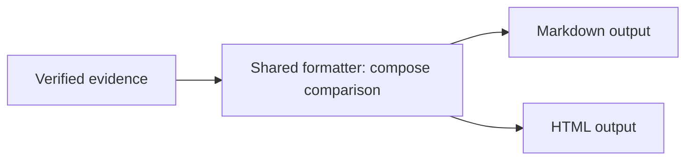
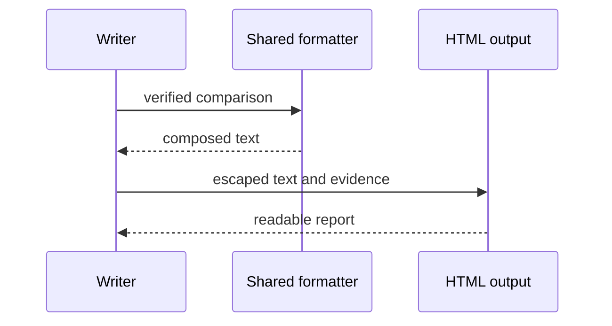

# Visual questions in an implementation review

Read this after finding the implementation scope, before writing the report.
Plan diagrams while choosing the Hills and test cases, then check their meaning
and rendered appearance before delivering the HTML.

## Account for each Hill

For each Hill, identify what the reader needs to reconstruct: the important
behavior, participants and responsibilities, request/response order, data
movement, failure/recovery path, or changed responsibility.

Record each useful visual question in `diagramRequirements`. Give each Hill a
`diagramIds` array referencing the diagrams that explain it. A local change
whose complete relationship and behavior are clear in one or two sentences may
use an empty array with its own concrete `diagramOmissionReason`. A global
omission reason never excuses a different, complex Hill.

One diagram may answer several related questions when the relationships remain
clear. Add or split diagrams when an important question remains unanswered.
Do not set a fixed diagram count or add a second type just because a state or
failure appears in the code.

## Choose the view that answers the question

| Reader's question                                                  | Preferred view                   | Information to show                                                                                                         |
| ------------------------------------------------------------------ | -------------------------------- | --------------------------------------------------------------------------------------------------------------------------- |
| Who requests what, in what order, and what comes back?             | `sequenceDiagram`                | Participants, meaningful input/response data, order, and relevant failure/retry branches. Applies to synchronous calls too. |
| Which parts own the behavior, and how are they connected?          | Component view using `flowchart` | Component roles, responsibility, dependencies/data flow, and system boundaries.                                             |
| Which condition selects the next algorithm or recovery path?       | `flowchart`                      | Conditions, outcomes, and important branches.                                                                               |
| Which transitions are allowed or forbidden throughout a lifecycle? | `stateDiagram-v2`                | States, transition conditions, and the invariant under review.                                                              |
| What data is related, owned, or repeated?                          | `erDiagram`                      | Entities, relationship meaning, and cardinality.                                                                            |

Prefer sequence and component views for ordinary implementation explanations.
Use both when structure and execution order are independently important.
State diagrams are for a lifecycle or allowed/forbidden transition question;
their selection reason must explain why a sequence or component view is
insufficient. A state value or failure branch alone does not justify a state
diagram. A failure already clear in a sequence's `alt` branches does not need a
second flowchart.

When multiple Hills share responsibilities or boundaries that must be
understood together, put the overall component view in `Context` and assign
its ID to the relevant Hills. It does not replace detailed execution/failure
questions it has not answered. Do not turn the report outline or file tree
into a component diagram.

## Keep the reader oriented

Place each diagram next to its explanation. Before it, briefly explain how to
read its boxes/actors, arrows, and relevant boundary. After it, add one
`Notice:` sentence stating what to verify. Prose explains causes, outcomes,
and interpretation; it should not repeat every arrow.

Use the same participant names and representative input across related views.
For before/after comparisons, keep those names and input stable and label
changed paths or responsibilities explicitly. Never rely on color alone.
Ground every node and edge in inspected code, contracts, or executed evidence.
Do not invent a caller, data store, dependency, or successful execution.

For example, when a shared formatter supplies two outputs, a component view
explains ownership:

A sequence view answers the separate question of how one output is produced:

These are syntax examples, not facts to paste into another repository. Real
report fences carry the corresponding `%% requirement: Vn` marker.

## Check coverage, meaning, and rendering

1. Check each Hill's questions against its assigned diagrams or local omission.
   An overall map cannot hide a missing detailed flow.
2. Check the selected view, participants, labels, boundaries, important branches,
   and before/after consistency against the reviewed evidence. The validator
   checks structure, not the truth or usefulness of a selection reason.
3. Materialize and validate the report. The validator checks IDs, ownership,
   references, diagram type, `Notice:`, and the renderer's supported grammar.
4. Render the HTML and inspect it. Sequence lifelines/messages and component
   nodes/boundaries/connections must actually be visible, with readable labels.
   Open both a wide and narrow view when layout is affected.
5. A source fallback is not a completed required visualization. Rewrite it using
   supported syntax and check again. If it cannot be resolved, report the
   specific rendering limit and do not claim visualization complete.

The self-contained renderer supports sequence participants/aliases, messages,
notes and nested `alt/else`, `opt`, `loop`, and `par/and`; flowchart nodes,
chains, labeled arrows, and single-level subgraphs; simple named states and
transitions; and entity relationships. Advanced syntax is rejected rather than
silently losing its meaning. Preserve full Mermaid source for inspection.
