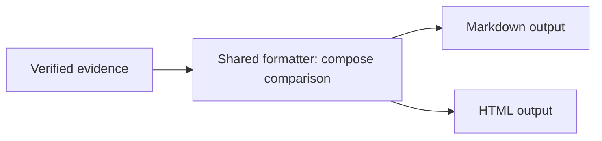
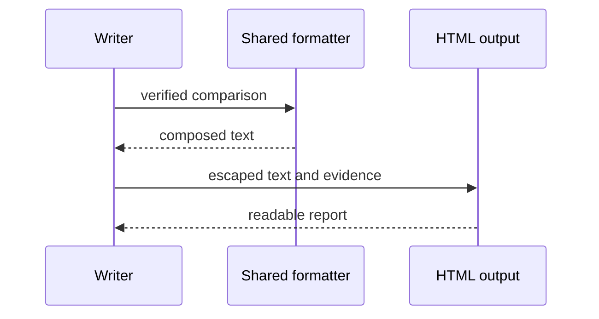

# Visual questions in an implementation review

Read this after finding the implementation scope, before writing the report.
Plan diagrams while choosing the Hills and test cases, then check their meaning
and rendered appearance before delivering the HTML.

## Account for each Hill

For each Hill, identify what the reader needs to reconstruct: the important
behavior, participants and responsibilities, request/response order, data
movement, failure/recovery path, or changed responsibility.

Include useful figures whenever the evidence and delivery format support them.
Record the figures selected for delivery in `diagramRequirements`, and give each
Hill a `diagramIds` array linking to them. Figures are never a delivery gate.
When the user excludes figures, evidence or format prevents a useful view, or
prose explains the relationship clearly, use an empty array with a concrete
`diagramOmissionReason` for that Hill. This metadata explains the presentation
choice; it never requires omission approval or a simpler subject.

One diagram may answer several related questions when the relationships remain
clear. Add or split diagrams when an important question remains unanswered.
Do not set a fixed diagram count or add a second type just because a state or
failure appears in the code.

## Choose the view that answers the question

Choose by the reader's question and any requested notation. Any type supported
by the bundled official Mermaid engine is available. Examples are not an
allowlist or preference hierarchy: a sequence view may explain interaction
order, a class view inheritance and composition, a state view transitions, or
an ER view cardinality. Select other views when they explain the subject better.
Do not default to flowchart boxes, or require extra justification only for a
state, class, C4, or other type. Preserve the chosen notation's relationship
semantics. Multiple views are useful when they answer different questions;
no fixed combination or diagram count is required.

When multiple Hills share responsibilities or boundaries that must be
understood together, put the overall component view in `Context` and assign
its ID to the relevant Hills. It does not replace detailed execution/failure
questions it has not answered. Do not turn the report outline or file tree
into a component diagram.

## Keep the reader oriented

Place each diagram next to its explanation. Before it, briefly explain how to
read its boxes/actors, arrows, and relevant boundary. After it, add one
`Notice:` sentence stating what to verify. Prose explains causes, outcomes,
and interpretation; it should not repeat every arrow.

Use the same participant names and representative input across related views.
For before/after comparisons, keep those names and input stable and label
changed paths or responsibilities explicitly. Never rely on color alone.
Ground every node and edge in inspected code, contracts, or executed evidence.
Do not invent a caller, data store, dependency, or successful execution.

For example, when a shared formatter supplies two outputs, a component view
explains ownership:

```mermaid
flowchart LR
  Input["Verified evidence"] --> Shared["Shared formatter: compose comparison"]
  Shared --> Markdown["Markdown output"]
  Shared --> HTML["HTML output"]
```

A sequence view answers the separate question of how one output is produced:

```mermaid
sequenceDiagram
  participant Writer
  participant Shared as Shared formatter
  participant HTML as HTML output
  Writer->>Shared: verified comparison
  Shared-->>Writer: composed text
  Writer->>HTML: escaped text and evidence
  HTML-->>Writer: readable report
```

These are syntax examples, not facts to paste into another repository. Real
report fences carry the corresponding `%% requirement: Vn` marker.

## Check coverage, meaning, and rendering

1. Check each Hill's questions against its assigned diagrams or local omission.
   An overall map cannot hide a missing detailed flow.
2. Check the selected view, participants, labels, boundaries, important branches,
   and before/after consistency against the reviewed evidence. The validator
   checks structure, not the truth or usefulness of a selection reason.
3. Materialize and validate the report. The validator checks IDs, ownership,
   references, diagram type, `Notice:`, and the bundled official Mermaid grammar. This proves syntax, not rendered appearance.
4. Render the HTML and inspect it. Sequence lifelines/messages and component
   nodes/boundaries/connections must actually be visible, with readable labels.
   Open both a wide and narrow view when layout is affected.
5. A source fallback or a pending figure is not a rendered figure. HTML embeds
   the official engine and reports success only after SVG creation; failures keep
   source and a visible error. Do not rewrite valid syntax to fit a local subset.
   If the selected engine or format cannot render the requested notation, explain
   that limitation and preserve the source. Do not claim rendering succeeded or
   block the report merely because a figure is absent.

The parser and browser engine are bundled, so marketplace installs require no
package installation or external network for diagrams. Mermaid source is kept
for inspection, and authored scripts and callbacks are inert.
