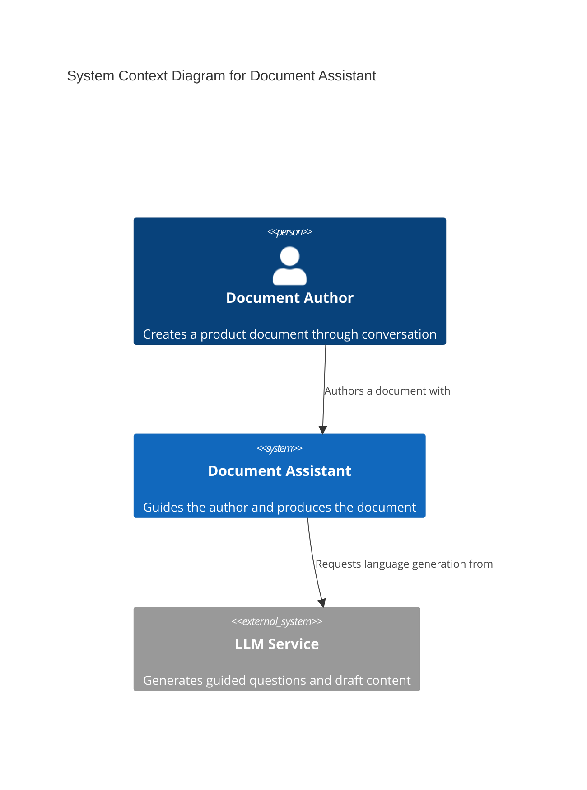
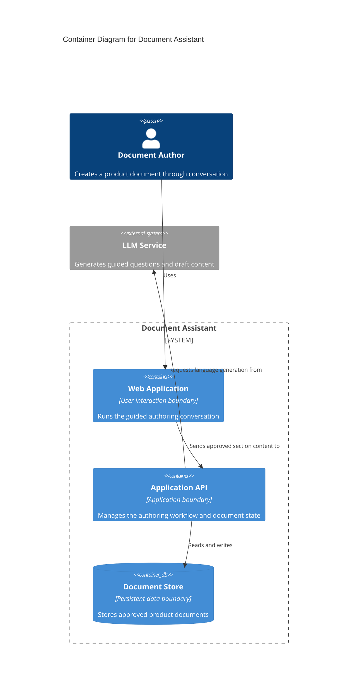

<section_guide number="4" title="High-Level Architecture">
<purpose>Describe the system architecture using C4 model Context and Container diagrams</purpose>

<scope_boundary>
Section 4 records the system boundaries and conditions that a regenerated implementation must preserve. It is not a technology inventory. A fact that an agent can recover by reading code or dependency metadata stays out unless changing it would violate a product requirement, contract, regulation, security boundary, or mandated external boundary.

Section 4.1 shows the product and major runtime/data boundaries once. Section 4.2 records only durable Architecture Constraints. How each Feature crosses those boundaries belongs to Section 7.3. `/feature-to-adr` later transfers admitted constraints into ADRs and leaves replaceable technology means to code. After successful handoff, ADRs are the implementation authority and this Section remains legacy planning context.

Section 4.1 MUST contain both a Mermaid `C4Context` diagram and a Mermaid `C4Container` diagram. These are the only C4 levels ALPS uses. Never generate Component, Dynamic, Deployment, or Code-level C4 diagrams, and never put modules, classes, functions, files, methods, libraries, or frameworks into the Container diagram.
</scope_boundary>

<questions>
1. Who uses the product, and which external systems or services interact with it? (Context)
2. What are the major independently running or deployable containers, data stores, and responsibilities inside the target system? (Container)
3. Which scale, access, platform, provider, data, security, or deployment constraints must any implementation preserve? (Architecture Constraints)
</questions>

<architecture_constraint_guide>
Architecture Constraints MUST be elicited without asking the user to design the implementation:

Step 1 — Reuse existing product context, then ask only for a missing durable constraint:

- Platform: "How will users access the product? (Web browser / Mobile app / Both)"
- Scale: "What total and concurrent usage must the MVP support?"
- External boundary: "Must the product use or avoid a particular provider or platform because of a contract, regulation, organization policy, or integration dependency?"
- Data/security: "Are there residency, privacy, trust-boundary, isolation, encryption, or recovery conditions every implementation must preserve?"
- Deployment: "Are region, availability, offline, environment, or recovery boundaries mandatory?"

Step 2 — Classify each candidate before writing:

- Durable constraint: changing it would violate a requirement, contract, regulation, security boundary, or mandated external boundary. Record it with its basis.
- Implementation discretion: a different framework, SDK, ORM, internal database product, credential mechanism, module layout, CI tool, or tuning value could satisfy the same constraints. Do not record it.
- Unresolved protected decision: several valid answers would change money, permissions, legal/compliance behavior, privacy, safety, irreversible data meaning, a public contract, or a durable external boundary. Ask one focused question.

Step 3 — Confirm only the Architecture Constraints:

- Record scale assumptions when Section 6.2 must derive a measurable performance NFR from them. Distinguish total from concurrent users.
- State mandated platforms or providers as boundaries plus their basis, not as a general stack list.
- If no additional durable constraints exist beyond Section 4.1, write that result directly.

IMPORTANT:

- Do NOT ask the user to choose frameworks, SDKs, ORMs, internal database products, credential plumbing, module layouts, or CI tools.
- Do NOT save an AI-recommended technology stack when the user has no durable constraint.
- If the user names a technology, ask what requirement or boundary mandates it. If none does, leave it to implementation.
  </architecture_constraint_guide>

<example>
### 4.1 System Context Diagram

### 4.1 System Container Diagram

### 4.2 Architecture Constraints

Scale assumption for this illustrative Document Assistant: support 1,000 concurrent users at peak, as carried into Section 6's example. Total audience size is unspecified in this example.

- Access boundary: users access the MVP through a web browser.
- Data boundary: customer documents remain in the contracted region.
- External provider boundary: the model provider must satisfy the organization's no-training data policy.

</example>

<completion>Include one confirmed C4 Context diagram, one confirmed C4 Container diagram, and confirmed Architecture Constraints containing only conditions a regenerated implementation must preserve. Reject Component, Dynamic, Deployment, Code-level diagrams, and replaceable technology inventories.</completion>
</section_guide>
