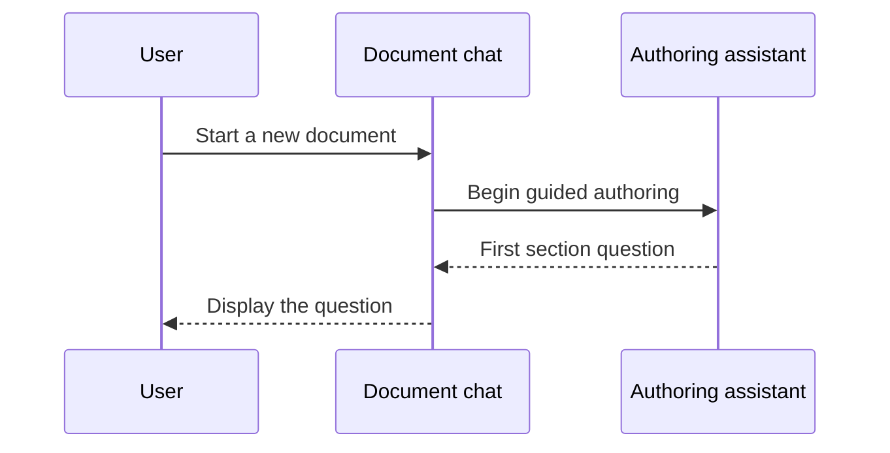

<section_guide number="5" title="Design Specification" references="6">
<purpose>Detail the UX, page flow, key pages, and user journey</purpose>

<required_review>
Section 6 (Requirements Summary) is authored BEFORE this section (see the recommended authoring order: ...4 → 6 → 5 → 7...).
Call read_alps_section(6), summarize its Feature IDs (F1, F2...), and reuse them in Key Pages.
If Section 6 is somehow still empty, author it first — its Feature IDs are prerequisites here. Do NOT invent ad-hoc Feature IDs.
</required_review>

<structure>
This section has ONE subsection, 5.1 "User Flow and Page Structure", with two nested parts:
- 5.1.1 "Key Pages (Features)" — save with subsection_id "1.1", title "Key Pages (Features)"
- 5.1.2 "Page Navigation" — save with subsection_id "1.2", title "Page Navigation"
</structure>

<questions>
1. What are the key pages (screens) the MVP must implement? (Use Feature IDs from Section 6.1 → 5.1.1)
2. What is the core functionality of each page? (→ 5.1.1)
3. How do users navigate between pages, and what are the key scenarios? (→ 5.1.2)
</questions>

<example>
### 5.1 User Flow and Page Structure

#### 5.1.1 Key Pages (Features)

- **F1: Chat Interface** — main screen where users converse with AI to write documents
- **F3: Document Download** — screen/action to export the completed document

#### 5.1.2 Page Navigation

1. The user opens the chat interface.
2. The user starts a new document → AI asks the first section's questions.
3. After all sections are complete → the download action becomes available.

</example>

<completion>Define key pages (5.1.1) and navigation flow (5.1.2), reusing Section 6.1 Feature IDs</completion>
</section_guide>
