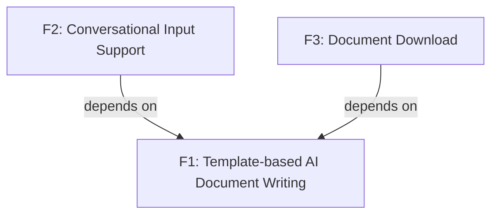

<section_guide number="6" title="Requirements Summary">
<purpose>Enumerate functional/non-functional requirements and assign priorities</purpose>

<questions>
1. List the core functional requirements
2. What is the priority of each requirement? (Must-Have / Should-Have / Nice-to-Have)
</questions>

<nfr_wizard>
Non-functional requirements MUST be guided through this process for non-technical users:

Step 1 — Ask scenario-based questions (ONE at a time) to derive NFRs:

- Performance: If Section 4.2 recorded a `Scale assumption`, restate it ("Section 4 assumes ~[N] users at launch") and ask only to pin the CONCURRENT peak, making the total-vs-concurrent distinction explicit. Otherwise ask: "How many people do you expect to use the product at the same time? (Under 10 / Tens / Hundreds / Thousands+)"
- Security: "Will users need to log in? Will the product handle sensitive information like payments or personal data? (Yes / No / Not sure)"
- Availability: "If the service goes down, how quickly must it recover? (Within minutes / Within hours / Next business day is fine)"
- Latency: "Are there any actions that must feel instant? For example, search results or page loads. (Yes, specify / No special needs)"
- Others: "Are there any regulatory or compliance requirements? (e.g., GDPR, HIPAA, accessibility standards)"

Step 2 — Translate answers into MEASURABLE NFRs (mandatory):

- Every NFR MUST end up with a measurable threshold and a way to check it. A qualitative answer is only an input — convert it to a number or a yes/no condition before writing it down. "minimum security", "fast", "scalable" are NOT acceptable as final NFRs.
- Map each answer to a concrete requirement: "Based on your answer about [topic], I recommend: [NFR with specific threshold]"
- Each NFR's threshold must line up 1:1 with a Success Threshold in Section 8 (or a release test). Phrase it so the same number appears in both places.
- Preserve the unit, population, and measurement condition as well as the number. A daily user count must not become a concurrency target. If one NFR has several obligations, verify every obligation in Section 8 or its release tests.
- Record each NFR's Scope: `Global`, or the Feature ID(s) it constrains. (This scope is what hands the NFR to the ADR cycle as a Decision Driver later.)
- For each NFR, briefly explain:
  - What it means in plain language
  - What happens if this requirement is NOT met (risk)
  - Whether the proposed level is typical for MVP or more ambitious
- If the user's expectation seems excessive for MVP, suggest a pragmatic alternative:
  "For MVP, [simpler level] is usually sufficient. You can tighten this in later iterations."
- If the user's expectation seems too low, flag the risk:
  "This might cause [specific problem]. Consider raising it to [suggested level]."

Step 3 — Select the focus set and preserve mandatory constraints:

- If more than 3 NFRs were identified, present all and recommend the top 3 with reasoning
- Ask user to confirm or adjust the top-3 focus set
- The top 3 are prioritization guidance, not a deletion cap. Preserve every mandatory security, privacy, regulatory, accessibility, contractual, and other Must-Have constraint even when that produces more than 3 NFRs.
- Optional NFRs outside the focus set may be merged, lowered in priority, or deferred through Section 9. Never defer a mandatory constraint merely to satisfy a count.

IMPORTANT:

- Do NOT ask "What are your non-functional requirements?" directly
- Do NOT use jargon like "SLA", "throughput", "p99 latency" without explaining
- Do NOT skip the risk explanation — non-technical users need to understand trade-offs to make informed decisions
- Do NOT finalize an NFR that has no measurable threshold — push one more round to make it checkable
- If the user is technical, has already stated a concrete expectation for a dimension (concurrency, recovery time, latency, auth/compliance), OR a reference document already supplies it, do NOT ask that scenario question cold — derive the candidate NFR from what was provided and present it for confirmation ("Based on your input I read [fact] → I'll record NFR [threshold]; confirm or adjust?"). Only run scenario questions for dimensions still unspecified. Step 2's measurable-threshold requirement still applies.
  </nfr_wizard>

<workflow>
After completing 6.1 and 6.2:
1. Analyze the features defined in 6.1 and automatically infer dependency relationships between them
2. Generate a Mermaid dependency diagram (graph TD) for Section 6.3
3. Present the generated diagram to the user and ask for confirmation or corrections
4. Do NOT ask the user to describe dependencies from scratch — propose your analysis first
</workflow>

<example>
### 6.1 Core Features (Functional Requirements)
- **F1: Template-based AI Document Writing** - AI generates documents based on a predefined ALPS (PRD) template, reflecting user input
- **F2: Conversational Input Support** - Users can fill in the document step by step through conversation with AI
- **F3: Document Download** - Download the completed document in Markdown format

### 6.2 Non-Functional Requirements

| ID  | Requirement (measurable)                                               | Scope  | Priority  |
| --- | ---------------------------------------------------------------------- | ------ | --------- |
| NF1 | Support 1,000 concurrent users; a document generates within 30 seconds | Global | Must-Have |
| NF2 | Authentication required before any document is saved                   | F2     | Must-Have |

### 6.3 Feature Dependency Diagram

</example>

<important>Assign a unique ID to each functional requirement (F1, F2, ...)</important>
<completion required="true">Confirm after all requirements have been assigned IDs</completion>
</section_guide>
