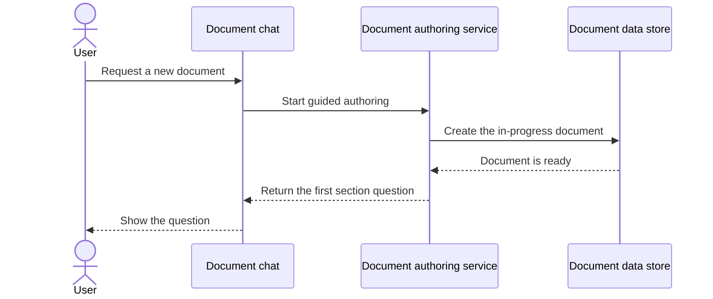

<section_guide number="7" title="Feature-Level Specification" references="3,6">
<purpose>Write detailed user stories and connect each requirement from Section 6 to the Section 3 demo</purpose>

<required_review>
MUST review Section 3 (Demo Scenario) and Section 6 (Requirements Summary) before writing this section.
Call read_alps_section(3) to summarize the end-to-end demo, then call read_alps_section(6) and confirm all Feature IDs (F1, F2...) to map 1:1.
</required_review>

<workflow>
Atomic confirmation is the default. When `/alps-init` selected batch mode, several
Features may be presented for one approval, but each 7.x remains a separately labeled
draft and a separate `save_alps_section` call. Never merge, skip, or infer a Feature.

1. Confirm the Feature list from Section 6 (F1, F2, F3...)
2. Proceed sequentially for each Feature:
   a. Discuss the Feature using the questions below
   b. Complete the 7.x subsection
   c. Present a concise plain-text approval digest for the complete 7.x Feature, followed by one line:
   `Comprehension load: <N>/10` (translate the label to the user's language)
   d. Call save_alps_section(7, "x", title, content) to save this ONE Feature — subsection_id is the feature index (e.g. "1" for 7.1), title is the feature name (e.g. "Feature A (F1: ...)"), content is the completed 7.x markdown
   e. In atomic mode, confirm and save before moving on. In batch mode, save each approved Feature separately after the batch ruling.
3. Review the entire Section 7 after all Features are complete
   </workflow>

<comprehension_load>
Before showing the score, evaluate five internal axes from 0 to 2 and sum them
(show 1 rather than 0): conceptual breadth, contract density, state and flow
complexity, boundary coupling, and uncertainty and verification burden.

Calibrate the total with this internal 10-point guide:
1 = one statement or rule; 2 = one action and one success condition;
3 = simple with few flows or exceptions; 4 = lower bound of the recommended size;
5 = best-balanced vertical slice; 6 = upper bound of the recommended size;
7 = high load; 8 = very high load; 9 = strongly coupled behaviors or contracts;
10 = maximum review load, first check whether several Features are mixed.
Treat 4-6 as the recommended range. A low score never requires merging, and a
high score never blocks approval or saving. Do not print the whole rubric.

Do not show or expose the axis scores or rationale. Show only
`Comprehension load: <N>/10`. Do not write or persist this score in the saved
ALPS Feature, the ALPS document, an ADR, or any mapping. It is a disposable
reading aid and does not block approval or saving.

When the score is 8/10 or higher, propose up to three smaller Feature candidates
before approval and include an explicit option to keep the original Feature.
The proposal is advisory and never blocks approval or saving. When the score is
below 8/10, do not propose a split unless the user asks.

Split only on independently observable user behavior. If the user selects a
candidate, update the corresponding Section 6 and Section 7 Feature boundaries
together. Never split a vertical slice into frontend/backend/data technical layers.
</comprehension_load>

<approval_digest>
Keep the approval digest readable as raw text. Label the Feature, then include:
its user value, scope/non-goals, mandatory requirements, every value and rule the
result must honor with its basis, key edge/error guarantees, and the Demo
checkpoint. Omit repeated flow narration, examples, Markdown decoration, and
implementation detail. Do not name omitted implementation details or add an
exclusion list for them. Never save a requirement contract that was absent from
the digest. Show the full pending Feature content when the user requests it.

The Feature `7.x` is one approval and save unit. Its internal `7.x.1`-`7.x.6`
fields stay together and are never saved as partial Features.
</approval_digest>

<readability_and_diagrams>
Write for a junior developer seeing this Feature for the first time. Use plain
language and do not assume they already know the product. Explain an unfamiliar
acronym, domain term, or technical term briefly when it first appears. Make it
possible to identify who starts each action, what happens, which conceptual data
is read or written, and what the user sees without opening the code.

When multiple participants or layers make a flow easier to understand visually,
recommend and normally include a concise Mermaid diagram in 7.x.3. Prefer
`sequenceDiagram` for request, data, and response flow across the user, UI, API,
data store, and external systems. Use `stateDiagram-v2` for important state
transitions, `flowchart` for meaningful branching, or `erDiagram` for conceptual
entity relationships when one of those explains the Feature more clearly.

A Feature diagram is optional. Its absence never blocks approval, saving, or
completion. Do not add a diagram only for decoration or repeat the full prose
flow inside it. The prose remains independently understandable and owns all
contract-bearing values and rules. Keep diagram participants and messages at
product-requirement resolution; exclude modules, classes, functions, fields,
schemas, libraries, algorithms, and other implementation detail. The approval
digest remains plain text and does not depend on Mermaid rendering.
</readability_and_diagrams>

<questions repeat="each_feature">
1. User Story: "As a [role], I want to [action] so that [benefit]"
2. What is the user flow?
3. For each key action, what happens end-to-end from UI through API to data store? (Think of it as a vertical slice — one feature cutting through all layers, so it can be built and tested on its own.) Describe the WHAT — behavior and responsibility per layer — not the chosen library/algorithm or why it was chosen. Those are architectural decisions captured later in an ADR, not in the PRD. If several participants or layers make the flow hard to scan, propose a concise Mermaid diagram and prefer `sequenceDiagram` for the request, data, and response path.
4. What are the edge cases and error handling strategies?
5. Are there values and rules the result must honor — limits, quotas, retention periods, size caps, allowed ranges? (Ask this even when the user has not raised it: "Is there anything a developer must NOT decide on their own here? For example a maximum number of turns/attempts, a usage quota per plan, how long data is kept, a file-size cap, or who is allowed to see what.") Record each with the NUMBER and its basis (pricing policy, security rule, regulation, contract) — e.g. "a chat session is capped at 20 turns (pricing policy)". These are requirements, not implementation choices: a developer picking a different number breaks the product. Leave out values a developer may freely pick (pool sizes, backoff delays, cache TTLs) — those are tuning constants that belong in code.
   Requirements do not arrive only as numbers, so ask the same question about non-numeric ones: which states/values are allowed and which transitions are forbidden ("a cancelled order can never move to shipping"), what input is mandatory, who may see or do what, whether duplicates are allowed, and the unit of money/time. Record these as domain sentences with their basis — a developer who changes the allowed set breaks the product just as surely as one who changes a number. Do NOT record the identifier that happens to hold a value (`StatusPaid`, `"PAID"`) — the set is the requirement, the name is the code's to pick.
6. What are the acceptance criteria? (Restate the values from Q5 as checkable criteria so the same number appears in both places.)
7. What one-sentence Demo checkpoint connects this Feature to the Section 3 end-to-end demo?
   - State its role in the Section 3 journey and the observable completion result.
   - Add that sentence under Acceptance Criteria. Do not repeat preconditions, user actions, failure scenarios, or success rules already recorded in User Flow, Edge Cases, Error Handling, and Acceptance Criteria.
</questions>

<scope_boundary>
Section 7 records REPRODUCIBLE REQUIREMENTS, not implementation decisions. Keep 7.x.3 decision-free:

- DO write: what each action does, which layers it crosses, what data it reads/writes (conceptually), what the user gets back, endpoint references at method+path level, any shared interface it relies on, and **the values and rules the result must honor** (limits, quotas, retention periods, size caps, permission rules) with the number and its basis — plus the non-numeric ones: allowed value sets and forbidden transitions, mandatory inputs, visibility rules, uniqueness, and units.
- DO NOT write: chosen libraries/algorithms, exact column lists, tuning constants, request/response schemas, or the rationale for a choice. A sentence that stays true after swapping the DB or hashing library belongs here; one that justifies a choice belongs in an ADR.
- Use first-reader-friendly language. Expand unfamiliar acronyms and explain domain or technical terms on first use, while preserving exact requirement values and rules.
- A Mermaid diagram may supplement 7.x.3 when it reduces comprehension cost. Prefer `sequenceDiagram` for UI → API → data or external-system flow, but never make a diagram mandatory or let it replace the prose contract.
- The two bullets above split on one question: **would a developer picking a different value break the requirement?** "Max 20 turns per session" survives any rewrite of the implementation, so it is a reproducible requirement and stays. "Connection pool of 10" does not, so it is a tuning constant and goes. The same question decides non-numeric facts: "a cancelled order can never move to shipping" survives any rewrite and stays; the enum identifier holding that state does not and goes. Do NOT soften a requirement into "reasonably limited", "an appropriate period", or "the status is managed". Section 7 is the preferred place to settle product-visible contracts. If one remains blurred, `/feature-to-adr` must ask for the missing contract before handoff rather than inventing a number or allowed set.
- `/feature-to-adr` transfers every implementation-relevant Feature contract into one or several ADRs. It first uses the regeneration test to find ADR-resolution gaps, asks only for missing contracts or durable decisions, and leaves replaceable implementation choices to code. At least one real ADR owns each transferred Feature's reproducible contract; independent durable decisions remain separate. After handoff, ADRs are the implementation authority and the PRD is legacy planning context. Explicit re-import compares semantics against the current ADRs; equivalent wording is a no-op and removed contracts are never deleted automatically.
- The Demo checkpoint stays at product resolution. State the Feature's role in the Section 3 journey and its observable completion result in one sentence; do not include test files, deployment steps, PR boundaries, commits, libraries, or code structure.
- When the user asks for a detailed demo walkthrough, derive it from Section 3 plus this Feature's User Flow, Edge Cases, Error Handling, and Acceptance Criteria. Show it in the conversation; do not persist a second demo description in the ALPS document.
  </scope_boundary>

<example>
### 7.1 Feature A (F1: Template-based AI Document Writing)

#### 7.1.1 User Story

- When a user starts a conversation, AI guides document writing based on the ALPS (PRD) template
- Users complete the document step by step following AI guidance

#### 7.1.2 User Flow

1. Welcome message and getting-started guide on app launch
2. AI presents questions for the first chapter when user wants to create a new document
3. After all chapters are complete, guide for final document save

#### 7.1.3 Technical Description

1. Start a new document
   - UI (User Interface — the chat the user interacts with): the user asks to create a document
   - API (Application Programming Interface — the system boundary that processes the request): the assistant uses the ALPS template as guidance and asks the first section's questions
   - Data store (where persistent document information is kept): an in-progress document is created or loaded
   - Response: the first question is shown to the user
2. Answer a chapter
   - UI: user replies in the chat
   - API: the reply is integrated into the current section; the next question follows
   - Data: the section content is saved after the user confirms

Because this action crosses several participants, the draft can add this optional
overview:

Values the result must honor:

- One document is capped at 9 sections — the ALPS template defines exactly nine
- An unconfirmed draft is kept for 30 days, then discarded (storage-cost policy)
- A section is saved only after explicit user confirmation (never auto-saved)

Note: an LLM/provider boundary appears here only when Section 4 records it as a durable constraint; prompt wording and replaceable provider tooling are not repeated here. Retry counts and cache lifetimes are tuning constants and are likewise absent.

#### 7.1.6 Acceptance Criteria

- [ ] An approved section is persisted exactly once.
- [ ] An unapproved draft is never treated as complete.
- **Demo checkpoint:** This Feature provides the guided authoring step in the Section 3 journey; completion is visible when the approved section appears and the next incomplete section becomes active.
  </example>

<important>
- Must map 1:1 with requirement IDs from Section 6
- Must include one Demo checkpoint under Acceptance Criteria that connects the Feature's Section 3 role to an observable completion result
- Each 7.x subsection must remain an individually addressable draft and save unit
- A 7.x.1-7.x.6 field is part of its Feature, not an independent approval or save unit
- A Feature scored 8/10 or higher must receive up to three user-behavior split candidates plus the option to keep the original; this never blocks approval or saving
- Batch approval is allowed only when `/alps-init` explicitly selected batch mode
- Do not skip a Feature for being small, similar, or "inferable" — every 7.x is its own confirmation step
- Do not add a separate Feature Demo subsection or repeat content already owned by User Flow, Edge Cases, Error Handling, and Acceptance Criteria
- Write for a junior developer seeing the Feature for the first time; explain unfamiliar terms on first use without weakening exact contracts
- Recommend Mermaid when it materially clarifies the flow, prefer `sequenceDiagram` for multi-participant data flow, and never require a diagram for approval, saving, or completion
- Never invent a requirement value the user did not give and present it as approved. An answer such as "whatever seems right" delegates a proposal; it does not determine whether a value is a tuning constant or approve a concrete value.
- Classify the value by its effect. A replaceable retry delay with no promised timing guarantee can remain implementation discretion. A quota, permission, retention rule, allowed state, failure guarantee, or other protected product decision stays at the product-contract level when changing it would change the required result. Propose a grounded value and its trade-off in the existing approval digest, or ask one focused question when the decision remains unresolved. Save it only after approval; do not move it into code merely because the user is unsure.
</important>
<completion required="true">Save after each Feature is completed; ensure 7.1, 7.2... correspond to all F1, F2... and every Feature includes one Demo checkpoint under Acceptance Criteria</completion>
</section_guide>
